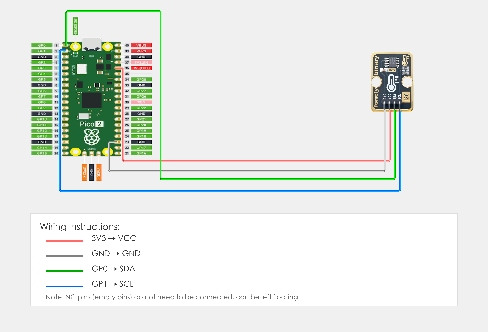

# Raspberry Pi Pico 2 Example

## Goal

This example shows how to use the TK42 - LM75 TEMPERATURE SENSOR module on a Raspberry Pi Pico 2 to read temperature.

## Wiring



## Code

```python
# Import required modules
from machine import Pin, I2C  # GPIO control and I2C communication
import time                   # For delay (time.sleep)

# Define I2C address and pins
LM75_ADDRESS = 0x48  # LM75 I2C address (usually 0x48)
SDA_PIN = 0          # GPIO connected to SDA (e.g. GPIO 0)
SCL_PIN = 1          # GPIO connected to SCL (e.g. GPIO 1)

# Create I2C object
i2c = I2C(0, sda=Pin(SDA_PIN), scl=Pin(SCL_PIN), freq=100000)  # Create I2C object, frequency 100kHz

# Main loop: runs forever
while True:
    # Read temperature value (read 2 bytes from register 0x00)
    data = i2c.readfrom_mem(LM75_ADDRESS, 0x00, 2)  # Read 2 bytes from address 0x00
    
    # LM75 returned data: data[0] is high byte (MSB), data[1] is low byte (LSB)
    # Combine into 16-bit temperature value (high byte first, big-endian)
    tempRaw = (data[0] << 8) | data[1]
    
    # Convert to actual temperature (unit: Celsius)
    # LM75 temperature value is 11-bit signed number, unit is 0.125°C
    # Method: Keep consistent with Arduino version, directly shift right by 5 bits
    # Note: Python's right shift for signed numbers performs sign extension
    # First convert unsigned number to signed number (if highest bit is 1)
    if tempRaw & 0x8000:
        tempRaw_signed = tempRaw - 0x10000
    else:
        tempRaw_signed = tempRaw
    
    # Shift right by 5 bits to get 11-bit temperature value, then multiply by 0.125
    temperature = (tempRaw_signed >> 5) * 0.125
    
    # Display temperature on terminal
    print("Temperature: {:.2f}°C".format(temperature))
    
    # Delay 1 second to avoid reading too fast
    time.sleep(1)
```

## Effect


## Code Walkthrough

**Lines 1–2: Imports**

```python
from machine import Pin, I2C  # GPIO control and I2C communication
import time                   # For delay (time.sleep)
```

- **`machine.Pin`:** Used to control Pico GPIO pins.
- **`machine.I2C`:** Used for I2C communication.
- **`time`:** Provides `sleep()` and other time-related functions.

**Lines 4–6: Pin definition**

```python
LM75_ADDRESS = 0x48  # LM75 I2C address (usually 0x48)
SDA_PIN = 0          # GPIO connected to SDA (e.g. GPIO 0)
SCL_PIN = 1          # GPIO connected to SCL (e.g. GPIO 1)
```

- **`SDA_PIN = 0`:** GPIO number for I2C data pin connected to Pico GPIO 0. Change this if you use another pin.
- **`SCL_PIN = 1`:** GPIO number for I2C clock pin connected to Pico GPIO 1. Change this if you use another pin.
- **`LM75_ADDRESS`:** LM75 module I2C address (usually 0x48).

**Lines 12–26: Main loop**

```python
while True:
    # Read temperature value (read 2 bytes from register 0x00)
    data = i2c.readfrom_mem(LM75_ADDRESS, 0x00, 2)  # Read 2 bytes from address 0x00
    
    # LM75 returned data: data[0] is high byte (MSB), data[1] is low byte (LSB)
    # Combine into 16-bit temperature value (high byte first, big-endian)
    tempRaw = (data[0] << 8) | data[1]
    
    # Convert to actual temperature (unit: Celsius)
    # LM75 temperature value is 11-bit signed number, unit is 0.125°C
    # Method: Keep consistent with Arduino version, directly shift right by 5 bits
    # Note: Python's right shift for signed numbers performs sign extension
    # First convert unsigned number to signed number (if highest bit is 1)
    if tempRaw & 0x8000:
        tempRaw_signed = tempRaw - 0x10000
    else:
        tempRaw_signed = tempRaw
    
    # Shift right by 5 bits to get 11-bit temperature value, then multiply by 0.125
    temperature = (tempRaw_signed >> 5) * 0.125
    
    # Display temperature on terminal
    print("Temperature: {:.2f}°C".format(temperature))
    
    # Delay 1 second to avoid reading too fast
    time.sleep(1)
```

- **`while True`:** Infinite loop; the program keeps running.
- **`i2c.readfrom_mem(LM75_ADDRESS, 0x00, 2)`:** Read 2 bytes of temperature data from LM75 register 0x00.
- **`(data[0] << 8) | data[1]`:** Combine 2 bytes into 16-bit integer.
- **`if tempRaw & 0x8000`:** Check sign bit; if highest bit is 1, it indicates negative number.
- **`tempRaw - 0x10000`:** Convert negative number to signed integer.
- **`(tempRaw_signed >> 5) * 0.125`:** Convert to Celsius, LM75 temperature data format: upper 11 bits are temperature value, lower 5 bits are fractional part, each unit represents 0.125°C.
- **`print(...)`:** Print temperature value to terminal.
- **`time.sleep(1)`:** Wait 1 second before reading again.
