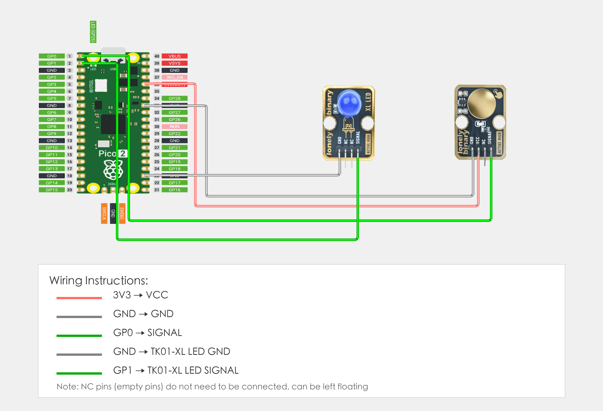

# Raspberry Pi Pico 2 Example

## Goal

This example shows how to use the TK43 - TP223 TOUCH SENSOR module on a Raspberry Pi Pico 2 to detect touch and control LED.

## Wiring



## Code

```python
# Import required modules
from machine import Pin  # GPIO control
import time              # For delay (time.sleep)

# Pin number: change these to match your wiring
TOUCH_PIN = 0    # GPIO connected to SIGNAL (e.g. GPIO 0)
LED_PIN = 1      # LED pin (GPIO 1, or external LED, Pico built-in LED is GPIO 25)

# Create pin objects
touch = Pin(TOUCH_PIN, Pin.IN)   # Set touch sensor pin as input (to read detection state)
led = Pin(LED_PIN, Pin.OUT)      # Set LED pin as output (to control LED on/off)

print("Touch sensor program started")
print("LED on when touch sensor is touched, LED off when not touched")

# Main loop: runs forever
while True:
    # Read touch sensor state
    touchState = touch.value()   # Read sensor pin level: 1=touched (HIGH), 0=not touched (LOW)
    
    # Control LED based on detection state
    if touchState == 1:
        # Touch sensor touched: turn LED on and print message
        led.on()                 # Output HIGH, LED on
        print("Touch sensor - LED on")
    else:
        # Not touched: turn LED off
        led.off()                # Output LOW, LED off
        print("Not touched - LED off")
    
    # Delay 100 milliseconds to avoid reading too fast
    time.sleep_ms(100)
```

## Effect


## Code Walkthrough

**Lines 1–2: Imports**

```python
from machine import Pin  # GPIO control
import time              # For delay (time.sleep)
```

- **`machine.Pin`:** Used to control Pico GPIO pins.
- **`time`:** Provides `sleep()` and other time-related functions.

**Lines 5–6: Pin definition**

```python
TOUCH_PIN = 0    # GPIO connected to SIGNAL (e.g. GPIO 0)
LED_PIN = 1      # LED pin (GPIO 1, or external LED, Pico built-in LED is GPIO 25)
```

- **`TOUCH_PIN = 0`:** GPIO number for touch sensor SIGNAL. Change this if you use another pin.
- **`LED_PIN = 1`:** GPIO number for LED (GPIO 1, or external LED, Pico built-in LED is GPIO 25).

**Lines 15–31: Main loop**

```python
while True:
    # Read touch sensor state
    touchState = touch.value()   # Read sensor pin level: 1=touched (HIGH), 0=not touched (LOW)
    
    # Control LED based on detection state
    if touchState == 1:
        # Touch sensor touched: turn LED on and print message
        led.on()                 # Output HIGH, LED on
        print("Touch sensor - LED on")
    else:
        # Not touched: turn LED off
        led.off()                # Output LOW, LED off
        print("Not touched - LED off")
    
    # Delay 100 milliseconds to avoid reading too fast
    time.sleep_ms(100)
```

- **`while True`:** Infinite loop; the program keeps running.
- **`touch.value()`:** Read touch sensor pin level, returns 1 when touched (HIGH), 0 when not touched (LOW).
- **`if touchState == 1`:** Check if touch sensor is touched; if touched, execute LED on operation.
- **`led.on()`:** Output HIGH, LED on.
- **`led.off()`:** Output LOW, LED off.
- **`print(...)`:** Print touch state and LED status to terminal.
- **`time.sleep_ms(100)`:** Wait 100 milliseconds before reading again to avoid reading too fast.
