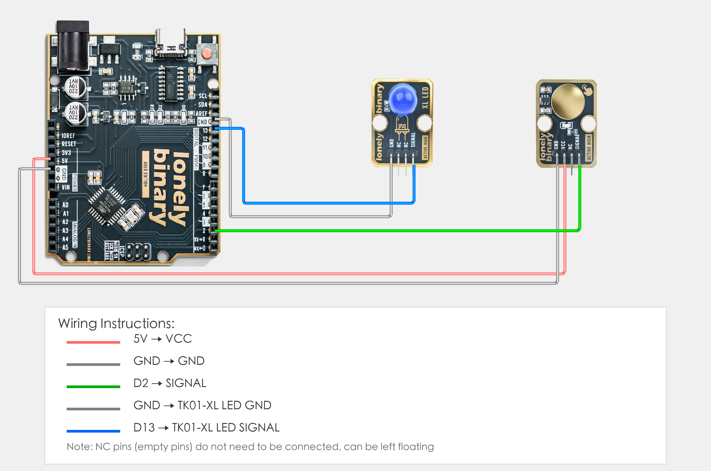

# Arduino Uno R3 Example

## Goal

This example shows how to use the TK43 - TP223 TOUCH SENSOR module on an Arduino Uno R3 to detect touch and control LED.

## Wiring



- **VCC** → Arduino Uno R3 5V
- **GND** → Arduino Uno R3 GND
- **SIGNAL** → Arduino Uno R3 D2
- **NC** → Leave unconnected

## Code

```cpp
// Pin number: change this to match your wiring
#define TOUCH_PIN 2      // Arduino digital pin connected to SIGNAL (e.g. D2)
#define LED_PIN 13       // LED pin (Arduino built-in LED on pin 13, or external LED)

void setup() {
  // Initialize pin modes
  pinMode(TOUCH_PIN, INPUT);   // Set touch sensor pin as input (to read detection state)
  pinMode(LED_PIN, OUTPUT);    // Set LED pin as output (to control LED on/off)
  
  // Start serial for debugging (9600 baud)
  Serial.begin(9600);
  
  Serial.println("Touch sensor program started");
  Serial.println("LED on when touch sensor is touched, LED off when not touched");
}

void loop() {
  // Read touch sensor state
  int touchState = digitalRead(TOUCH_PIN);  // Read sensor pin level: HIGH(1)=touched, LOW(0)=not touched
  
  // Control LED based on detection state
  if (touchState == HIGH) {
    // Touch sensor touched: LED on
    digitalWrite(LED_PIN, HIGH);
    Serial.println("Touch sensor - LED on");
  } else {
    // Not touched: LED off
    digitalWrite(LED_PIN, LOW);
    Serial.println("Not touched - LED off");
  }
  
  delay(100);  // Brief delay to avoid reading too fast
}
```

## Effect


## Code Walkthrough

**Lines 2–3: Pin definition**

```cpp
#define TOUCH_PIN 2      // Arduino digital pin connected to SIGNAL (e.g. D2)
#define LED_PIN 13       // LED pin (Arduino built-in LED on pin 13, or external LED)
```

- **`TOUCH_PIN`:** The Arduino digital pin connected to touch sensor SIGNAL. Change this if you use another pin.
- **`LED_PIN`:** The Arduino digital pin connected to LED (Arduino built-in LED on pin 13, or external LED).

**Lines 5–15: Initialization (setup function)**

```cpp
void setup() {
  // Initialize pin modes
  pinMode(TOUCH_PIN, INPUT);   // Set touch sensor pin as input (to read detection state)
  pinMode(LED_PIN, OUTPUT);    // Set LED pin as output (to control LED on/off)
  
  // Start serial for debugging (9600 baud)
  Serial.begin(9600);
  
  Serial.println("Touch sensor program started");
  Serial.println("LED on when touch sensor is touched, LED off when not touched");
}
```

- **`setup()`:** Runs once when the Arduino starts.
- **`pinMode(TOUCH_PIN, INPUT)`:** Set touch sensor pin as input to read detection state.
- **`pinMode(LED_PIN, OUTPUT)`:** Set LED pin as output to control LED on/off.
- **`Serial.begin(9600)`:** Start serial at 9600 baud.
- **`Serial.println(...)`:** Print program start message and instructions to Serial Monitor.

**Lines 17–33: Main loop (loop function)**

```cpp
void loop() {
  // Read touch sensor state
  int touchState = digitalRead(TOUCH_PIN);  // Read sensor pin level: HIGH(1)=touched, LOW(0)=not touched
  
  // Control LED based on detection state
  if (touchState == HIGH) {
    // Touch sensor touched: LED on
    digitalWrite(LED_PIN, HIGH);
    Serial.println("Touch sensor - LED on");
  } else {
    // Not touched: LED off
    digitalWrite(LED_PIN, LOW);
    Serial.println("Not touched - LED off");
  }
  
  delay(100);  // Brief delay to avoid reading too fast
}
```

- **`loop()`:** Runs repeatedly.
- **`digitalRead(TOUCH_PIN)`:** Read sensor pin level, HIGH(1) means touched, LOW(0) means not touched.
- **`if (touchState == HIGH)`:** Check if touch sensor is touched; if touched, execute LED on operation.
- **`digitalWrite(LED_PIN, HIGH)`:** Output HIGH to turn LED on.
- **`digitalWrite(LED_PIN, LOW)`:** Output LOW to turn LED off.
- **`Serial.println(...)`:** Print detection state and LED status to Serial Monitor.
- **`delay(100)`:** Wait 100 milliseconds before reading again to avoid reading too fast and reduce CPU usage.
