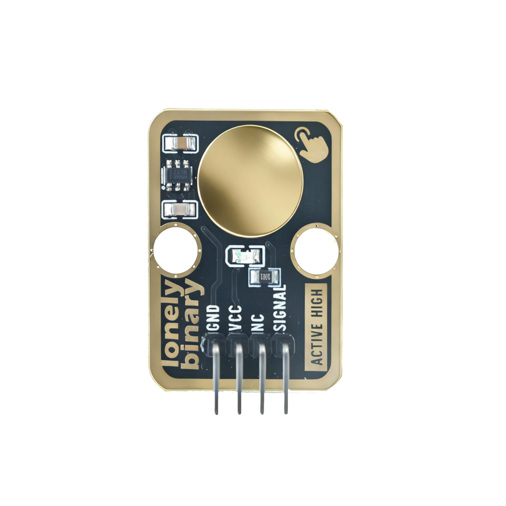
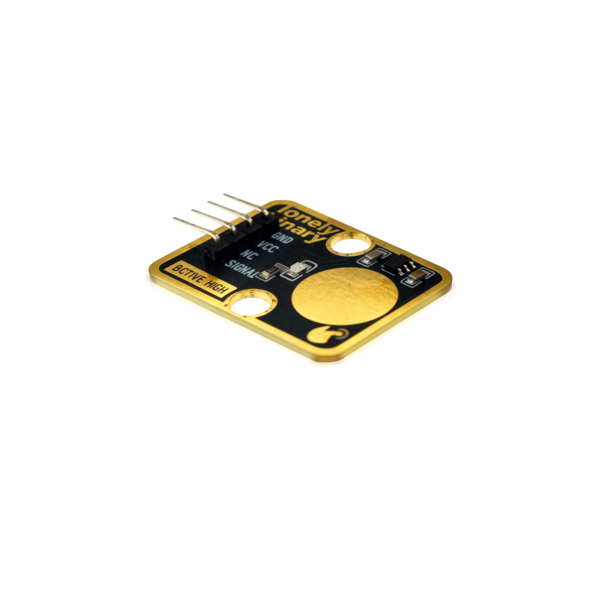

# Function

This module is a TP223 touch sensor module that can detect finger touch operations. When a finger touches the metal pad on the module, the module outputs a HIGH signal. Can be used to control LEDs, servos, buzzers, and other devices, implementing touch switches, touch control, and other functions.

# Appearance

|  |  |  |
| :-----------------------: | :-----------------------: | :-----------------------: |
|          **Front**          |          **Back**          |          **Side**          |

The module has a touch metal pad and a 4-pin header interface. Each pin can be identified by the silkscreen (text printed next to the pin).

# Pinout

- **GND** (negative): Like the negative terminal (-) of a battery, connect to the control board's GND
- **VCC** (positive): Like the positive terminal (+) of a battery, connect to the control board's 3.3V or 5V (this module supports both 3.3V and 5V)
- **SIGNAL** (signal output): Touch detection output pin, connect to the control board's digital pin (e.g. Arduino D2 or Pico GPIO 0)
  - Outputs HIGH when touched
  - Outputs LOW when not touched
- **NC** (no connection): No actual circuit connection, included for unified interface, can be left unconnected

# Features

- Touch detection: Outputs HIGH when finger touches metal pad
- Operating voltage: 3.3V or 5V
- Low power consumption: Very low static current

# Quick Wiring

1. GND → Control board GND
2. VCC → Control board 3.3V or 5V
3. SIGNAL → Control board digital pin (use the pin defined in your program)
