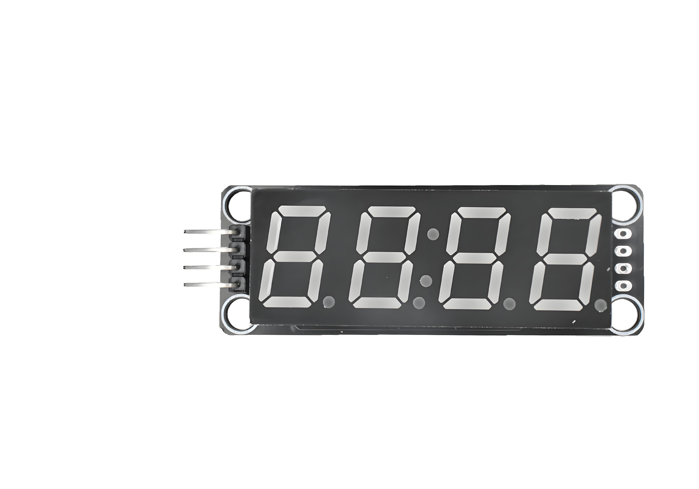
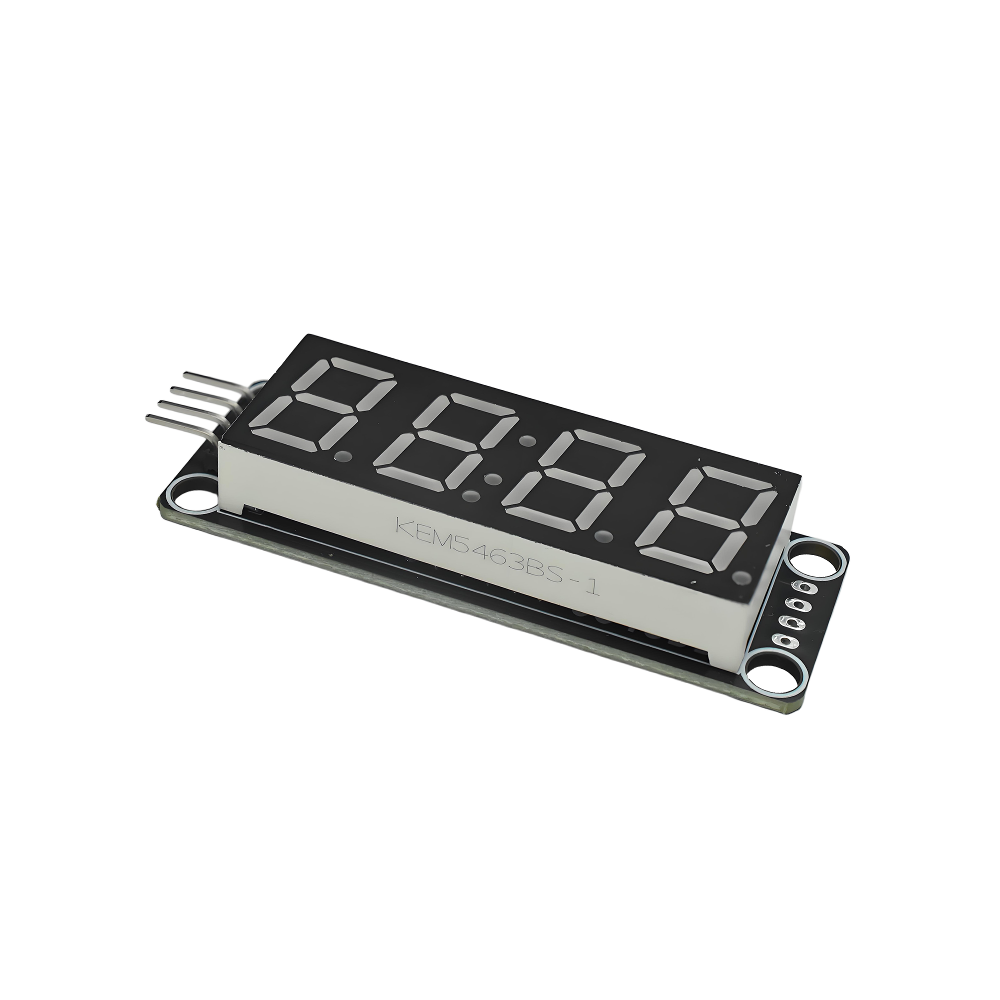

# Function

This module is a 4-digit 7-segment display module using TM1637 driver chip. Can display numbers 0-9, some letters and symbols. Can be used to make counters, clocks, temperature displays, and other applications.

# Appearance

|  |  |  |
| :------------------------: | :------------------------: | :------------------------: |
| **Front** | **Back** | **Side** |

The module has 4 seven-segment displays and a 4-pin header interface. Each pin can be identified by the silkscreen (text printed next to the pin).

# Pinout

- **GND** (negative): Like the negative terminal (-) of a battery, connect to the control board's GND
- **VCC** (positive): Like the positive terminal (+) of a battery, connect to the control board's 3.3V or 5V (this module supports both 3.3V and 5V)
- **CLOCK** (clock line): TM1637 clock line, connect to the control board's digital pin (e.g. Arduino D2 or Pico GPIO 0)
- **DATA** (data line): TM1637 data line, connect to the control board's digital pin (e.g. Arduino D3 or Pico GPIO 1)

# Features

- 4-digit display: Can display 4 digits
- TM1637 driver: Uses TM1637 chip, only needs 2 data lines
- Operating voltage: 3.3V or 5V
- Adjustable brightness: Can adjust display brightness

# Quick Wiring

1. GND → Control board GND
2. VCC → Control board 3.3V or 5V
3. CLOCK → Control board digital pin (use the pin defined in your program)
4. DATA → Control board digital pin (use the pin defined in your program)

