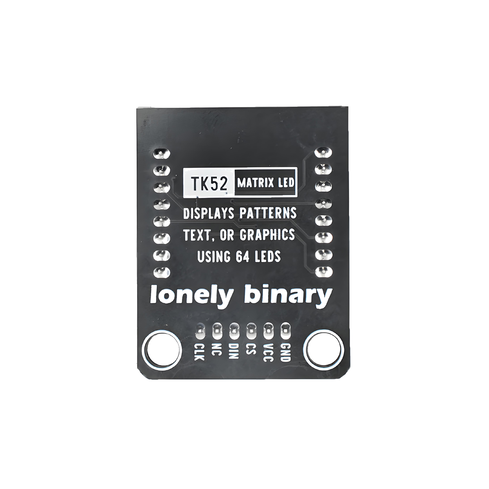

# Function

This module is a 64×64 pixel matrix LED display that can display text, patterns, animations, and more. Controlled through SPI interface, can control each LED pixel individually for on/off and color, suitable for making information displays, animation effects, and other applications.

# Appearance

|  |  |  |
| :-----------------------: | :-----------------------: | :-----------------------: |
|          **Front**          |          **Back**          |          **Side**          |

The module has a 64×64 LED matrix display and a 6-pin header interface. Each pin can be identified by the silkscreen (text printed next to the pin).

# Pinout

- **GND** (negative): Like the negative terminal (-) of a battery, connect to the control board's GND
- **VCC** (positive): Like the positive terminal (+) of a battery, connect to the control board's 5V (this module requires 5V power supply)
- **CS** (chip select): SPI chip select signal, connect to the control board's digital pin (e.g. Arduino D10 or Pico GPIO 5)
- **DIN** (data input): SPI data input pin, connect to the control board's SPI data pin (e.g. Arduino D11 or Pico GPIO 19)
- **NC** (no connection): No actual circuit connection, included for unified interface, can be left unconnected
- **CLK** (clock): SPI clock signal, connect to the control board's SPI clock pin (e.g. Arduino D13 or Pico GPIO 18)

# Features

- 64×64 pixel high-resolution display
- SPI interface communication, fast speed
- Supports monochrome or color display (depending on module model)
- Operating voltage: 5V

# Quick Wiring

1. GND → Control board GND
2. VCC → Control board 5V
3. CS → Control board digital pin (e.g. D10)
4. DIN → Control board SPI data pin (e.g. D11)
5. CLK → Control board SPI clock pin (e.g. D13)
