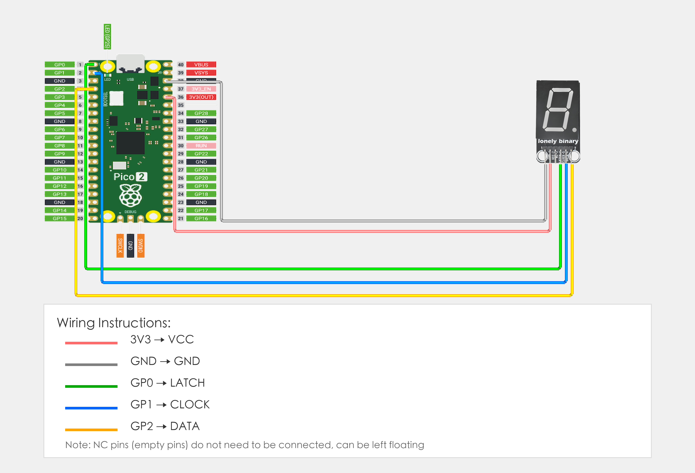

# Raspberry Pi Pico 2 Example

## Goal

This example shows how to use the TK53 - 74HC595 DIGIT DISPLAY module on a Raspberry Pi Pico 2 to display numbers.

## Wiring



## Code

```python
from machine import Pin
import time

# Pin number: change these to match your wiring
LATCH_PIN = 0   # GPIO connected to LATCH (e.g. GPIO 0)
CLOCK_PIN = 1   # GPIO connected to CLOCK (e.g. GPIO 1)
DATA_PIN = 2    # GPIO connected to DATA (e.g. GPIO 2)

# 7-segment display segment code table (common anode, numbers 0-9)
digit_patterns = [
    0b11111100,  # 0
    0b01100000,  # 1
    0b11011010,  # 2
    0b11110010,  # 3
    0b01100110,  # 4
    0b10110110,  # 5
    0b10111110,  # 6
    0b11100000,  # 7
    0b11111110,  # 8
    0b11110110   # 9
]

# Initialize pins
latch = Pin(LATCH_PIN, Pin.OUT)
clock = Pin(CLOCK_PIN, Pin.OUT)
data = Pin(DATA_PIN, Pin.OUT)

def display_digit(digit):
    """Display digit function"""
    if digit < 0 or digit > 9:
        return  # Check range
    
    # Latch pin LOW, ready to receive data
    latch.value(0)
    
    # Send data through shift register
    shift_out(data, clock, digit_patterns[digit])
    
    # Latch pin HIGH, output data to display
    latch.value(1)

def shift_out(data_pin, clock_pin, value):
    """Shift output function (LSBFIRST, least significant bit first)"""
    for i in range(8):
        # Send least significant bit
        data_pin.value(value & 0x01)
        # Clock rising edge
        clock_pin.value(1)
        time.sleep_us(1)
        clock_pin.value(0)
        time.sleep_us(1)
        # Shift right by one bit
        value >>= 1

print("74HC595 7-segment display program started")
print("Cycling through 0-9")

# Main loop: runs forever
while True:
    # Cycle through 0-9
    for i in range(10):
        display_digit(i)
        print(f"Display number: {i}")
        time.sleep(1)  # Switch number every second
```

## Effect


## Code Walkthrough

**Lines 1–2: Imports**

```python
from machine import Pin
import time
```

- **`machine.Pin`:** Used to control Pico GPIO pins.
- **`time`:** Provides `sleep()` and other time-related functions.

**Lines 5–7: Pin definition**

```python
LATCH_PIN = 0   # GPIO connected to LATCH (e.g. GPIO 0)
CLOCK_PIN = 1   # GPIO connected to CLOCK (e.g. GPIO 1)
DATA_PIN = 2    # GPIO connected to DATA (e.g. GPIO 2)
```

- **`LATCH_PIN = 0`:** GPIO number for LATCH pin. Change this if you use another pin.
- **`CLOCK_PIN = 1`:** GPIO number for CLOCK pin. Change this if you use another pin.
- **`DATA_PIN = 2`:** GPIO number for DATA pin. Change this if you use another pin.

**Lines 10–21: Segment code table**

```python
# 7-segment display segment code table (common anode, numbers 0-9)
digit_patterns = [
    0b11111100,  # 0
    0b01100000,  # 1
    # ... other numbers
]
```

- **`digit_patterns`:** 7-segment display segment code table (common anode), each number corresponds to an 8-bit binary value.

**Lines 24–26: Initialize pins**

```python
latch = Pin(LATCH_PIN, Pin.OUT)
clock = Pin(CLOCK_PIN, Pin.OUT)
data = Pin(DATA_PIN, Pin.OUT)
```

- **Pin initialization:** Set all pins as output mode.

**Lines 28–37: Display digit function**

```python
def display_digit(digit):
    """Display digit function"""
    if digit < 0 or digit > 9:
        return  # Check range
    
    # Latch pin LOW, ready to receive data
    latch.value(0)
    
    # Send data through shift register
    shift_out(data, clock, digit_patterns[digit])
    
    # Latch pin HIGH, output data to display
    latch.value(1)
```

- **`display_digit()` function:** Function to display specified digit.
- **Range check:** Check if digit is in valid range (0-9).
- **Latch LOW:** Pull latch pin LOW to prepare receiving data.
- **Shift out:** Send segment code data through shift register.
- **Latch HIGH:** Pull latch pin HIGH to output data to display.

**Lines 39–49: Shift out function**

```python
def shift_out(data_pin, clock_pin, value):
    """Shift output function (LSBFIRST, least significant bit first)"""
    for i in range(8):
        # Send least significant bit
        data_pin.value(value & 0x01)
        # Clock rising edge
        clock_pin.value(1)
        time.sleep_us(1)
        clock_pin.value(0)
        time.sleep_us(1)
        # Shift right by one bit
        value >>= 1
```

- **`shift_out()` function:** Shift output function, sends data bit by bit through shift register.
- **LSBFIRST:** Send from least significant bit first.
- **Clock signal:** Generate clock signal to shift data into register.

**Lines 54–60: Main loop**

```python
while True:
    # Cycle through 0-9
    for i in range(10):
        display_digit(i)
        print(f"Display number: {i}")
        time.sleep(1)  # Switch number every second
```

- **`while True`:** Infinite loop; the program keeps running.
- **`for i in range(10)`:** Loop through 0-9, display one number per loop.
- **`display_digit(i)`:** Call display function to display number i on the display.
- **`print(f"...")`:** Print current displayed number to terminal.
- **`time.sleep(1)`:** Wait 1 second before switching to next number.
