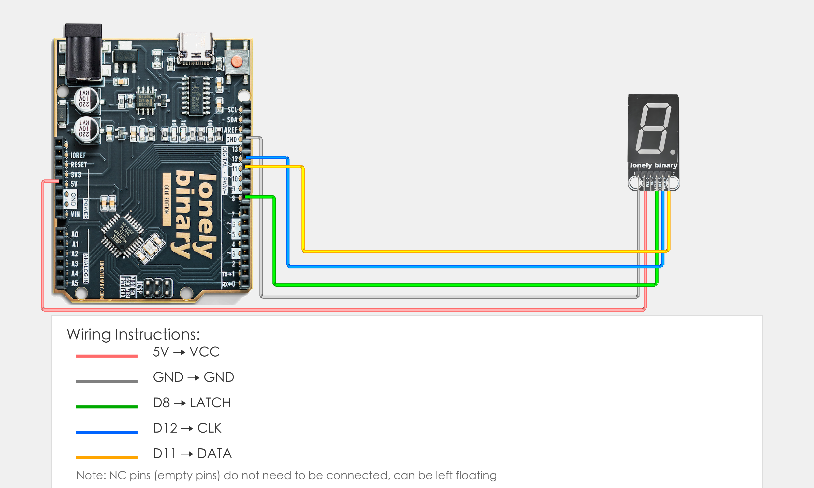

# Arduino Uno R3 Example

## Goal

This example shows how to use the TK53 - 74HC595 DIGIT DISPLAY module on an Arduino Uno R3 to display numbers.

## Wiring



- **GND** → Arduino Uno R3 GND
- **NC** → Leave unconnected

## Code

```cpp
// Pin number: change these to match your wiring
#define LATCH_PIN 8   // Arduino digital pin connected to LATCH (e.g. D8)
#define CLOCK_PIN 12  // Arduino digital pin connected to CLOCK (e.g. D12)
#define DATA_PIN 11   // Arduino digital pin connected to DATA (e.g. D11)

// 7-segment display segment code table (common anode, numbers 0-9)
byte digitPatterns[10] = {
  0b11111100,  // 0
  0b01100000,  // 1
  0b11011010,  // 2
  0b11110010,  // 3
  0b01100110,  // 4
  0b10110110,  // 5
  0b10111110,  // 6
  0b11100000,  // 7
  0b11111110,  // 8
  0b11110110   // 9
};

void setup() {
  // Initialize pin modes
  pinMode(LATCH_PIN, OUTPUT);
  pinMode(CLOCK_PIN, OUTPUT);
  pinMode(DATA_PIN, OUTPUT);
  
  // Start serial for debugging (9600 baud)
  Serial.begin(9600);
  
  Serial.println("74HC595 7-segment display program started");
  Serial.println("Cycling through 0-9");
}

void loop() {
  // Cycle through 0-9
  for (int i = 0; i < 10; i++) {
    displayDigit(i);
    Serial.print("Display number: ");
    Serial.println(i);
    delay(1000);  // Switch number every second
  }
}

// Display digit function
void displayDigit(int digit) {
  if (digit < 0 || digit > 9) return;  // Check range
  
  // Latch pin LOW, ready to receive data
  digitalWrite(LATCH_PIN, LOW);
  
  // Send data through shift register
  shiftOut(DATA_PIN, CLOCK_PIN, LSBFIRST, digitPatterns[digit]);
  
  // Latch pin HIGH, output data to display
  digitalWrite(LATCH_PIN, HIGH);
}
```

## Effect


## Code Walkthrough

**Lines 2–4: Pin definition**

```cpp
#define LATCH_PIN 8   // Arduino digital pin connected to LATCH (e.g. D8)
#define CLOCK_PIN 12  // Arduino digital pin connected to CLOCK (e.g. D12)
#define DATA_PIN 11   // Arduino digital pin connected to DATA (e.g. D11)
```

- **`LATCH_PIN`:** 74HC595 LATCH pin connected to Arduino D8 digital pin. Change this if you use another pin.
- **`CLOCK_PIN`:** 74HC595 CLOCK pin connected to Arduino D12 digital pin. Change this if you use another pin.
- **`DATA_PIN`:** 74HC595 DATA pin connected to Arduino D11 digital pin. Change this if you use another pin.

**Lines 6–17: Define segment code table**

```cpp
// 7-segment display segment code table (common anode, numbers 0-9)
byte digitPatterns[10] = {
  0b11111100,  // 0
  0b01100000,  // 1
  0b11011010,  // 2
  0b11110010,  // 3
  0b01100110,  // 4
  0b10110110,  // 5
  0b10111110,  // 6
  0b11100000,  // 7
  0b11111110,  // 8
  0b11110110   // 9
};
```

- **`digitPatterns[10]`:** 7-segment display segment code table (common anode), each number corresponds to an 8-bit binary value, used to control the 7 segments (a-g) and 1 decimal point (dp) of the display.

**Lines 19–29: Initialization (setup function)**

```cpp
void setup() {
  // Initialize pin modes
  pinMode(LATCH_PIN, OUTPUT);
  pinMode(CLOCK_PIN, OUTPUT);
  pinMode(DATA_PIN, OUTPUT);
  
  // Start serial for debugging (9600 baud)
  Serial.begin(9600);
  
  Serial.println("74HC595 7-segment display program started");
  Serial.println("Cycling through 0-9");
}
```

- **`setup()`:** Runs once when the Arduino starts.
- **`pinMode(LATCH_PIN, OUTPUT)`:** Set LATCH pin as output to control 74HC595 data latch.
- **`pinMode(CLOCK_PIN, OUTPUT)`:** Set CLOCK pin as output for 74HC595 clock signal.
- **`pinMode(DATA_PIN, OUTPUT)`:** Set DATA pin as output to send data to 74HC595.
- **`Serial.begin(9600)`:** Start serial at 9600 baud.
- **`Serial.println(...)`:** Print program start message and instructions to Serial Monitor.

**Lines 31–40: Main loop (loop function)**

```cpp
void loop() {
  // Cycle through 0-9
  for (int i = 0; i < 10; i++) {
    displayDigit(i);
    Serial.print("Display number: ");
    Serial.println(i);
    delay(1000);  // Switch number every second
  }
}
```

- **`loop()`:** Runs repeatedly.
- **`for (int i = 0; i < 10; i++)`:** Loop through 0-9, display one number per loop.
- **`displayDigit(i)`:** Call display digit function to display number i on the display.
- **`Serial.print(...)` and `Serial.println(...)`:** Print current displayed number to Serial Monitor.
- **`delay(1000)`:** Wait 1000 milliseconds (1 second) before switching to next number to control display switching frequency.

**Lines 42–54: Display digit function (displayDigit function)**

```cpp
// Display digit function
void displayDigit(int digit) {
  if (digit < 0 || digit > 9) return;  // Check range
  
  // Latch pin LOW, ready to receive data
  digitalWrite(LATCH_PIN, LOW);
  
  // Send data through shift register
  shiftOut(DATA_PIN, CLOCK_PIN, LSBFIRST, digitPatterns[digit]);
  
  // Latch pin HIGH, output data to display
  digitalWrite(LATCH_PIN, HIGH);
}
```

- **`displayDigit()` function:** Function to display specified digit, controls display through 74HC595 shift register.
- **`if (digit < 0 || digit > 9) return`:** Check digit range, if not in 0-9 range then return directly to avoid array out of bounds.
- **`digitalWrite(LATCH_PIN, LOW)`:** Pull latch pin LOW, ready to receive data into 74HC595 shift register.
- **`shiftOut(DATA_PIN, CLOCK_PIN, LSBFIRST, digitPatterns[digit])`:** Send data through shift register, LSBFIRST means send from least significant bit first, `digitPatterns[digit]` is the segment code data to send.
- **`digitalWrite(LATCH_PIN, HIGH)`:** Pull latch pin HIGH, output data from shift register to 74HC595 output pins, thus displaying on the 7-segment display.
