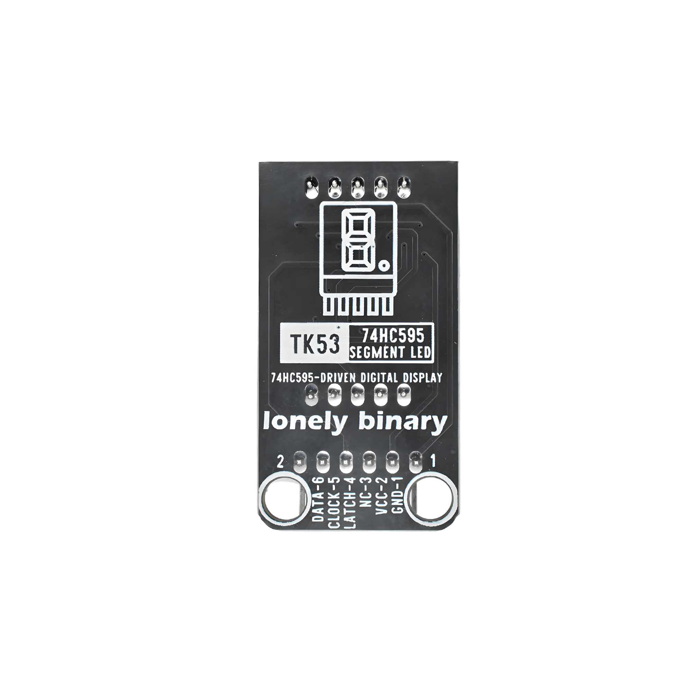
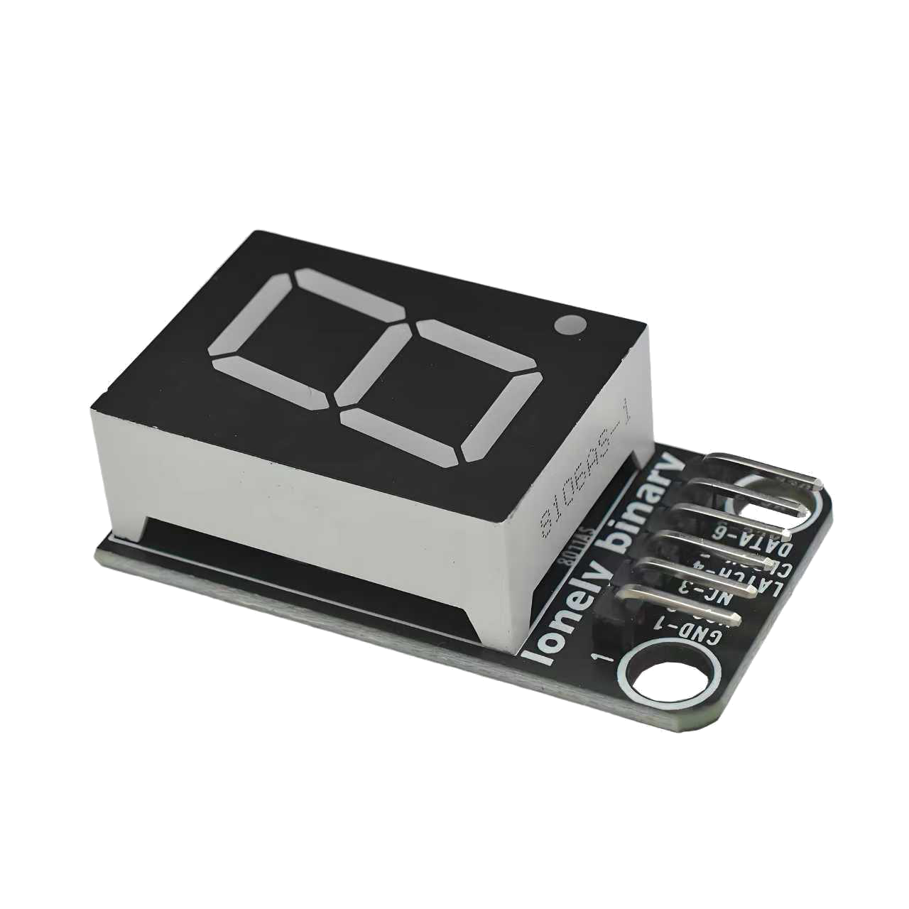

# Function

This module is a single-digit 7-segment display using 74HC595 shift register driver. Can display numbers 0-9. Controlled through serial data input, only needs 3 data lines to control multiple displays. Suitable for making counters, clocks, temperature displays, and other applications.

# Appearance

|  |  |  |
| :-----------------------: | :-----------------------: | :-----------------------: |
|          **Front**          |          **Back**          |          **Side**          |

The module has a single-digit 7-segment display and a 6-pin header interface. Each pin can be identified by the silkscreen (text printed next to the pin).

# Pinout

- **GND** (negative): Like the negative terminal (-) of a battery, connect to the control board's GND
- **VCC** (positive): Like the positive terminal (+) of a battery, connect to the control board's 3.3V or 5V (this module supports both 3.3V and 5V)
- **NC** (no connection): No actual circuit connection, included for unified interface, can be left unconnected
- **LATCH** (latch): Data latch signal, connect to the control board's digital pin (e.g. Arduino D8 or Pico GPIO 2)
- **CLOCK** (clock): Shift clock signal, connect to the control board's digital pin (e.g. Arduino D12 or Pico GPIO 3)
- **DATA** (data): Serial data input, connect to the control board's digital pin (e.g. Arduino D11 or Pico GPIO 4)

# Features

- Uses 74HC595 shift register, saves pins
- Serial input, only needs 3 data lines
- Can cascade multiple modules
- Operating voltage: 3.3V or 5V

# Quick Wiring

1. GND → Control board GND
2. VCC → Control board 3.3V or 5V
3. LATCH → Control board digital pin (e.g. D8)
4. CLOCK → Control board digital pin (e.g. D12)
5. DATA → Control board digital pin (e.g. D11)
