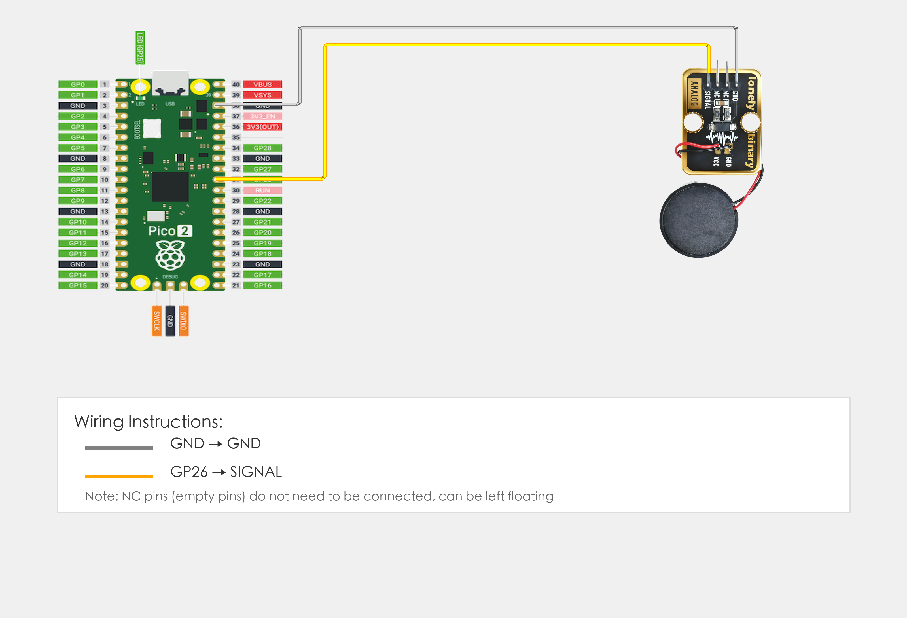

# Raspberry Pi Pico 2 Example

## Goal

This example shows how to use the TK59 - PIEZO SENSOR module on a Raspberry Pi Pico 2 to read pressure intensity.

## Wiring



## Code

```python
# Import required modules
from machine import Pin, ADC  # GPIO control and ADC
import time                   # For delay (time.sleep)

# Pin number: change this to match your wiring
PIEZO_PIN = 26  # GPIO connected to SIGNAL (e.g. GPIO 26, must be ADC pin)

# Create ADC object
piezo = ADC(Pin(PIEZO_PIN))  # Set piezoelectric sensor pin as ADC mode (to read analog signal)

print("Piezoelectric sensor program started")
print("Read pressure intensity value and output via serial")

# Main loop: runs forever
while True:
    # Read piezoelectric sensor analog value (0-65535)
    sensor_value = piezo.read_u16()  # Read sensor pin analog value: 0=no pressure, 65535=maximum pressure
    
    # Convert analog value to voltage value (0-3.3V)
    voltage = sensor_value * (3.3 / 65535.0)
    
    # Output intensity value
    print(f"Pressure intensity: {sensor_value} | Voltage: {voltage:.3f}V")
    
    # Delay 100 milliseconds to avoid reading too fast
    time.sleep_ms(100)
```

## Effect


## Code Walkthrough

**Lines 1–2: Imports**

```python
from machine import Pin, ADC  # GPIO control and ADC
import time                   # For delay (time.sleep)
```

- **`machine.Pin`:** Used to control Pico GPIO pins.
- **`machine.ADC`:** Used to read analog signals.
- **`time`:** Provides `sleep()` and other time-related functions.

**Line 5: Pin definition**

```python
PIEZO_PIN = 26  # GPIO connected to SIGNAL (e.g. GPIO 26, must be ADC pin)
```

- **`PIEZO_PIN = 26`:** GPIO number for piezoelectric sensor SIGNAL (must be ADC pin). Change this if you use another pin.

**Lines 8–9: Create ADC object**

```python
piezo = ADC(Pin(PIEZO_PIN))  # Set piezoelectric sensor pin as ADC mode (to read analog signal)
```

- **`ADC(Pin(PIEZO_PIN))`:** Create ADC object for piezoelectric sensor pin.

**Lines 13–25: Main loop**

```python
while True:
    # Read piezoelectric sensor analog value (0-65535)
    sensor_value = piezo.read_u16()  # Read sensor pin analog value: 0=no pressure, 65535=maximum pressure
    
    # Convert analog value to voltage value (0-3.3V)
    voltage = sensor_value * (3.3 / 65535.0)
    
    # Output intensity value
    print(f"Pressure intensity: {sensor_value} | Voltage: {voltage:.3f}V")
    
    # Delay 100 milliseconds to avoid reading too fast
    time.sleep_ms(100)
```

- **`while True`:** Infinite loop; the program keeps running.
- **`piezo.read_u16()`:** Read ADC analog value (0-65535), 0 means no pressure, 65535 means maximum pressure.
- **`sensor_value * (3.3 / 65535.0)`:** Convert analog value (0-65535) to voltage value (0-3.3V).
- **`print(f"...")`:** Print pressure intensity and voltage value to terminal.
- **`time.sleep_ms(100)`:** Wait 100 milliseconds before reading again to avoid reading too fast.
