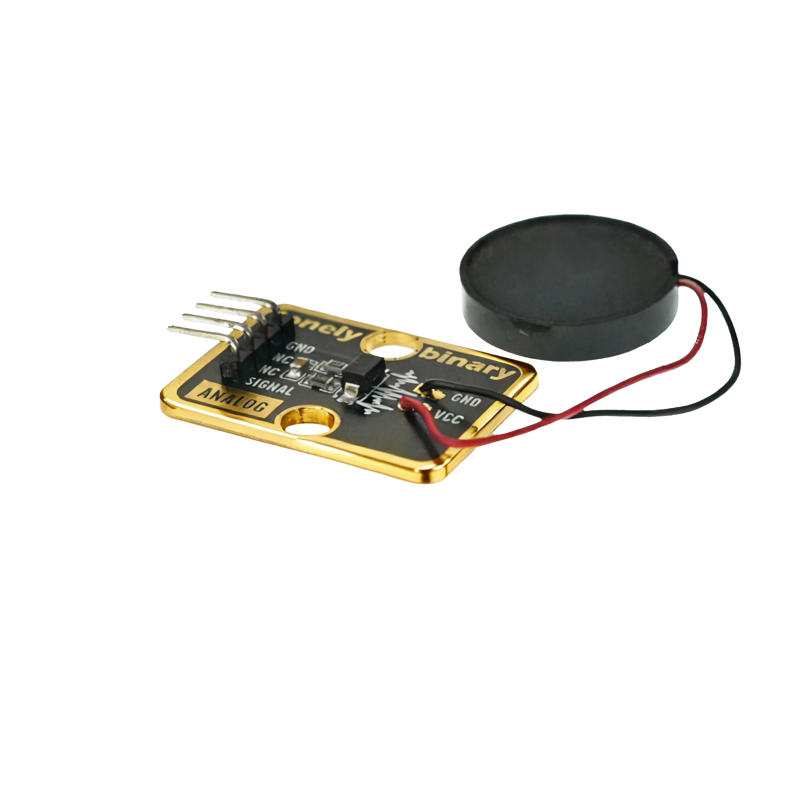

# Function

This module is a piezoelectric ceramic sensor module that can detect pressure or vibration. When pressure or vibration is applied, the module outputs a voltage signal. Can be used to make pressure detectors, vibration alarms, and other applications.

# Appearance

|  |  |  |
| :-----------------------: | :-----------------------: | :-----------------------: |
|          **Front**          |          **Back**          |          **Side**          |

The module has a piezoelectric ceramic sensor and a 4-pin header interface. Each pin can be identified by the silkscreen (text printed next to the pin).

# Pinout

- **GND** (negative): Like the negative terminal (-) of a battery, connect to the control board's GND
- **VCC** (positive): Like the positive terminal (+) of a battery, connect to the control board's 3.3V or 5V (this module supports both 3.3V and 5V)
- **NC** (no connection): No actual circuit connection, included for unified interface, can be left unconnected
- **SIGNAL** (signal output): Pressure detection output pin, connect to the control board's analog input pin (e.g. Arduino A0 or Pico GPIO 26)
  - Outputs voltage signal when pressure is applied
  - Higher pressure results in higher output voltage

# Features

- Pressure detection: Can detect pressure or vibration
- Analog output: Outputs continuously varying voltage signal
- Operating voltage: 3.3V or 5V

# Quick Wiring

1. GND → Control board GND
2. VCC → Control board 3.3V or 5V
3. SIGNAL → Control board analog input pin (use the pin defined in your program)
