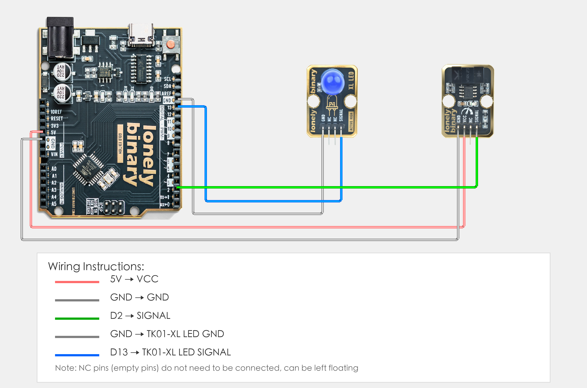

# Arduino Uno R3 Example

## Goal

This example shows how to use the TK61 - PHOTOELECTRIC SWITCH module on an Arduino Uno R3 to detect objects and control LED.

## Wiring



- **VCC** → Arduino Uno R3 5V
- **GND** → Arduino Uno R3 GND
- **SIGNAL** → Arduino Uno R3 D2
- **NC** → Leave unconnected

## Code

```cpp
// Pin number: change this to match your wiring
#define PHOTO_SWITCH_PIN 2  // Arduino digital pin connected to SIGNAL (e.g. D2)
#define LED_PIN 13          // LED pin (Arduino built-in LED on pin 13, or external LED)

void setup() {
  // Initialize pin modes
  pinMode(PHOTO_SWITCH_PIN, INPUT);   // Set photoelectric switch pin as input (to read detection state)
  pinMode(LED_PIN, OUTPUT);           // Set LED pin as output (to control LED on/off)
  
  // Start serial for debugging (9600 baud)
  Serial.begin(9600);
  
  Serial.println("Photoelectric switch program started");
  Serial.println("LED on when object blocks light, LED off when no object detected");
}

void loop() {
  // Read photoelectric switch state
  int switchState = digitalRead(PHOTO_SWITCH_PIN);  // Read sensor pin level: HIGH(1)=object detected, LOW(0)=no object
  
  // Control LED based on detection state
  if (switchState == HIGH) {
    // Object blocks light: LED on
    digitalWrite(LED_PIN, HIGH);
    Serial.println("Object blocks light - LED on");
  } else {
    // No object detected: LED off
    digitalWrite(LED_PIN, LOW);
    Serial.println("No object detected - LED off");
  }
  
  delay(100);  // Brief delay to avoid reading too fast
}
```

## Effect


## Code Walkthrough

**Lines 2–3: Pin definition**

```cpp
#define PHOTO_SWITCH_PIN 2  // Arduino digital pin connected to SIGNAL (e.g. D2)
#define LED_PIN 13          // LED pin (Arduino built-in LED on pin 13, or external LED)
```

- **`PHOTO_SWITCH_PIN`:** The Arduino digital pin connected to photoelectric switch SIGNAL. Change this if you use another pin.
- **`LED_PIN`:** The Arduino digital pin connected to LED (Arduino built-in LED on pin 13, or external LED).

**Lines 5–15: Initialization (setup function)**

```cpp
void setup() {
  // Initialize pin modes
  pinMode(PHOTO_SWITCH_PIN, INPUT);   // Set photoelectric switch pin as input (to read detection state)
  pinMode(LED_PIN, OUTPUT);           // Set LED pin as output (to control LED on/off)
  
  // Start serial for debugging (9600 baud)
  Serial.begin(9600);
  
  Serial.println("Photoelectric switch program started");
  Serial.println("LED on when object blocks light, LED off when no object detected");
}
```

- **`setup()`:** Runs once when the Arduino starts.
- **`pinMode(PHOTO_SWITCH_PIN, INPUT)`:** Set photoelectric switch pin as input to read detection state.
- **`pinMode(LED_PIN, OUTPUT)`:** Set LED pin as output to control LED on/off.
- **`Serial.begin(9600)`:** Start serial at 9600 baud.
- **`Serial.println(...)`:** Print program start message and instructions to Serial Monitor.

**Lines 17–33: Main loop (loop function)**

```cpp
void loop() {
  // Read photoelectric switch state
  int switchState = digitalRead(PHOTO_SWITCH_PIN);  // Read sensor pin level: HIGH(1)=object detected, LOW(0)=no object
  
  // Control LED based on detection state
  if (switchState == HIGH) {
    // Object blocks light: LED on
    digitalWrite(LED_PIN, HIGH);
    Serial.println("Object blocks light - LED on");
  } else {
    // No object detected: LED off
    digitalWrite(LED_PIN, LOW);
    Serial.println("No object detected - LED off");
  }
  
  delay(100);  // Brief delay to avoid reading too fast
}
```

- **`loop()`:** Runs repeatedly.
- **`digitalRead(PHOTO_SWITCH_PIN)`:** Read sensor pin level, HIGH(1) means object blocks light, LOW(0) means no object detected.
- **`if (switchState == HIGH)`:** Check if object blocks light; if detected, execute LED on operation.
- **`digitalWrite(LED_PIN, HIGH)`:** Output HIGH to turn LED on.
- **`digitalWrite(LED_PIN, LOW)`:** Output LOW to turn LED off.
- **`Serial.println(...)`:** Print detection state and LED status to Serial Monitor.
- **`delay(100)`:** Wait 100 milliseconds before reading again to avoid reading too fast and reduce CPU usage.
