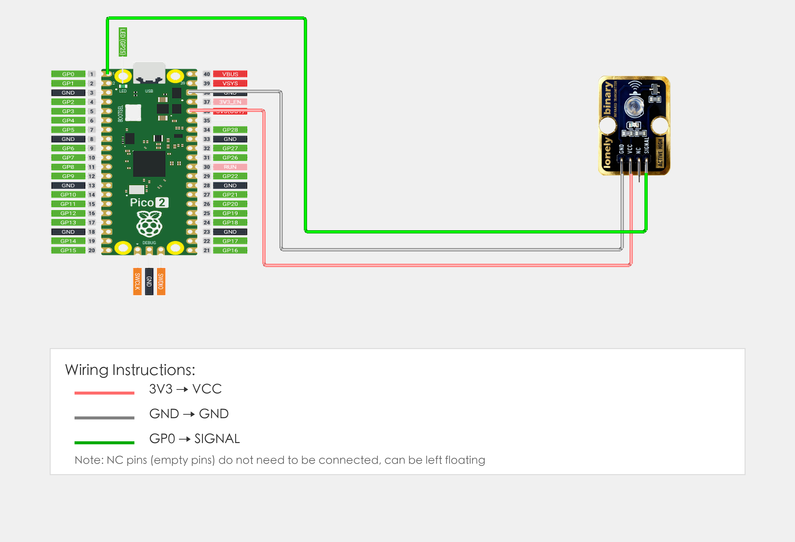

# Raspberry Pi Pico 2 Example

## Goal

This example shows how to use the TK63 - INFRARED TRANSMITTER module on a Raspberry Pi Pico 2 to transmit infrared signals.

## Wiring



## Code

```python
# Import required modules
from machine import Pin, PWM  # GPIO control and PWM
import time                   # For delay (time.sleep)

# Pin number: change this to match your wiring
IR_TX_PIN = 0  # GPIO connected to SIGNAL (e.g. GPIO 0)

# Create PWM object (for generating 38kHz frequency)
ir_tx = PWM(Pin(IR_TX_PIN))

# Set PWM frequency to 38kHz (common frequency for infrared remote control)
ir_tx.freq(38000)

print("Infrared transmitter program started")
print("Transmitting infrared signal...")

# Main loop: runs forever
while True:
    # Transmit infrared signal (38kHz modulation)
    # Set duty cycle to 50% (half of 65535)
    ir_tx.duty_u16(32767)  # 50% duty cycle
    time.sleep(0.1)        # Transmit for 100 milliseconds
    
    # Stop transmission
    ir_tx.duty_u16(0)      # 0% duty cycle, stop transmission
    time.sleep(1)          # Wait 1 second before transmitting again
    
    print("Infrared signal transmitted")
```

## Effect


## Code Walkthrough

**Lines 1–2: Imports**

```python
from machine import Pin, PWM  # GPIO control and PWM
import time                   # For delay (time.sleep)
```

- **`machine.Pin`:** Used to control Pico GPIO pins.
- **`machine.PWM`:** Used to control Pico PWM output.
- **`time`:** Provides `sleep()` and other time-related functions.

**Line 5: Pin definition**

```python
IR_TX_PIN = 0  # GPIO connected to SIGNAL (e.g. GPIO 0)
```

- **`IR_TX_PIN = 0`:** GPIO number for infrared transmitter SIGNAL. Change this if you use another pin.

**Lines 8–9: Create PWM object**

```python
ir_tx = PWM(Pin(IR_TX_PIN))
ir_tx.freq(38000)
```

- **`PWM(Pin(IR_TX_PIN))`:** Create PWM object for infrared transmitter pin.
- **`ir_tx.freq(38000)`:** Set PWM frequency to 38kHz (common frequency for infrared remote control).

**Lines 16–27: Main loop**

```python
while True:
    # Transmit infrared signal (38kHz modulation)
    # Set duty cycle to 50% (half of 65535)
    ir_tx.duty_u16(32767)  # 50% duty cycle
    time.sleep(0.1)        # Transmit for 100 milliseconds
    
    # Stop transmission
    ir_tx.duty_u16(0)      # 0% duty cycle, stop transmission
    time.sleep(1)          # Wait 1 second before transmitting again
    
    print("Infrared signal transmitted")
```

- **`while True`:** Infinite loop; the program keeps running.
- **`ir_tx.duty_u16(32767)`:** Set PWM duty cycle to 50% (32767 is half of 65535) to transmit infrared signal.
- **`ir_tx.duty_u16(0)`:** Set PWM duty cycle to 0% to stop infrared transmission.
- **`time.sleep(0.1)`:** Transmit for 100 milliseconds.
- **`time.sleep(1)`:** Wait 1 second before transmitting again.
- **`print(...)`:** Print infrared signal transmission message to terminal.
