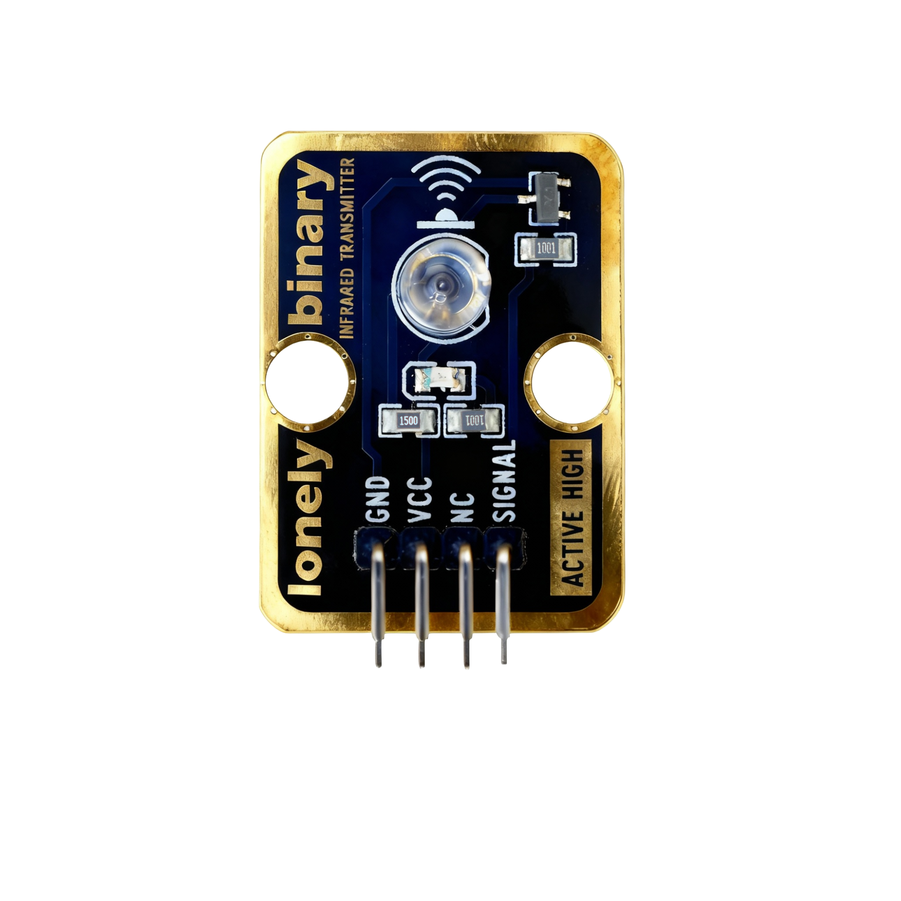
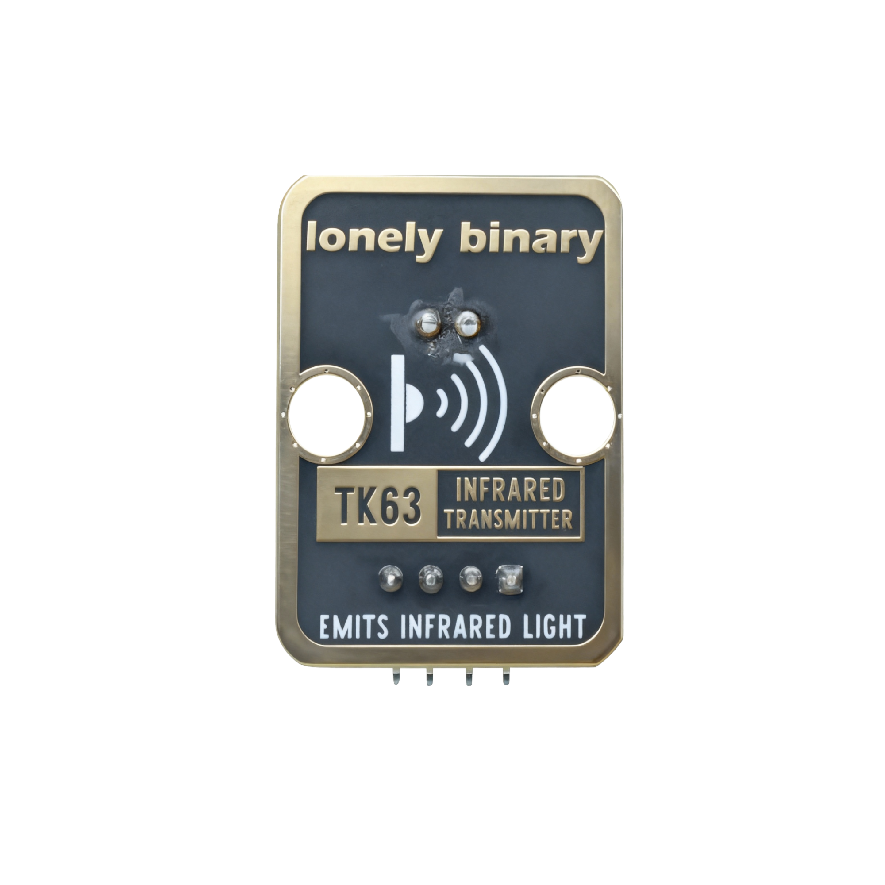

# Function

This module is an infrared transmitter module that can emit infrared light signals. Controlled through program, can emit infrared signals to control TVs, air conditioners, and other infrared devices. Can also be used with infrared receivers for communication.

# Appearance

|  |  |  |
| :-----------------------: | :-----------------------: | :-----------------------: |
|          **Front**          |          **Back**          |          **Side**          |

The module has an infrared LED and a 4-pin header interface. Each pin can be identified by the silkscreen (text printed next to the pin).

# Pinout

- **GND** (negative): Like the negative terminal (-) of a battery, connect to the control board's GND
- **VCC** (positive): Like the positive terminal (+) of a battery, connect to the control board's 3.3V or 5V (this module supports both 3.3V and 5V)
- **NC** (no connection): No actual circuit connection, included for unified interface, can be left unconnected
- **SIGNAL** (signal input): Pin to control infrared transmission, connect to the control board's digital pin (e.g. Arduino D3 or Pico GPIO 0)
  - Emits infrared light when HIGH (HIGH/1)
  - Does not emit when LOW (LOW/0)

# Features

- Infrared transmission: Emits invisible infrared light signals
- Operating voltage: 3.3V or 5V
- Requires modulation: Usually needs 38kHz carrier frequency for modulation
- Works with infrared receiver: Can be used with TK64 infrared receiver module

# Quick Wiring

1. GND → Control board GND
2. VCC → Control board 3.3V or 5V
3. SIGNAL → Control board digital pin (use the pin defined in your program)
