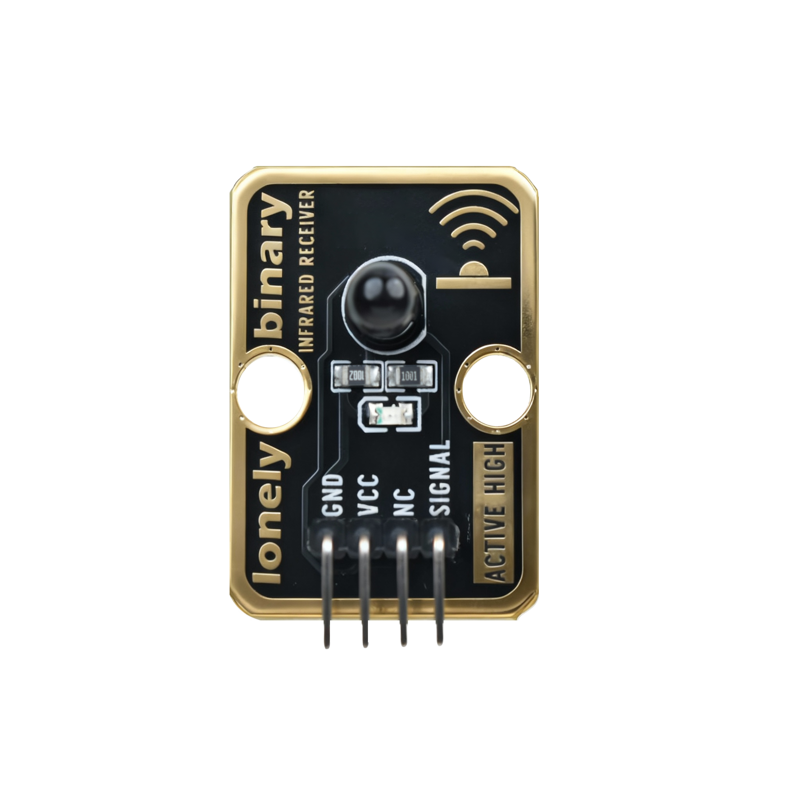

# Function

This module is an infrared receiver module that can receive infrared remote control signals. When receiving infrared signals, the module outputs decoded data. Can be used to make infrared remote receivers, infrared communication receivers, and other applications.

# Appearance

|  |  |  |
| :-----------------------: | :-----------------------: | :-----------------------: |
|          **Front**          |          **Back**          |          **Side**          |

The module has an infrared receiver element (such as VS1838B) and a 4-pin header interface. Each pin can be identified by the silkscreen (text printed next to the pin).

# Pinout

- **GND** (negative): Like the negative terminal (-) of a battery, connect to the control board's GND
- **VCC** (positive): Like the positive terminal (+) of a battery, connect to the control board's 3.3V or 5V (this module supports both 3.3V and 5V)
- **NC** (no connection): No actual circuit connection, included for unified interface, can be left unconnected
- **SIGNAL** (signal output): Infrared signal output pin, connect to the control board's digital pin (e.g. Arduino D2 or Pico GPIO 0)
  - Outputs decoded data when receiving infrared signal
  - Maintains HIGH when no signal received

# Features

- Infrared reception: Can receive 38kHz modulated infrared signals
- Automatic demodulation: Module internally automatically demodulates 38kHz carrier
- Operating voltage: 3.3V or 5V
- Works with infrared transmitter: Can be used with TK63 infrared transmitter module

# Quick Wiring

1. GND → Control board GND
2. VCC → Control board 3.3V or 5V
3. SIGNAL → Control board digital pin (use the pin defined in your program)
