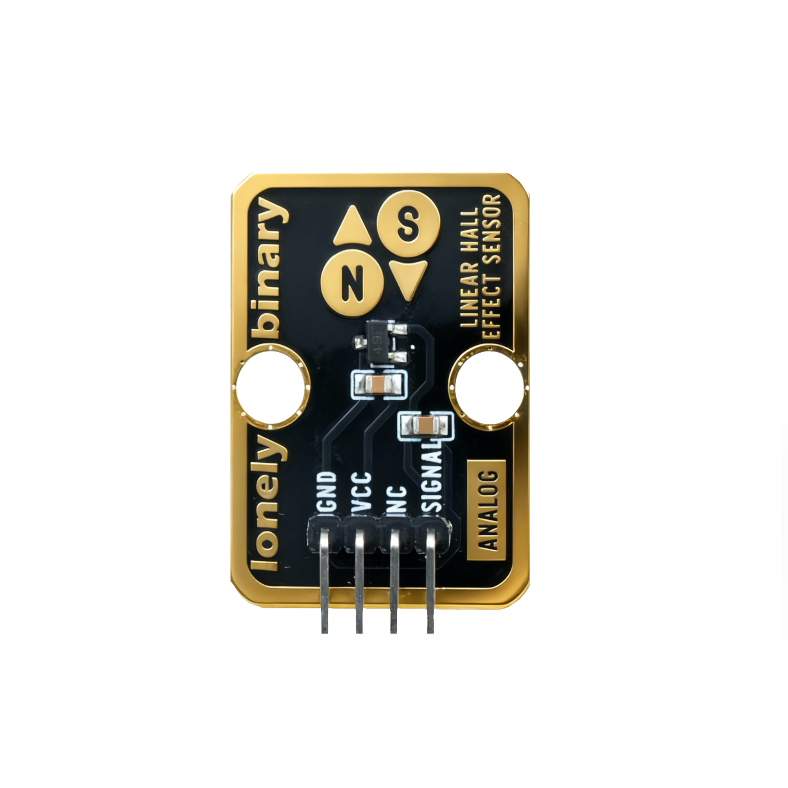
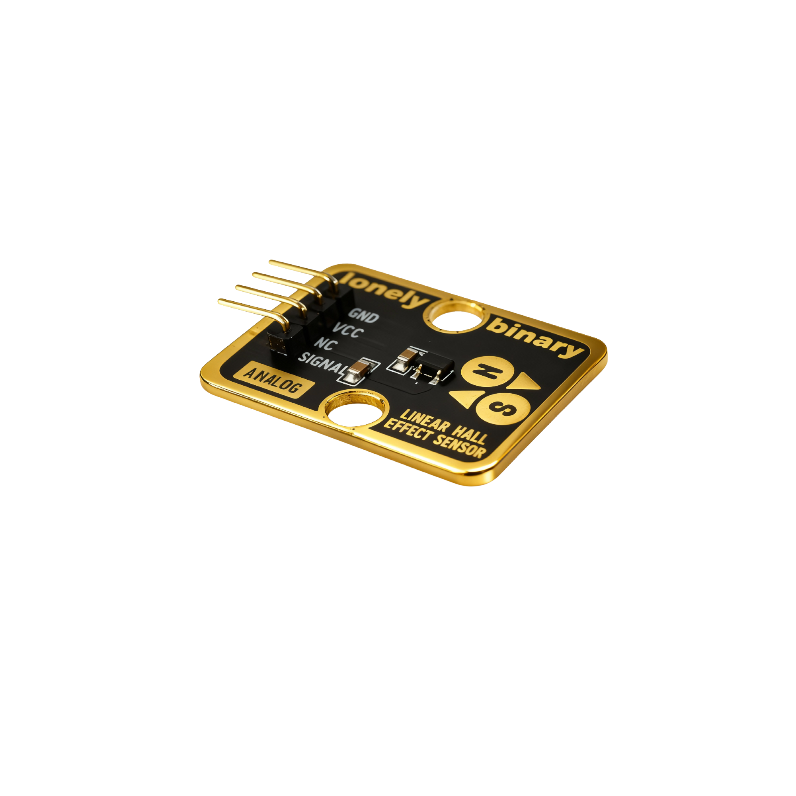

# Function

This module is a linear Hall effect sensor module that can detect magnetic field strength and magnetic polarity. When a magnetic field approaches, it outputs an analog voltage signal. The stronger the magnetic field, the higher the output voltage. Can be used to make magnetic field detectors, position detectors, and other applications.

# Appearance

|  |  |  |
| :-----------------------: | :-----------------------: | :-----------------------: |
|          **Front**          |          **Back**          |          **Side**          |

The module has a Hall sensor and a 4-pin header interface. Each pin can be identified by the silkscreen (text printed next to the pin).

# Pinout

- **GND** (negative): Like the negative terminal (-) of a battery, connect to the control board's GND
- **VCC** (positive): Like the positive terminal (+) of a battery, connect to the control board's 3.3V or 5V (this module supports both 3.3V and 5V)
- **NC** (no connection): No actual circuit connection, included for unified interface, can be left unconnected
- **SIGNAL** (signal output): Magnetic field strength output pin, connect to the control board's analog input pin (e.g. Arduino A0 or Pico GPIO 26)
  - Stronger magnetic field results in higher output voltage
  - Weaker magnetic field results in lower output voltage
  - Can detect magnetic poles (N pole and S pole output different voltage values)

# Features

- Magnetic field detection: Can detect magnetic field strength and polarity
- Analog output: Outputs continuously varying voltage signal
- Operating voltage: 3.3V or 5V
- High sensitivity: Can detect weak magnetic fields

# Quick Wiring

1. GND → Control board GND
2. VCC → Control board 3.3V or 5V
3. SIGNAL → Control board analog input pin (use the pin defined in your program)
