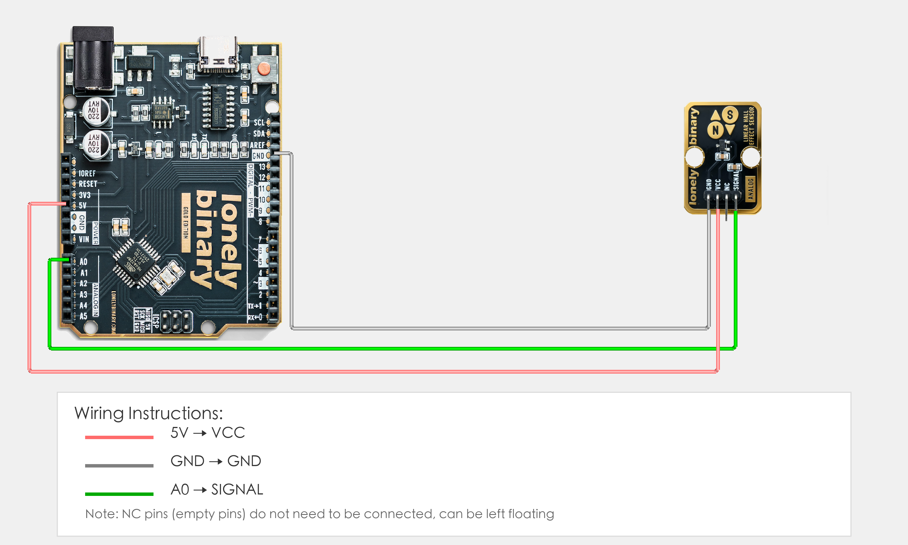

# Arduino Uno R3 Example

## Goal

This example shows how to use the TK70 - LINEAR HALL EFFECT SENSOR module on an Arduino Uno R3 to read magnetic field strength.

## Wiring



- **VCC** → Arduino Uno R3 5V
- **GND** → Arduino Uno R3 GND
- **SIGNAL** → Arduino Uno R3 A0
- **NC** → Leave unconnected

## Code

```cpp
// Pin number: change this to match your wiring
#define HALL_PIN A0  // Arduino analog input pin connected to SIGNAL (e.g. A0)

void setup() {
  // Initialize pin mode
  pinMode(HALL_PIN, INPUT);   // Set Hall sensor pin as input (to read analog value)
  
  // Start serial for debugging (9600 baud)
  Serial.begin(9600);
  
  Serial.println("Linear Hall sensor program started");
  Serial.println("Reading magnetic field strength value and output via serial");
}

void loop() {
  // Read Hall sensor analog value (0-1023)
  int sensorValue = analogRead(HALL_PIN);  // Read sensor pin analog value: 0=no magnetic field, 1023=strong magnetic field
  
  // Convert analog value to voltage value (0-5V)
  float voltage = sensorValue * (5.0 / 1023.0);
  
  // Output strength value
  Serial.print("Magnetic field strength: ");
  Serial.print(sensorValue);
  Serial.print(" | Voltage: ");
  Serial.print(voltage, 3);
  Serial.println("V");
  
  delay(100);  // Brief delay to avoid reading too fast
}
```

## Effect


## Code Walkthrough

**Line 2: Pin definition**

```cpp
#define HALL_PIN A0  // Arduino analog input pin connected to SIGNAL (e.g. A0)
```

- **`HALL_PIN`:** The Arduino analog input pin connected to linear Hall sensor SIGNAL. Change this if you use another pin.

**Lines 4–13: Initialization (setup function)**

```cpp
void setup() {
  // Initialize pin mode
  pinMode(HALL_PIN, INPUT);   // Set Hall sensor pin as input (to read analog value)
  
  // Start serial for debugging (9600 baud)
  Serial.begin(9600);
  
  Serial.println("Linear Hall sensor program started");
  Serial.println("Reading magnetic field strength value and output via serial");
}
```

- **`setup()`:** Runs once when the Arduino starts.
- **`pinMode(HALL_PIN, INPUT)`:** Set HALL_PIN as INPUT mode for reading analog value.
- **`Serial.begin(9600)`:** Start serial at 9600 baud.
- **`Serial.println(...)`:** Print program start message and instructions to Serial Monitor.

**Lines 15–31: Main loop (loop function)**

```cpp
void loop() {
  // Read Hall sensor analog value (0-1023)
  int sensorValue = analogRead(HALL_PIN);  // Read sensor pin analog value: 0=no magnetic field, 1023=strong magnetic field
  
  // Convert analog value to voltage value (0-5V)
  float voltage = sensorValue * (5.0 / 1023.0);
  
  // Output strength value
  Serial.print("Magnetic field strength: ");
  Serial.print(sensorValue);
  Serial.print(" | Voltage: ");
  Serial.print(voltage, 3);
  Serial.println("V");
  
  delay(100);  // Brief delay to avoid reading too fast
}
```

- **`loop()`:** Runs repeatedly.
- **`analogRead(HALL_PIN)`:** Read HALL_PIN analog value (0-1023), 0 means no magnetic field, 1023 means strong magnetic field (linear Hall sensor can detect magnetic field strength, not just presence).
- **`sensorValue * (5.0 / 1023.0)`:** Convert analog value (0-1023) to voltage value (0-5V).
- **`Serial.print(...)` and `Serial.println(...)`:** Print magnetic field strength and voltage value to Serial Monitor (voltage value with 3 decimal places).
- **`delay(100)`:** Wait 100 milliseconds before reading again to avoid reading too fast and control output frequency.
