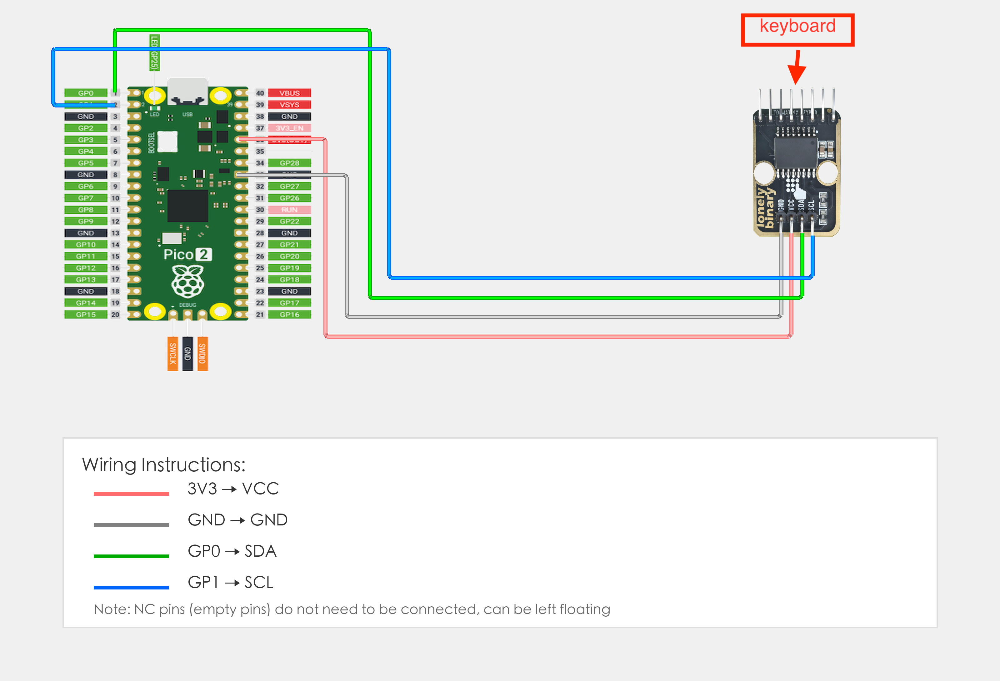
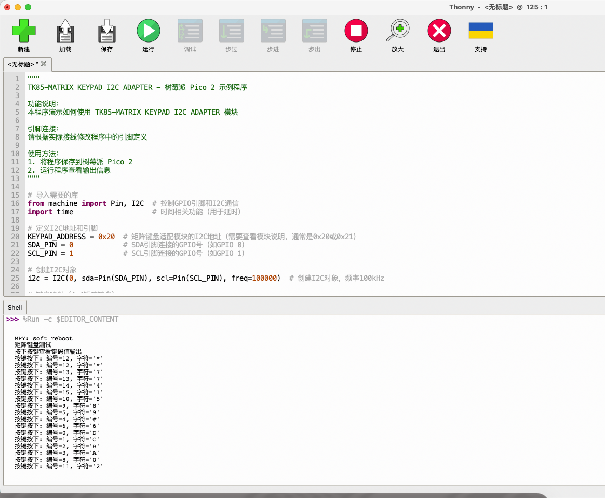

# Raspberry Pi Pico 2 Example

## Goal

This example shows how to use the TK85 - MATRIX KEYPAD I2C ADAPTER module on a Raspberry Pi Pico 2 to read keypad input.

## Wiring



## Code

```python
# Import required modules
from machine import Pin, I2C  # GPIO control and I2C communication
import time                   # For delay (time.sleep)

# Define I2C address and pins
KEYPAD_ADDRESS = 0x20  # I2C address of matrix keypad adapter module (check module documentation, usually 0x20 or 0x21)
SDA_PIN = 0            # GPIO connected to SDA (e.g. GPIO 0)
SCL_PIN = 1            # GPIO connected to SCL (e.g. GPIO 1)

# Create I2C object
i2c = I2C(0, sda=Pin(SDA_PIN), scl=Pin(SCL_PIN), freq=100000)  # Create I2C object, frequency 100kHz

# Keypad mapping (4x4 matrix keypad)
keymap = "DCBA#9630852*741"

# Debounce variables
stable_key = 16   # 16 = NoKey
stable_count = 0
last_keypad_key = 16

def read_keypad():
    
    current_key = 16  # 0..15 or 16(NoKey)
    found = False
    
    # Mode A: rows = lower 4 bits (P0..P3), columns = upper 4 bits (P4..P7)
    for col in range(4):
        if found:
            break
        # Pull all high (quasi-input), pull one column low
        out = 0xFF & ~(1 << (4 + col))
        try:
            i2c.writeto(KEYPAD_ADDRESS, bytes([out]))
            time.sleep_us(200)
            
            data = i2c.readfrom(KEYPAD_ADDRESS, 1)
            raw = data[0]
            rows = raw & 0x0F
            if rows != 0x0F:
                for row in range(4):
                    if not (rows & (1 << row)):
                        current_key = row * 4 + col
                        found = True
                        break
        except:
            continue
    
    # Mode B: rows = upper 4 bits (P4..P7), columns = lower 4 bits (P0..P3)
    if not found:
        for col in range(4):
            if found:
                break
            out = 0xFF & ~(1 << col)
            try:
                i2c.writeto(KEYPAD_ADDRESS, bytes([out]))
                time.sleep_us(200)
                
                data = i2c.readfrom(KEYPAD_ADDRESS, 1)
                raw = data[0]
                rows = (raw >> 4) & 0x0F
                if rows != 0x0F:
                    for row in range(4):
                        if not (rows & (1 << row)):
                            current_key = row * 4 + col
                            found = True
                            break
            except:
                continue
    
    # Restore all high
    try:
        i2c.writeto(KEYPAD_ADDRESS, bytes([0xFF]))
    except:
        pass
    
    # Debounce: need to read the same key twice consecutively to consider it pressed
    global stable_key, stable_count, last_keypad_key
    
    if current_key < 16:
        if current_key == stable_key:
            if stable_count < 255:
                stable_count += 1
        else:
            stable_key = current_key
            stable_count = 1

        if stable_count >= 2 and current_key != last_keypad_key:
            last_keypad_key = current_key
            return current_key
    else:
        stable_key = 16
        stable_count = 0
        if last_keypad_key != 16:
            last_keypad_key = 16
    
    return -1

print("Matrix keypad test")
print("Press keys to see key code output")

# Main loop: runs forever
while True:
    key = read_keypad()
    
    if key >= 0:
        print("Key pressed: number={}, character='{}'".format(key, keymap[key]))
    
    time.sleep_ms(50)
```

## Effect





## Code Walkthrough

**Lines 1–2: Imports**

```python
from machine import Pin, I2C  # GPIO control and I2C communication
import time                   # For delay (time.sleep)
```

- **`machine.Pin`:** Used to control Pico GPIO pins.
- **`machine.I2C`:** Used for I2C communication.
- **`time`:** Provides `sleep()` and other time-related functions.

**Lines 5–7: Pin definition**

```python
KEYPAD_ADDRESS = 0x20  # I2C address of matrix keypad adapter module (check module documentation, usually 0x20 or 0x21)
SDA_PIN = 0            # GPIO connected to SDA (e.g. GPIO 0)
SCL_PIN = 1            # GPIO connected to SCL (e.g. GPIO 1)
```

- **`SDA_PIN = 0`:** GPIO number for SDA. Change this if you use another pin.
- **`SCL_PIN = 1`:** GPIO number for SCL. Change this if you use another pin.

**Lines 15–31: Main loop**

```python
while True:
    key = read_keypad()
    if key >= 0:
        print("Key pressed: number={}, character='{}'".format(key, keymap[key]))
    time.sleep_ms(50)
```

- **`while True`:** Infinite loop; the program keeps running.
- **`read_keypad()`:** Call function to read matrix keypad keys, returns key number (0-15) or -1 (no key).
- **`if key >= 0`:** Check if key press detected.
- **`keymap[key]`:** Get corresponding character based on key number.
- **`print(...)`:** Print key number and character to terminal.
- **`time.sleep_ms(50)`:** Wait 50 milliseconds before reading again to control output frequency.
