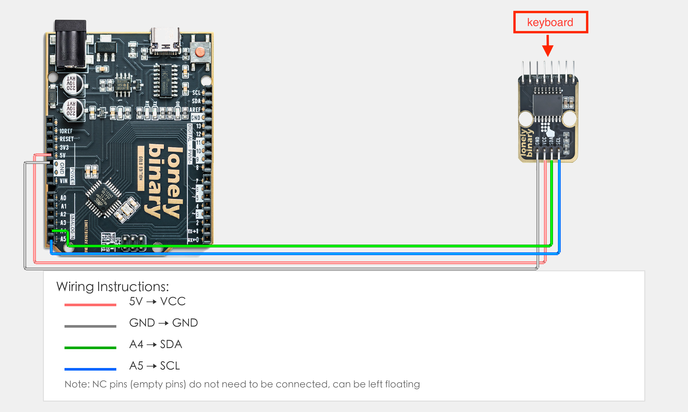

# Arduino Uno R3 Example

## Goal

This example shows how to use the TK85 - MATRIX KEYPAD I2C ADAPTER module on an Arduino Uno R3 to read keypad input.

## Wiring



- **VCC** → Arduino Uno R3 5V
- **GND** → Arduino Uno R3 GND
- **SDA** → Arduino Uno R3 A4 (I2C data line)
- **SCL** → Arduino Uno R3 A5 (I2C clock line)
- **NC** → Leave unconnected

# I2C Scan

### I2C Address Scan

``` cpp
#include <Wire.h>

void setup()
{
  Serial.begin(9600);
  
  while (!Serial);             // Leonardo: wait for serial monitor
  Serial.println("\nI2C Scanner");
}


void loop()
{
  byte error, address;
  int nDevices;

  Serial.print("SDA: ");
  Serial.print(SDA);
  Serial.print(",  SCL: ");
  Serial.println(SCL);
  Serial.println("Scanning...");

  nDevices = 0;
  for(address = 1; address < 127; address++ ) 
  {
    // The i2c_scanner uses the return value of
    // the Write.endTransmisstion to see if
    // a device did acknowledge to the address.
    Wire.beginTransmission(address);
    error = Wire.endTransmission();

    if (error == 0)
    {
      Serial.print("I2C device found at address 0x");
      if (address<16) 
        Serial.print("0");
      Serial.print(address,HEX);
      Serial.println("  !");

      nDevices++;
    }
    else if (error==4) 
    {
      Serial.print("Unknown error at address 0x");
      if (address<16) 
        Serial.print("0");
      Serial.println(address,HEX);
    }    
  }
  if (nDevices == 0)
    Serial.println("No I2C devices found\n");
  else
    Serial.println("done\n");

  delay(5000);           // wait 5 seconds for next scan
}
```


## Sample Code

#### Option 1: Using Arduino Library Manager (Easiest)

1. Open the Arduino IDE.
2. Go to **Sketch > Include Library > Manage Libraries**.
3. Search for **"I2CKeyPad" (by Rob Tillaart)**.
4. Click **Install** on the result.
5. Restart the IDE if prompted.

#### Option 2: Manual Install from GitHub

1. Go to [https://github.com/RobTillaart/I2CKeyPad](https://github.com/RobTillaart/I2CKeyPad) and download the ZIP file (click **Code > Download ZIP**).
2. In Arduino IDE, go to **Sketch > Include Library > Add .ZIP Library**.
3. Select the downloaded ZIP file.
4. Restart the IDE.

Due to differences in the hardware layout between the Soft and Heavy Duty matrix keypads, you'll need to adjust the keymap at the start of your code.

- For the Soft keypad: char keymap[19] = "DCBA#9630852*741NF";
- For the Heavy Duty keypad: char keymap[19] = "D#0*C987B654A321NF";


``` cpp
#include "Wire.h"
#include "I2CKeyPad.h"

const uint8_t KEYPAD_ADDRESS = 0x20;

I2CKeyPad keyPad(KEYPAD_ADDRESS);

//Heavy Duty Keypad
char keymap[19] = "D#0*C987B654A321NF";  //  N = NoKey, F = Fail

//Soft Keypad
//char keymap[19] = "DCBA#9630852*741NF";  //  N = NoKey, F = Fail

void setup()
{
  delay(2000);
  Serial.begin(9600);
  Serial.println();
  Serial.println(__FILE__);
  Serial.print("I2C_KEYPAD_LIB_VERSION: ");
  Serial.println(I2C_KEYPAD_LIB_VERSION);
  Serial.println();

  Wire.begin(SDA,SCL);
  Wire.setClock(400000);

  if (keyPad.begin() == false)
  {
    Serial.println("\nERROR: cannot communicate to keypad.\nPlease reboot.\n");
    while (1);
  }

  keyPad.loadKeyMap(keymap);
}


void loop()
{
  if (keyPad.isPressed())
  {
    char ch = keyPad.getChar();     //  note we want the translated char
    int key = keyPad.getLastKey();
    Serial.print(key);
    Serial.print(" \t");
    Serial.println(ch);
    delay(100);
  }
}

```


## Effect


## Code Walkthrough

**Includes and address**

- **`Wire.h`** — I2C communication. **`I2CKeyPad.h`** — keypad library.
- **`KEYPAD_ADDRESS = 0x20`** — I2C address of the keypad (use I2C scan if different).
- **`keyPad(KEYPAD_ADDRESS)`** — keypad object.
- **`keymap[19]`** — maps key index to character. Use the line that matches your keypad (Heavy Duty or Soft).

**setup()**

- **`Serial.begin(9600)`** — for printing to Serial Monitor.
- **`Wire.begin(SDA, SCL)`** — start I2C on A4 (SDA) and A5 (SCL).
- **`Wire.setClock(400000)`** — 400 kHz I2C speed.
- **`keyPad.begin()`** — init keypad; stops in a loop if it fails.
- **`keyPad.loadKeyMap(keymap)`** — load the keymap so keys give the right characters.

**loop()**

- **`keyPad.isPressed()`** — true when a key is pressed.
- **`keyPad.getChar()`** — the character for that key (from keymap).
- **`keyPad.getLastKey()`** — key index (0–15).
- **`Serial.print(key)` / `Serial.println(ch)`** — print index and character.
- **`delay(100)`** — short debounce so one press isn’t read many times.
