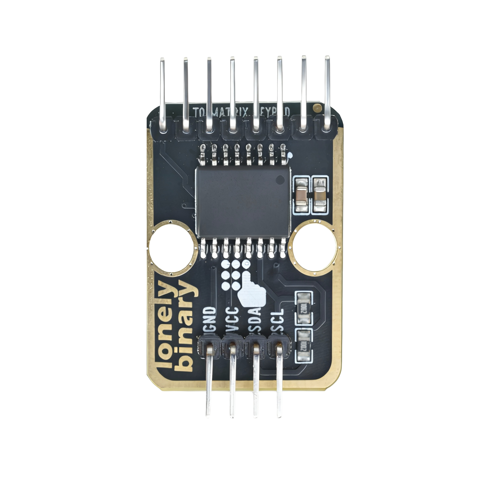
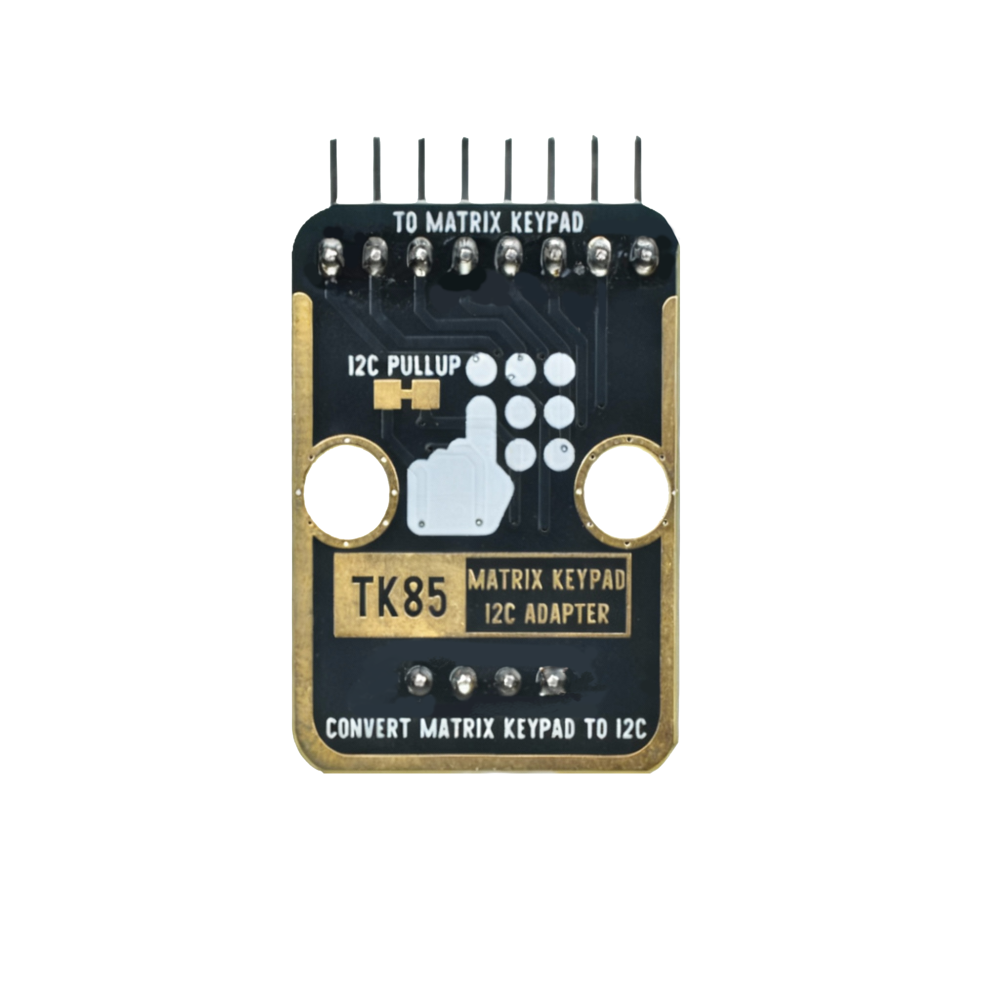
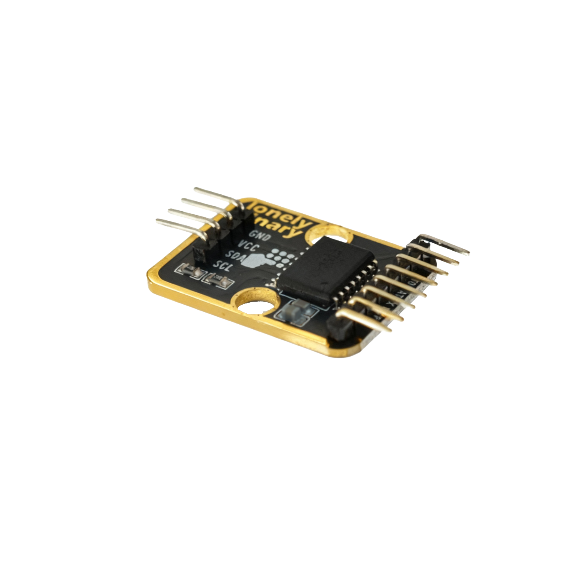

# Matrix Keypad

A matrix keypad is a grid of buttons (like on a phone or calculator) that saves wiring by using rows and columns instead of separate wires for each key.

### How It Works Simply:

- **Setup**: Keys are arranged in rows (horizontal) and columns (vertical). For a 4x4 keypad (16 keys), you only need 8 wires: 4 for rows, 4 for columns.
- **Press Detection**: A controller (like Arduino) scans by sending a signal down one row at a time and checking columns for a connection.
  - Press a key? It connects its row and column, so the controller detects which one.

It's like a crossword puzzle: rows and columns intersect at keys, and scanning finds the "word" (pressed key). For projects, plug it in and use simple code to read inputs!

# Lonely Binary Matrix Keypad I2C Adapter

Usually, a standard 4x4 matrix keypad requires 8 GPIO pins. We provide an I2C adapter, which means you can connect this keypad to the I2C bus using only two GPIO pins. Since it uses the I2C bus, you can add more sensors to the same bus. What a space saver!

The Lonely Binary Matrix Keypad I2C adapter includes built-in pull-up resistors for both SDA and SCL lines, as required by the I2C bus. If you add more sensors that also have their own built-in pull-up resistors, you can easily disable the keypad's pull-ups by cutting the I2C PULL-UP pad on the back.

You can also change the I2C address by shorting the A0, A1, and/or A2 pads on the back.

# Appearance

|  |  |  |
| :------------------------: | :------------------------: | :------------------------: |
| **Front** | **Back** | **Side** |

The module has a matrix keypad interface and a 4-pin header interface. Each pin can be identified by the silkscreen (text printed next to the pin).

# Pinout

- **GND** (negative): Like the negative terminal (-) of a battery, connect to the control board's GND
- **VCC** (positive): Like the positive terminal (+) of a battery, connect to the control board's 3.3V or 5V (this module supports both 3.3V and 5V)
- **SDA** (data line): I2C data line, connect to the control board's SDA pin (e.g. Arduino A4 or Pico GPIO 0)
- **SCL** (clock line): I2C clock line, connect to the control board's SCL pin (e.g. Arduino A5 or Pico GPIO 1)

# Features

- I2C interface: Uses I2C communication protocol, only needs 2 wires
- Saves pins: Does not require multiple digital pins
- Operating voltage: 3.3V or 5V
- Supports multiple matrix keypads: 4x4, 3x4, etc.

# Quick Wiring

1. GND → Control board GND
2. VCC → Control board 3.3V or 5V
3. SDA → Control board SDA pin
4. SCL → Control board SCL pin

