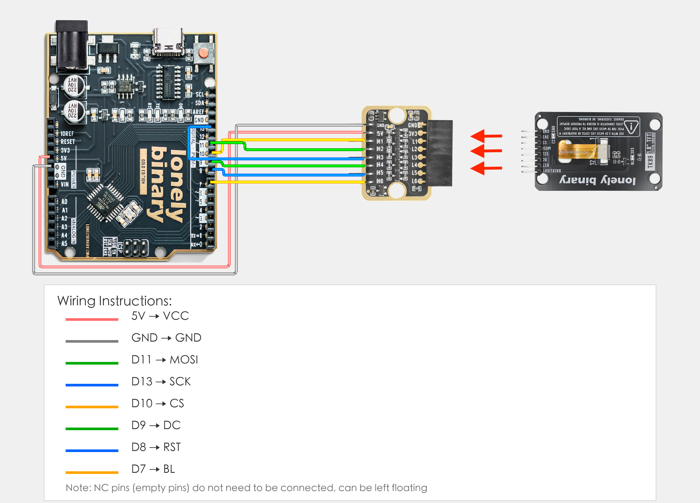

# Arduino Uno R3 Example

## Goal

This example shows how to use the TK89 - 1.8INCH TFT ST7735 module on an Arduino Uno R3 to display graphics and text.

## Wiring



⚠️ **Important Warning:** Arduino Uno R3 is a 5V MCU, while this TFT screen module's signal pins are 3.3V level. Must use TK97 logic level converter module for level conversion, otherwise the screen may be damaged!

- **VCC** → TK97 logic level converter module → 3.3V (must use 3.3V, provided through TK97)
- **GND** → Arduino Uno R3 GND
- **CS** → TK97 logic level converter module → Arduino Uno R3 D10 (chip select pin)
- **DC** → TK97 logic level converter module → Arduino Uno R3 D9 (data/command selection pin)
- **RST** → TK97 logic level converter module → Arduino Uno R3 D8 (reset pin)
- **BL** → TK97 logic level converter module → Arduino Uno R3 D7 (backlight control pin)
- **MOSI** → TK97 logic level converter module → Arduino Uno R3 D11 (SPI data, hardware SPI)
- **SCK** → TK97 logic level converter module → Arduino Uno R3 D13 (SPI clock, hardware SPI)
- **NC** → Leave unconnected

## Code

```cpp
#include <Adafruit_GFX.h>
#include <Adafruit_ST7735.h>
#include <SPI.h>

// Pin number: change these to match your wiring
#define TFT_CS   10  // CS pin (chip select)
#define TFT_DC   9   // DC pin (data/command selection)
#define TFT_RST  8   // RST pin (reset)
#define TFT_BL   7   // BL pin (backlight control)

// Create TFT display object (using hardware SPI)
Adafruit_ST7735 tft = Adafruit_ST7735(TFT_CS, TFT_DC, TFT_RST);

// ==================== Test Functions ====================

// Test: Fill screen
void testFillScreen() {
  Serial.println("Test: Fill screen");
  tft.fillScreen(ST77XX_BLACK);
  delay(500);
  tft.fillScreen(ST77XX_RED);
  delay(500);
  tft.fillScreen(ST77XX_GREEN);
  delay(500);
  tft.fillScreen(ST77XX_BLUE);
  delay(500);
  tft.fillScreen(ST77XX_WHITE);
  delay(500);
}

// Test: Text display
void testText() {
  Serial.println("Test: Text display");
  tft.fillScreen(ST77XX_BLACK);
  tft.setCursor(0, 0);
  tft.setTextColor(ST77XX_WHITE);
  tft.setTextSize(2);
  tft.println("SPI LCD Test");
  
  tft.setTextColor(ST77XX_RED);
  tft.setTextSize(1);
  tft.println("RESOLUTION:128x160");
  tft.println("DRIVER IC:ST7735");
  tft.println("Interface: SPI");
  tft.println("Support rotation");
  
  delay(2000);
}

// Test: Color display
void testColors() {
  Serial.println("Test: Color display");
  tft.fillScreen(ST77XX_BLACK);
  
  uint16_t colors[] = {
    ST77XX_RED, ST77XX_GREEN, ST77XX_BLUE,
    ST77XX_YELLOW, ST77XX_MAGENTA, ST77XX_CYAN, ST77XX_WHITE
  };
  
  int w = tft.width() / 4;
  int h = tft.height() / 2;
  
  for (int i = 0; i < 4; i++) {
    for (int j = 0; j < 2; j++) {
      int idx = i + j * 4;
      if (idx < 7) {
        tft.fillRect(i * w, j * h, w, h, colors[idx]);
      }
    }
  }
  
  delay(2000);
}

// Test: Line drawing
void testLines() {
  Serial.println("Test: Line drawing");
  tft.fillScreen(ST77XX_BLACK);
  
  for (int i = 0; i < tft.width(); i += 10) {
    tft.drawLine(0, 0, i, tft.height() - 1, ST77XX_RED);
    delay(10);
  }
  for (int i = 0; i < tft.height(); i += 10) {
    tft.drawLine(0, 0, tft.width() - 1, i, ST77XX_GREEN);
    delay(10);
  }
  
  delay(1000);
}

// Test: Circle drawing
void testCircles() {
  Serial.println("Test: Circle drawing");
  tft.fillScreen(ST77XX_BLACK);
  
  int centerX = tft.width() / 2;
  int centerY = tft.height() / 2;
  
  int maxR = (centerX < centerY) ? centerX : centerY;
  for (int r = 5; r < maxR; r += 5) {
    tft.drawCircle(centerX, centerY, r, ST77XX_BLUE);
    delay(50);
  }
  
  delay(1000);
}

// Test: Rectangle drawing
void testRectangles() {
  Serial.println("Test: Rectangle drawing");
  tft.fillScreen(ST77XX_BLACK);
  
  int maxSize = (tft.width() < tft.height()) ? tft.width() : tft.height();
  for (int i = 0; i < maxSize / 2; i += 5) {
    tft.drawRect(i, i, tft.width() - 2 * i, tft.height() - 2 * i, ST77XX_YELLOW);
    delay(50);
  }
  
  delay(1000);
}

// Test: Screen rotation
void testRotation() {
  Serial.println("Test: Screen rotation");
  
  for (uint8_t rotation = 0; rotation < 4; rotation++) {
    tft.setRotation(rotation);
    tft.fillScreen(ST77XX_BLACK);
    tft.setCursor(10, 10);
    tft.setTextColor(ST77XX_WHITE);
    tft.setTextSize(2);
    tft.print("Rotation ");
    tft.println(rotation);
    delay(2000);
  }
  
  // Restore default direction
  tft.setRotation(0);
}

// Test: Gradient effect
void testGradient() {
  Serial.println("Test: Gradient effect");
  tft.fillScreen(ST77XX_BLACK);
  
  for (int y = 0; y < tft.height(); y++) {
    uint16_t color = tft.color565(0, (y * 255) / tft.height(), 255 - (y * 255) / tft.height());
    tft.drawFastHLine(0, y, tft.width(), color);
  }
  
  delay(2000);
}

// Display information page
void displayInfo() {
  tft.fillScreen(ST77XX_BLACK);
  tft.setCursor(0, 0);
  tft.setTextColor(ST77XX_WHITE);
  tft.setTextSize(1);
  
  tft.println("SPI LCD Test Program");
  tft.println("================");
  tft.print("Width: ");
  tft.println(tft.width());
  tft.print("Height: ");
  tft.println(tft.height());
  tft.println("");
  tft.println("Tests:");
  tft.println("1. Fill Screen");
  tft.println("2. Text Display");
  tft.println("3. Colors");
  tft.println("4. Lines");
  tft.println("5. Circles");
  tft.println("6. Rectangles");
  tft.println("7. Rotation");
  tft.println("8. Gradient");
  
  delay(3000);
}

// ==================== Initialization ====================
void setup() {
  // Initialize serial communication
  Serial.begin(115200);
  delay(1000);
  
  Serial.println("========================================");
  Serial.println("TK89-1.8INCH TFT ST7735 Test Program");
  Serial.println("Driver IC: ST7735/ST7735S");
  Serial.println("Resolution: 128x160");
  Serial.println("Using Adafruit ST7735 Library");
  Serial.println("========================================");
  
  // Initialize backlight
  pinMode(TFT_BL, OUTPUT);
  digitalWrite(TFT_BL, HIGH);  // Turn on backlight
  
  // Initialize LCD
  Serial.println("Initializing LCD...");
  
  // Reset screen first
  pinMode(TFT_RST, OUTPUT);
  digitalWrite(TFT_RST, LOW);
  delay(10);
  digitalWrite(TFT_RST, HIGH);
  delay(120);
  
  // ST7735 initialization (128x160)
  Serial.println("Initializing ST7735 screen (128x160)...");
  tft.initR(INITR_BLACKTAB);  // If screen is white, try INITR_GREENTAB or INITR_REDTAB
  tft.setRotation(0);  // Set rotation direction: 0=normal, 1=90°, 2=180°, 3=270°
  
  // Set column and row offset (if library supports, fixes display position offset)
  // This setting is important if screen is white or not displaying!
  #if defined(ADAFRUIT_ST77XX_H)
    tft.setColRowStart(0, 0);  // If display position is wrong, try (2, 0), (0, 1), (2, 1), etc.
  #endif
  
  // If screen is white, try the following methods:
  // 1. Try different initialization parameters: INITR_BLACKTAB, INITR_GREENTAB, INITR_REDTAB
  // 2. Try different offsets: setColRowStart(2, 0), setColRowStart(0, 1), etc.
  
  // Test: Fill a color first to see if there's a response
  tft.fillScreen(ST77XX_RED);
  delay(500);
  tft.fillScreen(ST77XX_BLACK);
  
  Serial.println("LCD initialization complete");
  
  // Display information
  displayInfo();
  
  Serial.println("Starting tests...");
}

// ==================== Main Loop ====================
void loop() {
  // Run various tests
  testFillScreen();
  testText();
  testColors();
  testLines();
  testCircles();
  testRectangles();
  testRotation();
  testGradient();
  
  // Finally display information
  displayInfo();
  
  Serial.println("Test cycle complete, restarting...");
  delay(2000);
}
```

## Effect


## Code Walkthrough

**Lines 1–3: Include libraries**

```cpp
#include <Adafruit_GFX.h>
#include <Adafruit_ST7735.h>
#include <SPI.h>
```

- **`#include <Adafruit_GFX.h>`:** Include Adafruit graphics library, provides basic graphics drawing functions (need to install Adafruit GFX library first).
- **`#include <Adafruit_ST7735.h>`:** Include ST7735 TFT screen driver library (need to install Adafruit ST7735 library first).
- **`#include <SPI.h>`:** Include Arduino SPI communication library for hardware SPI communication (built-in with Arduino).

**Lines 5–8: Pin definition**

```cpp
// Pin number: change these to match your wiring
#define TFT_CS   10  // CS pin (chip select)
#define TFT_DC   9   // DC pin (data/command selection)
#define TFT_RST  8   // RST pin (reset)
#define TFT_BL   7   // BL pin (backlight control)
```

- **`TFT_CS`:** Chip select pin connected to Arduino D10 (hardware SPI CS pin).
- **`TFT_DC`:** Data/command selection pin connected to Arduino D9.
- **`TFT_RST`:** Reset pin connected to Arduino D8.
- **`TFT_BL`:** Backlight control pin connected to Arduino D7.

**Line 10: Create TFT object**

```cpp
// Create TFT display object (using hardware SPI)
Adafruit_ST7735 tft = Adafruit_ST7735(TFT_CS, TFT_DC, TFT_RST);
```

- **`Adafruit_ST7735 tft = Adafruit_ST7735(TFT_CS, TFT_DC, TFT_RST)`:** Create TFT display object, uses hardware SPI communication (MOSI=D11, SCK=D13).

**Lines 12–73: Test functions (testFillScreen, testText, testColors, etc.)**

```cpp
// ==================== Test Functions ====================
// Test: Fill screen
void testFillScreen() { ... }
// Test: Text display
void testText() { ... }
// ... other test functions
```

- **Test functions:** Define multiple test functions to test various TFT screen functions (fill screen, text display, color display, line drawing, circle drawing, rectangle drawing, screen rotation, gradient effect, etc.).

**Lines 75–180: Display information function (displayInfo function)**

```cpp
// Display information page
void displayInfo() { ... }
```

- **`displayInfo()` function:** Display program information and test list on screen.

**Lines 182–260: Initialization (setup function)**

```cpp
// ==================== Initialization ====================
void setup() {
  // Initialize serial communication
  Serial.begin(115200);
  delay(1000);
  
  Serial.println("========================================");
  Serial.println("TK89-1.8INCH TFT ST7735 Test Program");
  // ... other initialization code
  
  // Initialize backlight
  pinMode(TFT_BL, OUTPUT);
  digitalWrite(TFT_BL, HIGH);  // Turn on backlight
  
  // Initialize LCD
  // Reset screen first
  pinMode(TFT_RST, OUTPUT);
  digitalWrite(TFT_RST, LOW);
  delay(10);
  digitalWrite(TFT_RST, HIGH);
  delay(120);
  
  // ST7735 initialization (128x160)
  tft.initR(INITR_BLACKTAB);  // If screen is white, try INITR_GREENTAB or INITR_REDTAB
  tft.setRotation(0);  // Set rotation direction: 0=normal, 1=90°, 2=180°, 3=270°
  
  // Test: Fill a color first to see if there's a response
  tft.fillScreen(ST77XX_RED);
  delay(500);
  tft.fillScreen(ST77XX_BLACK);
  
  // Display information
  displayInfo();
  
  Serial.println("Starting tests...");
}
```

- **`setup()` function:** Runs once when the Arduino starts.
- **`Serial.begin(115200)`:** Start serial at 115200 baud.
- **`pinMode(TFT_BL, OUTPUT)` and `digitalWrite(TFT_BL, HIGH)`:** Set backlight pin as output mode and turn on backlight.
- **`pinMode(TFT_RST, OUTPUT)`:** Set reset pin as output mode.
- **`digitalWrite(TFT_RST, LOW)` and `digitalWrite(TFT_RST, HIGH)`:** Perform reset operation, pull low then high to ensure screen initializes correctly.
- **`tft.initR(INITR_BLACKTAB)`:** Initialize ST7735 screen, use black tab initialization parameter (if screen is white, try INITR_GREENTAB or INITR_REDTAB).
- **`tft.setRotation(0)`:** Set screen rotation direction, 0 means normal direction (1=90°, 2=180°, 3=270°).
- **`tft.fillScreen(ST77XX_RED)`:** Fill screen with red to test if screen works correctly.
- **`displayInfo()`:** Display program information and test list.
- **`Serial.println(...)`:** Print program start message and initialization status to Serial Monitor.

**Lines 262–279: Main loop (loop function)**

```cpp
// ==================== Main Loop ====================
void loop() {
  // Run various tests
  testFillScreen();
  testText();
  testColors();
  testLines();
  testCircles();
  testRectangles();
  testRotation();
  testGradient();
  
  // Finally display information
  displayInfo();
  
  Serial.println("Test cycle complete, restarting...");
  delay(2000);
}
```

- **`loop()` function:** Runs repeatedly.
- **`testFillScreen()`:** Test fill screen function, fill different colors sequentially (black, red, green, blue, white).
- **`testText()`:** Test text display function, display text of different sizes and colors.
- **`testColors()`:** Test color display function, display rectangles of different colors.
- **`testLines()`:** Test line drawing function, draw lines from center point.
- **`testCircles()`:** Test circle drawing function, draw concentric circles.
- **`testRectangles()`:** Test rectangle drawing function, draw nested rectangles.
- **`testRotation()`:** Test screen rotation function, display rotations of 0, 90, 180, 270 degrees sequentially.
- **`testGradient()`:** Test gradient effect, display gradient from blue to green.
- **`displayInfo()`:** Finally display program information and test list.
- **`Serial.println(...)`:** Print test cycle complete message to Serial Monitor.
- **`delay(2000)`:** Wait 2000 milliseconds (2 seconds) before restarting test cycle.
