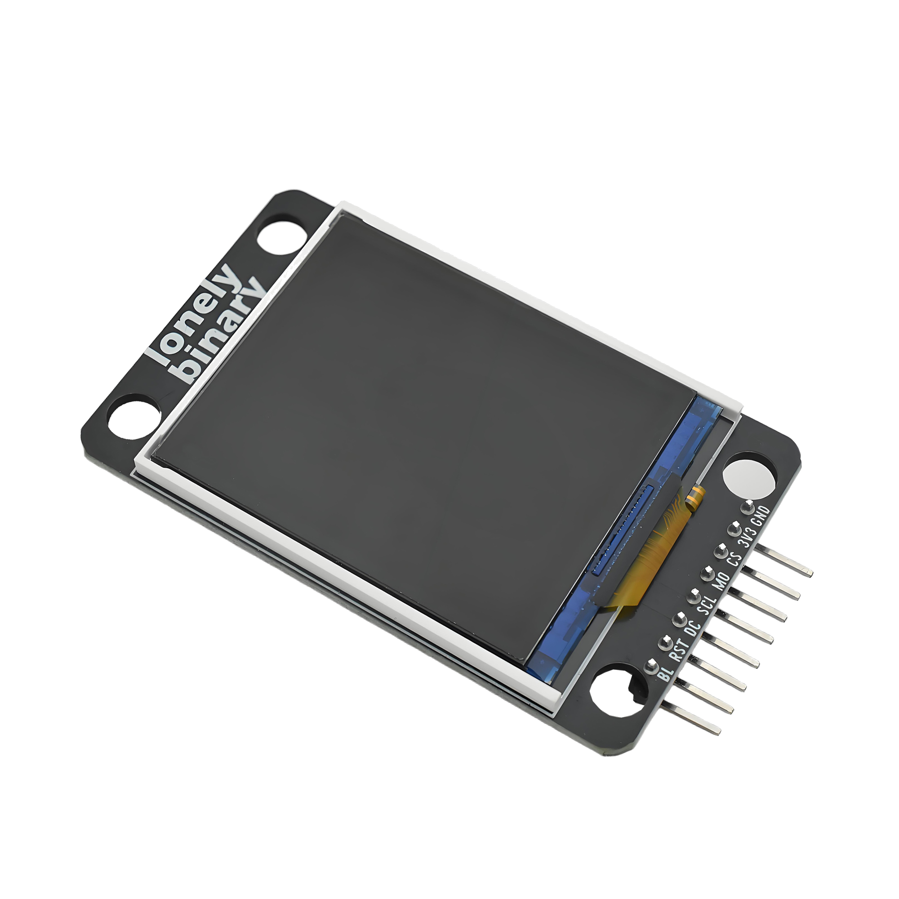

# Function

This module is a 1.8-inch color TFT LCD display using ST7735 driver chip. Can display text, patterns, colors, etc. Controlled through SPI interface, supports 128×160 pixel resolution. Suitable for making information displays, graphical interfaces, data visualization, and other applications.

# Appearance

|  |  |  |
| :-----------------------: | :-----------------------: | :-----------------------: |
|          **Front**          |          **Back**          |          **Side**          |

The module has a 1.8-inch TFT display and an 8-pin header interface. Each pin can be identified by the silkscreen (text printed next to the pin).

# Pinout

- **GND** (negative): Like the negative terminal (-) of a battery, connect to the control board's GND
- **3V3** (positive): Like the positive terminal (+) of a battery, connect to the control board's 3.3V (this module requires 3.3V power supply)
- **CS** (chip select): SPI chip select signal, connect to the control board's digital pin (e.g. Arduino D10 or Pico GPIO 5)
- **MOSI** (master out slave in): SPI data output pin, connect to the control board's SPI data pin (e.g. Arduino D11 or Pico GPIO 19)
- **SCL** (clock): SPI clock signal, connect to the control board's SPI clock pin (e.g. Arduino D13 or Pico GPIO 18)
- **DC** (data/command): Data/command selection pin, connect to the control board's digital pin (e.g. Arduino D9 or Pico GPIO 4)
- **RST** (reset): Reset pin, connect to the control board's digital pin (e.g. Arduino D8 or Pico GPIO 3)
- **BL** (backlight): Backlight control pin, connect to the control board's digital pin (e.g. Arduino D7 or Pico GPIO 2)

# Features

- 1.8-inch color TFT display
- 128×160 pixel resolution
- ST7735 driver chip
- SPI interface communication
- Operating voltage: 3.3V

# Quick Wiring

**For Arduino Uno R3 (5V MCU):**
⚠️ **Must use TK97 logic level converter module!**
- Arduino Uno (5V) → TK97 logic level converter module → TFT screen (3.3V)
- Note: TFT screen display direction and "LOGIC LEVEL CONVERTER" text on TK97 module should be in the same direction
- Please refer to TK97 module documentation for correct connection
