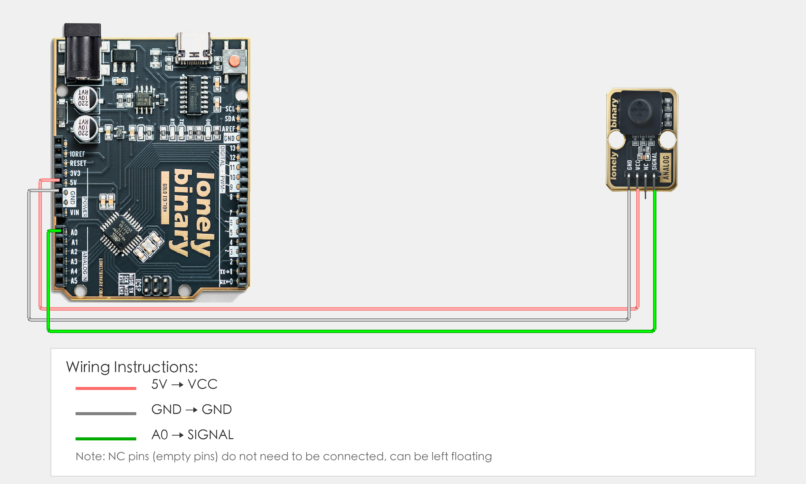

# Arduino Uno R3 Example

## Goal

This example shows how to use the TK94 - FIVE-DIRECTION JOYSTICK module on an Arduino Uno R3 to detect joystick direction.

## Wiring



- **VCC** → Arduino Uno R3 5V
- **GND** → Arduino Uno R3 GND
- **SIGNAL** → Arduino Uno R3 A0
- **NC** → Leave unconnected

## Code

```cpp
// Pin number: change this to match your wiring
#define SIGNAL_PIN A0   // Arduino analog input pin connected to SIGNAL (e.g. A0)

void setup() {
  // Start serial for debugging (9600 baud)
  Serial.begin(9600);
  
  Serial.println("Five-direction joystick program started");
  Serial.println("Reading SIGNAL pin analog value to determine direction");
}

void loop() {
  // Read SIGNAL pin analog value (0-1023)
  int signalValue = analogRead(SIGNAL_PIN);
  
  // Determine joystick direction (based on actual measured values)
  // Push up: 100-130
  // Push left: 270-290
  // Push down: 450-470
  // Push right: 1000-1024
  // Press: 180-190
  
  if (signalValue >= 100 && signalValue <= 130) {
    Serial.println("Push up");
  } else if (signalValue >= 270 && signalValue <= 290) {
    Serial.println("Push left");
  } else if (signalValue >= 450 && signalValue <= 470) {
    Serial.println("Push down");
  } else if (signalValue >= 1000 && signalValue <= 1024) {
    Serial.println("Push right");
  } else if (signalValue >= 180 && signalValue <= 190) {
    Serial.println("Press");
  } else {
    Serial.println("Center position");
  }
  
  // Print joystick status
  Serial.print("SIGNAL value: ");
  Serial.println(signalValue);
  
  delay(200);  // Wait 200 milliseconds before reading again
}
```

## Effect


## Code Walkthrough

**Line 2: Pin definition**

```cpp
#define SIGNAL_PIN A0   // Arduino analog input pin connected to SIGNAL (e.g. A0)
```

- **`SIGNAL_PIN`:** The Arduino analog input pin connected to five-direction joystick SIGNAL. Change this if you use another pin.

**Lines 4–10: Initialization (setup function)**

```cpp
void setup() {
  // Start serial for debugging (9600 baud)
  Serial.begin(9600);
  
  Serial.println("Five-direction joystick program started");
  Serial.println("Reading SIGNAL pin analog value to determine direction");
}
```

- **`setup()`:** Runs once when the Arduino starts.
- **`Serial.begin(9600)`:** Start serial at 9600 baud.
- **`Serial.println(...)`:** Print program start message and instructions to Serial Monitor.

**Lines 12–43: Main loop (loop function)**

```cpp
void loop() {
  // Read SIGNAL pin analog value (0-1023)
  int signalValue = analogRead(SIGNAL_PIN);
  
  // Determine joystick direction (based on actual measured values)
  if (signalValue >= 100 && signalValue <= 130) {
    Serial.println("Push up");
  } else if (signalValue >= 270 && signalValue <= 290) {
    Serial.println("Push left");
  } else if (signalValue >= 450 && signalValue <= 470) {
    Serial.println("Push down");
  } else if (signalValue >= 1000 && signalValue <= 1024) {
    Serial.println("Push right");
  } else if (signalValue >= 180 && signalValue <= 190) {
    Serial.println("Press");
  } else {
    Serial.println("Center position");
  }
  
  // Print joystick status
  Serial.print("SIGNAL value: ");
  Serial.println(signalValue);
  
  delay(200);  // Wait 200 milliseconds before reading again
}
```

- **`loop()`:** Runs repeatedly.
- **`analogRead(SIGNAL_PIN)`:** Read SIGNAL_PIN analog value (0-1023), different directions correspond to different analog value ranges.
- **`if (signalValue >= 100 && signalValue <= 130)`:** Check if joystick is pushed up, analog value in range 100-130.
- **`else if (signalValue >= 270 && signalValue <= 290)`:** Check if joystick is pushed left, analog value in range 270-290.
- **`else if (signalValue >= 450 && signalValue <= 470)`:** Check if joystick is pushed down, analog value in range 450-470.
- **`else if (signalValue >= 1000 && signalValue <= 1024)`:** Check if joystick is pushed right, analog value in range 1000-1024.
- **`else if (signalValue >= 180 && signalValue <= 190)`:** Check if joystick is pressed, analog value in range 180-190.
- **`else`:** If not in above ranges, consider it center position.
- **`Serial.print(...)` and `Serial.println(...)`:** Print joystick direction and SIGNAL value to Serial Monitor.
- **`delay(200)`:** Wait 200 milliseconds before reading again to avoid reading too fast and control output frequency.
