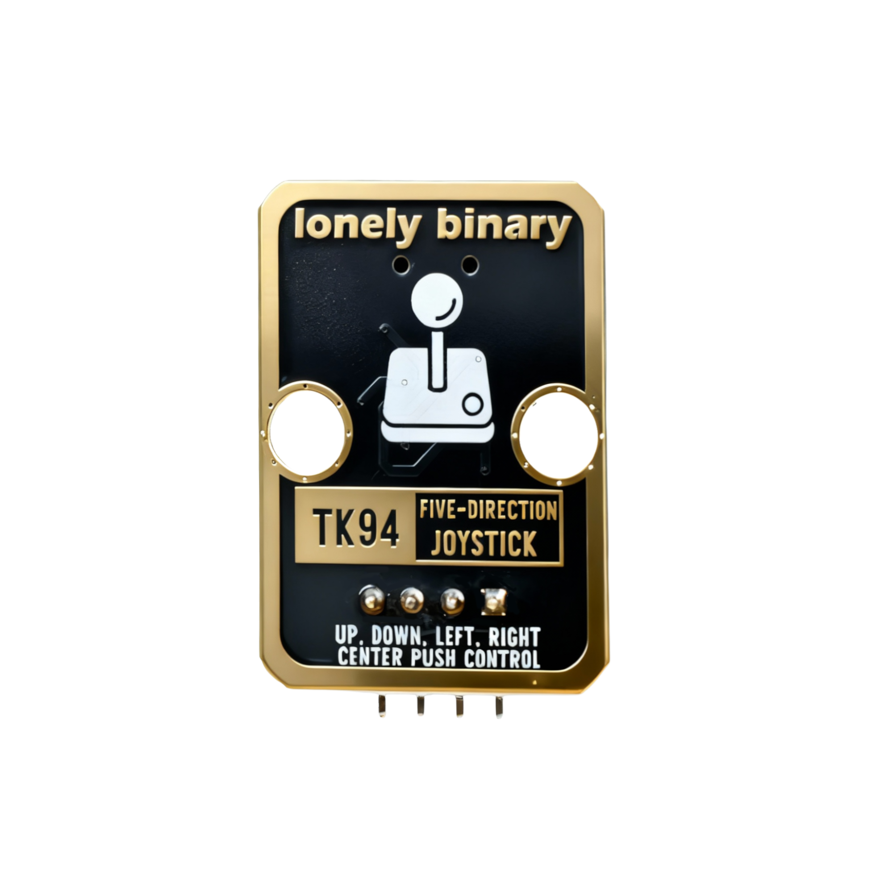
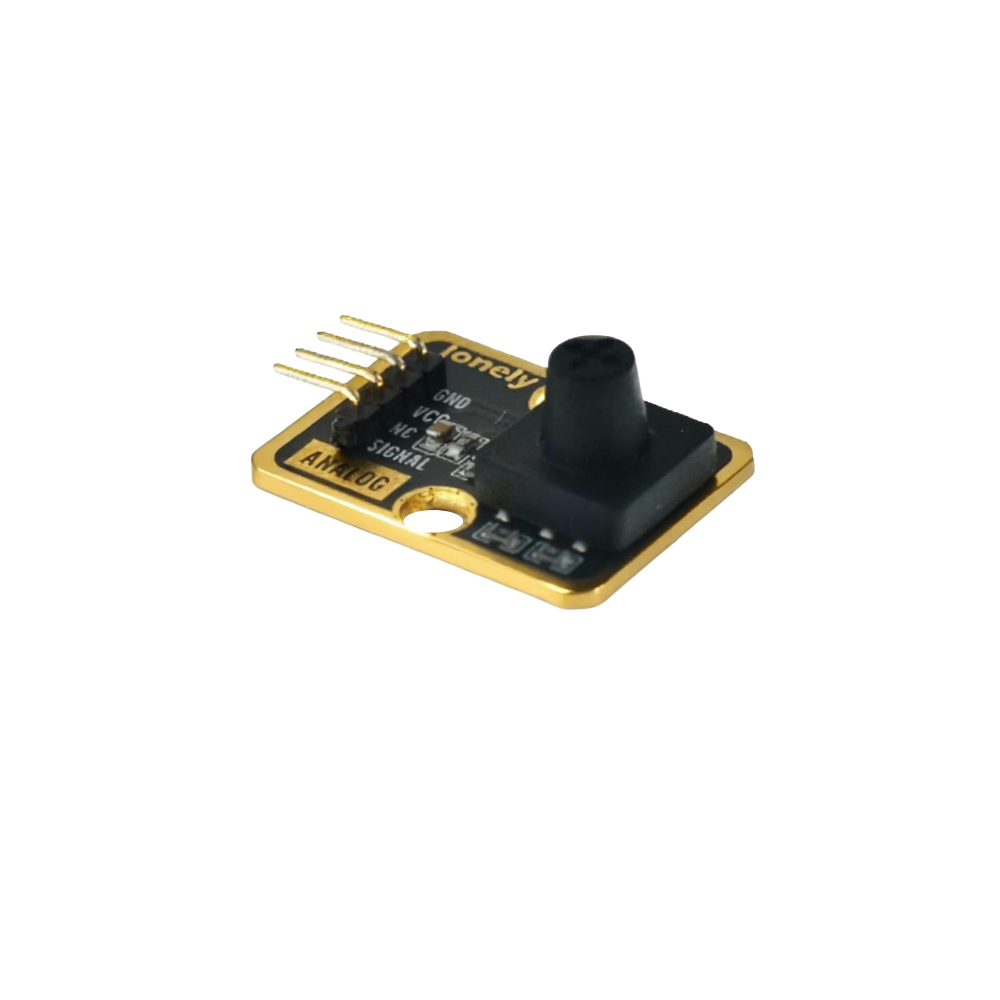

# Function

This module is a five-direction joystick module that can detect four directions: up, down, left, and right. By reading the analog value of the SIGNAL pin, the joystick direction can be determined. Can be used to make game controllers, remote controls, and other applications.

# Appearance

|  |  |  |
| :-----------------------: | :-----------------------: | :-----------------------: |
|          **Front**          |          **Back**          |          **Side**          |

The module has a joystick and a 5-pin header interface. Each pin can be identified by the silkscreen (text printed next to the pin).

# Pinout

- **GND** (negative): Like the negative terminal (-) of a battery, connect to the control board's GND
- **VCC** (positive): Like the positive terminal (+) of a battery, connect to the control board's 3.3V or 5V (this module supports both 3.3V and 5V)
- **NC** (no connection): No actual circuit connection, included for unified interface, can be left unconnected
- **SIGNAL** (signal output): Joystick direction detection output pin, connect to the control board's analog input pin (e.g. Arduino A0 or Pico GPIO 26)
  - Outputs analog signal (0-1023), direction can be determined by reading analog value
  - Center value is about 512, pushing up decreases value, pushing down increases value

# Features

- Five-direction operation: four directions (up, down, left, right)
- Analog output: SIGNAL pin outputs analog signal (0-1023)
- Operating voltage: 3.3V or 5V

# Quick Wiring

1. GND → Control board GND
2. VCC → Control board 3.3V or 5V
3. SIGNAL → Control board analog input pin (for direction detection)
