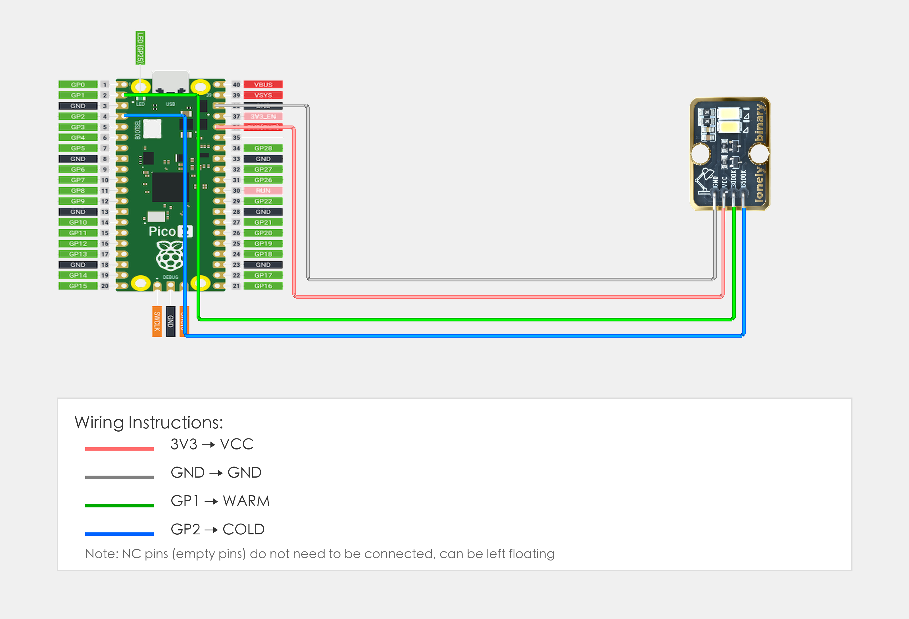

# Raspberry Pi Pico 2 Example

## Goal

This example shows how to use the TK95 - EXTREME BRIGHT DUAL LEDS module on a Raspberry Pi Pico 2 to control dual-color LED brightness.

## Wiring



## Code

```python
# Import required modules
from machine import Pin, PWM  # GPIO control and PWM
import time                   # For delay (time.sleep)

# Pin number: change these to match your wiring
WARM_PIN = 1   # GPIO connected to 3000K (e.g. GPIO 1, must be PWM-capable pin)
COLD_PIN = 2   # GPIO connected to 6500K (e.g. GPIO 2)

# Create PWM objects
warm = PWM(Pin(WARM_PIN))
cold = PWM(Pin(COLD_PIN))

# Set PWM frequency (1000 Hz)
warm.freq(1000)
cold.freq(1000)

# Main loop: runs forever
while True:
    # Warm white (3000K brightest, 6500K off)
    warm.duty_u16(65535)    # Warm white brightest (65535 is max value)
    cold.duty_u16(0)         # Cool white off
    print("Warm white")
    time.sleep(2)
    
    # Cool white (3000K off, 6500K brightest)
    warm.duty_u16(0)
    cold.duty_u16(65535)
    print("Cool white")
    time.sleep(2)
    
    # Mixed light (both LEDs on, color temperature in middle)
    warm.duty_u16(32767)    # Warm white medium brightness
    cold.duty_u16(32767)     # Cool white medium brightness
    print("Mixed light")
    time.sleep(2)
```

## Effect


## Code Walkthrough

**Lines 1–2: Imports**

```python
from machine import Pin, PWM  # GPIO control and PWM
import time                   # For delay (time.sleep)
```

- **`machine.Pin`:** Used to control Pico GPIO pins.
- **`machine.PWM`:** Used to control Pico PWM output.
- **`time`:** Provides `sleep()` and other time-related functions.

**Lines 5–6: Pin definition**

```python
WARM_PIN = 1   # GPIO connected to 3000K (e.g. GPIO 1, must be PWM-capable pin)
COLD_PIN = 2   # GPIO connected to 6500K (e.g. GPIO 2)
```

- **`WARM_PIN`:** GPIO number for warm white (3000K) LED (must be PWM-capable pin). Change this if you use another pin.
- **`COLD_PIN`:** GPIO number for cool white (6500K) LED (must be PWM-capable pin). Change this if you use another pin.

**Lines 9–12: Create PWM objects and set frequency**

```python
warm = PWM(Pin(WARM_PIN))
cold = PWM(Pin(COLD_PIN))

# Set PWM frequency (1000 Hz)
warm.freq(1000)
cold.freq(1000)
```

- **`PWM(Pin(WARM_PIN))` and `PWM(Pin(COLD_PIN))`:** Create PWM objects to control LED brightness.
- **`freq(1000)`:** Set PWM frequency to 1000Hz.

**Lines 16–34: Main loop**

```python
while True:
    # Warm white (3000K brightest, 6500K off)
    warm.duty_u16(65535)    # Warm white brightest (65535 is max value)
    cold.duty_u16(0)         # Cool white off
    print("Warm white")
    time.sleep(2)
    
    # Cool white (3000K off, 6500K brightest)
    warm.duty_u16(0)
    cold.duty_u16(65535)
    print("Cool white")
    time.sleep(2)
    
    # Mixed light (both LEDs on, color temperature in middle)
    warm.duty_u16(32767)    # Warm white medium brightness
    cold.duty_u16(32767)     # Cool white medium brightness
    print("Mixed light")
    time.sleep(2)
```

- **`while True`:** Infinite loop; the program keeps running.
- **`warm.duty_u16(65535)` and `cold.duty_u16(0)`:** Set warm white brightest, cool white off, displays warm white effect.
- **`warm.duty_u16(0)` and `cold.duty_u16(65535)`:** Set warm white off, cool white brightest, displays cool white effect.
- **`warm.duty_u16(32767)` and `cold.duty_u16(32767)`:** Set both LEDs to medium brightness, displays mixed light effect (color temperature in middle).
- **`print(...)`:** Print current light color type to terminal.
- **`time.sleep(2)`:** Wait 2 seconds before switching to next light color effect.
