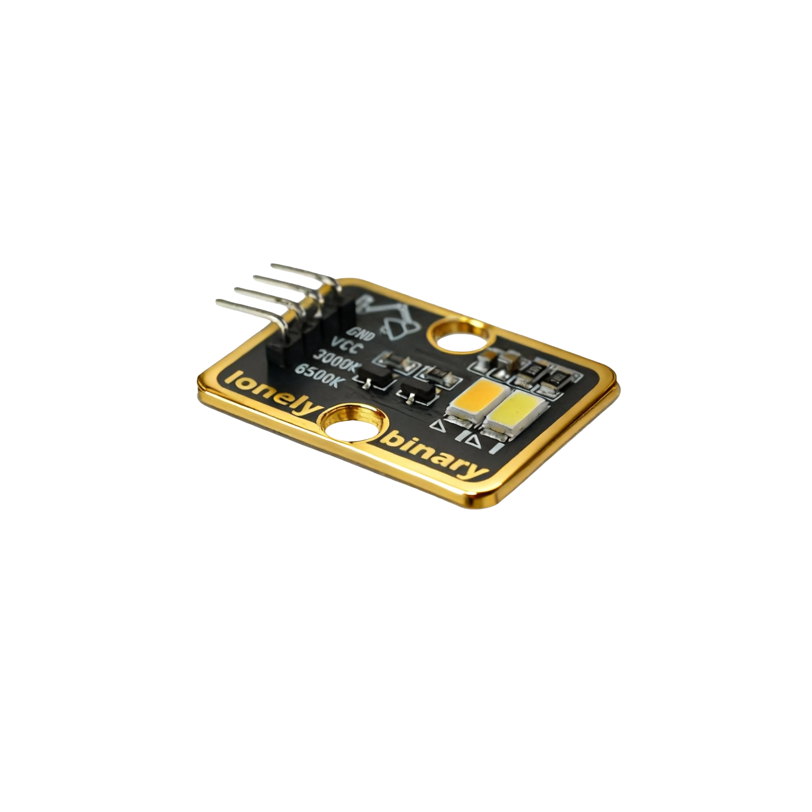

# Function

This module is an extreme bright dual-color LED module containing two LEDs: 3000K (warm white) and 6500K (cool white). By controlling the brightness of each LED through PWM, color temperature can be adjusted to achieve continuous change from warm white to cool white.

# Appearance

|  |  |  |
| :-----------------------: | :-----------------------: | :-----------------------: |
|          **Front**          |          **Back**          |          **Side**          |

The module has two extreme bright LED beads (3000K and 6500K) and a 4-pin header interface. Each pin can be identified by the silkscreen (text printed next to the pin).

# Pinout

- **GND** (negative): Like the negative terminal (-) of a battery, connect to the control board's GND
- **VCC** (positive): Like the positive terminal (+) of a battery, connect to the control board's 3.3V or 5V (this module supports both 3.3V and 5V)
- **3000K** (warm white control): Pin to control 3000K warm white LED, connect to the control board's PWM pin (e.g. Arduino D3 or Pico GPIO 1)
- **6500K** (cool white control): Pin to control 6500K cool white LED, connect to the control board's PWM pin (e.g. Arduino D5 or Pico GPIO 2)

# Features

- Dual-color LED: 3000K warm white and 6500K cool white
- Requires PWM control: Must use PWM-capable pins
- Extreme bright: Very high brightness, suitable for lighting applications
- Operating voltage: 3.3V or 5V

# Quick Wiring

1. GND → Control board GND
2. VCC → Control board 3.3V or 5V
3. 3000K → Control board PWM pin (use the pin defined in your program)
4. 6500K → Control board PWM pin (use the pin defined in your program)
