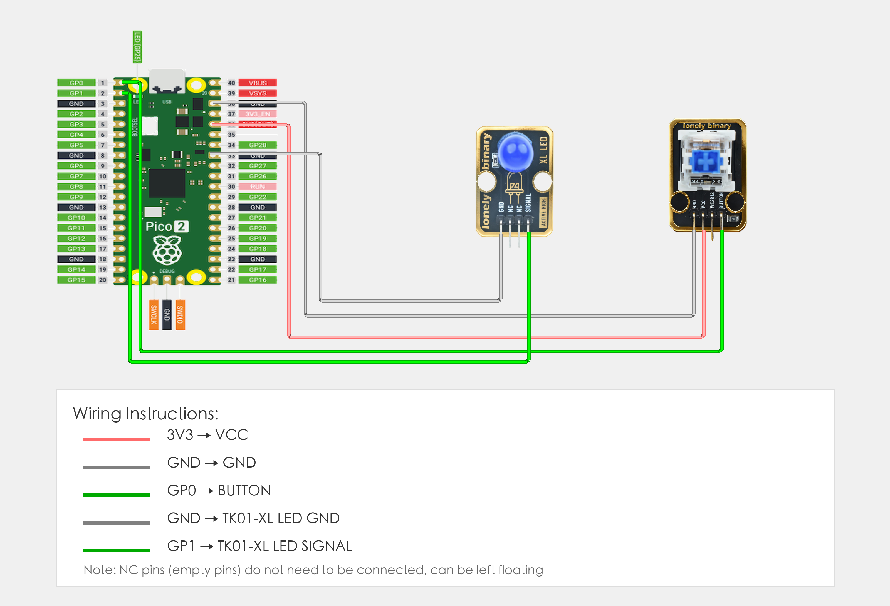

# Raspberry Pi Pico 2 Example

## Goal

This example shows how to use the TK96 - MECHANICAL KEY AND LED module on a Raspberry Pi Pico 2 to detect key presses and control LED.

## Wiring



## Code

```python
# Import required modules
from machine import Pin  # GPIO control
import time              # For delay (time.sleep)

# Pin number: change this to match your wiring
BUTTON_PIN = 0   # GPIO connected to BUTTON (e.g. GPIO 0)
LED_PIN = 1      # LED pin (GPIO 1, or external LED, Pico built-in LED is GPIO 25)

# Create pin objects
button = Pin(BUTTON_PIN, Pin.IN, Pin.PULL_UP)   # Set button pin as input mode, enable pull-up resistor
led = Pin(LED_PIN, Pin.OUT)                     # Set LED pin as output mode (to control LED on/off)

print("Mechanical key program started")
print("LED on when key pressed, LED off when key released")

# Main loop: runs forever
while True:
    # Read button state
    buttonState = button.value()  # Read button pin level: 0=pressed (LOW), 1=released (HIGH)
    
    # Control LED based on button state
    if buttonState == 0:
        # Key pressed: turn LED on and print message
        led.on()                 # Output HIGH, LED on
        print("Key pressed - LED on")
    else:
        # Key released: turn LED off
        led.off()                # Output LOW, LED off
        print("Key released - LED off")
    
    # Delay 100 milliseconds to avoid reading too fast
    time.sleep_ms(100)
```

## Effect


## Code Walkthrough

**Lines 1–2: Imports**

```python
from machine import Pin  # GPIO control
import time              # For delay (time.sleep)
```

- **`machine.Pin`:** Used to control Pico GPIO pins.
- **`time`:** Provides `sleep()` and other time-related functions.

**Lines 5–6: Pin definition**

```python
BUTTON_PIN = 0   # GPIO connected to BUTTON (e.g. GPIO 0)
LED_PIN = 1      # LED pin (GPIO 1, or external LED, Pico built-in LED is GPIO 25)
```

- **`BUTTON_PIN`:** GPIO number for button SIGNAL. Change this if you use another pin.
- **`LED_PIN`:** GPIO number for LED (GPIO 1, or external LED, Pico built-in LED is GPIO 25).

**Lines 9–10: Create pin objects**

```python
button = Pin(BUTTON_PIN, Pin.IN, Pin.PULL_UP)   # Set button pin as input mode, enable pull-up resistor
led = Pin(LED_PIN, Pin.OUT)                     # Set LED pin as output mode (to control LED on/off)
```

- **`Pin(BUTTON_PIN, Pin.IN, Pin.PULL_UP)`:** Set button pin as input mode, enable internal pull-up resistor. Pin is HIGH when key not pressed.
- **`Pin(LED_PIN, Pin.OUT)`:** Set LED pin as output mode to control LED on/off.

**Lines 15–31: Main loop**

```python
while True:
    # Read button state
    buttonState = button.value()  # Read button pin level: 0=pressed (LOW), 1=released (HIGH)
    
    # Control LED based on button state
    if buttonState == 0:
        # Key pressed: turn LED on and print message
        led.on()                 # Output HIGH, LED on
        print("Key pressed - LED on")
    else:
        # Key released: turn LED off
        led.off()                # Output LOW, LED off
        print("Key released - LED off")
    
    # Delay 100 milliseconds to avoid reading too fast
    time.sleep_ms(100)
```

- **`while True`:** Infinite loop; the program keeps running.
- **`button.value()`:** Read button pin level, returns 0 when key pressed (LOW), 1 when key released (HIGH).
- **`if buttonState == 0`:** Check if key is pressed; if pressed, execute LED on operation.
- **`led.on()`:** Output HIGH, LED on.
- **`led.off()`:** Output LOW, LED off.
- **`print(...)`:** Print button state and LED status to terminal.
- **`time.sleep_ms(100)`:** Wait 100 milliseconds before reading again to avoid reading too fast and reduce CPU usage.
