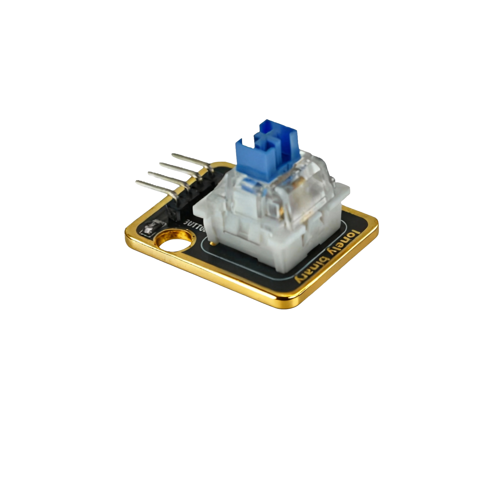

# Function

This module is a mechanical key + LED module containing a mechanical key and a WS2812 LED. The key can detect press operations, and the LED can display any color. Can be used to make key switches with indicator lights and other applications.

# Appearance

|  |  |  |
| :-----------------------: | :-----------------------: | :-----------------------: |
|          **Front**          |          **Back**          |          **Side**          |

The module has a mechanical key and a WS2812 LED, as well as a 4-pin header interface. Each pin can be identified by the silkscreen (text printed next to the pin).

# Pinout

- **GND** (negative): Like the negative terminal (-) of a battery, connect to the control board's GND
- **VCC** (positive): Like the positive terminal (+) of a battery, connect to the control board's 5V (Note: WS2812 requires 5V)
- **WS2812** (data line): WS2812 LED data line, connect to the control board's digital pin (e.g. Arduino D6 or Pico GPIO 0)
- **BUTTON** (key): Key detection output pin, connect to the control board's digital pin (e.g. Arduino D2 or Pico GPIO 1)
  - Outputs LOW (LOW/0) when key pressed
  - Outputs HIGH (HIGH/1) when key released

# Features

- Mechanical key: Can detect press operations
- WS2812 LED: Can display any color
- Operating voltage: 5V (WS2812 requires 5V)

# Quick Wiring

1. GND → Control board GND
2. VCC → Control board 5V
3. WS2812 → Control board digital pin (to control LED)
4. BUTTON → Control board digital pin (to detect key)
