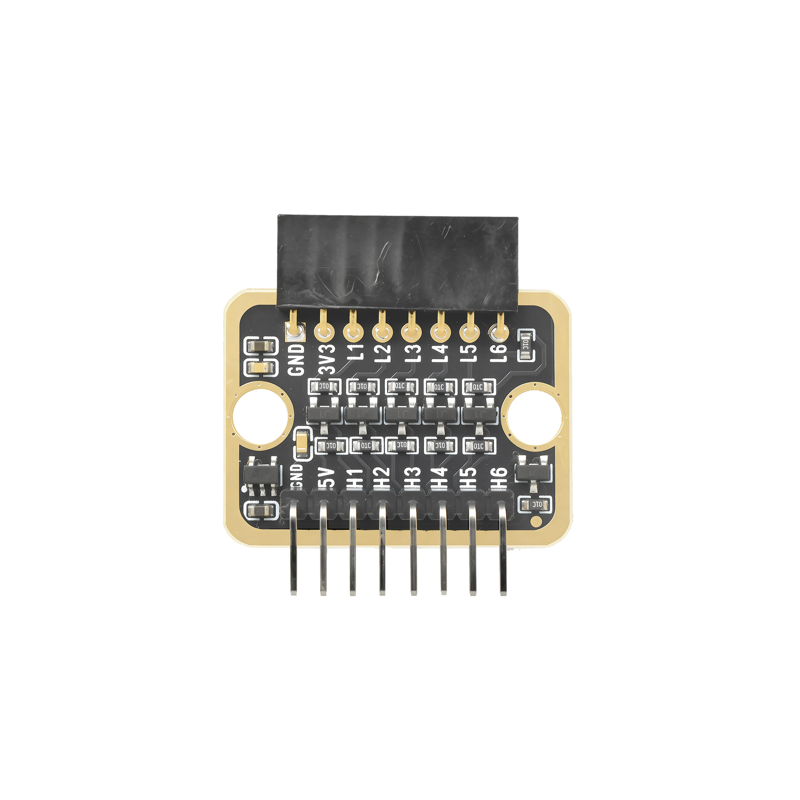
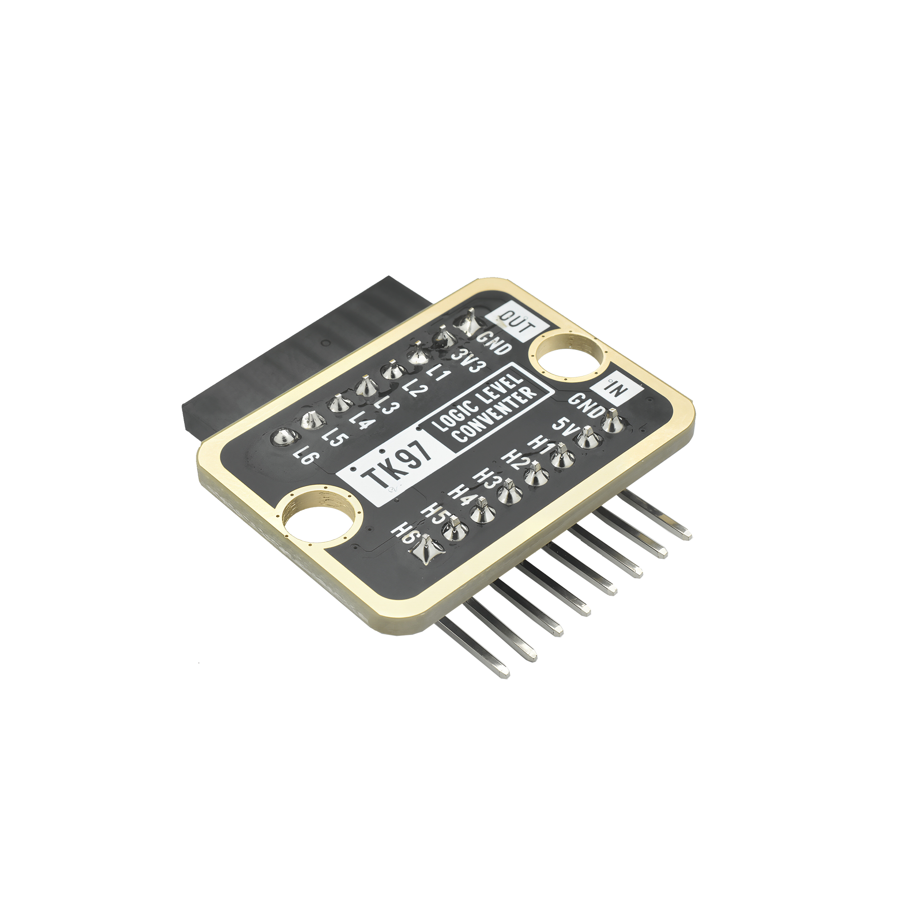

# Function

This module is a logic level converter module that can perform bidirectional conversion between 3.3V and 5V logic levels. When connecting 3.3V devices (such as Raspberry Pi Pico) and 5V devices (such as Arduino Uno), this module can be used for level conversion to protect devices from damage.

# Appearance

|  |  |  |
| :-----------------------: | :-----------------------: | :-----------------------: |
|          **Front**          |          **Back**          |          **Side**          |

The module has two rows of header interfaces, one side is OUT (output) side, the other side is IN (input) side. Each pin can be identified by the silkscreen (text printed next to the pin).

# Pinout

**OUT side - 3.3V side:**
- **GND** (negative): Connect to 3.3V device's GND
- **3V3** (positive): Connect to 3.3V device's 3.3V power supply
- **L1-L6** (channels 1-6): 6 bidirectional conversion channels, connect to 3.3V device's signal pins

**IN side - 5V side:**
- **GND** (negative): Connect to 5V device's GND
- **5V** (positive): Connect to 5V device's 5V power supply
- **H1-H6** (channels 1-6): 6 bidirectional conversion channels, connect to 5V device's signal pins

# Features

- Bidirectional conversion: Can convert bidirectionally between 3.3V and 5V
- 6 channels: Can convert 6 signals simultaneously
- Automatic direction detection: Automatically converts based on signal direction
- Protects devices: Prevents high voltage from damaging low voltage devices

# Quick Wiring

1. OUT side GND → 3.3V device GND
2. OUT side 3V3 → 3.3V device 3.3V
3. IN side GND → 5V device GND
4. IN side 5V → 5V device 5V
5. OUT side L1 → 3.3V device signal pin
6. IN side H1 → 5V device signal pin
