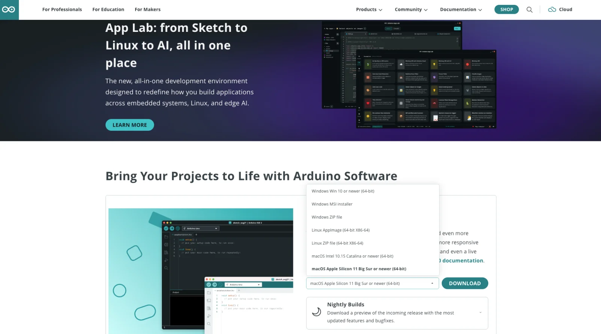
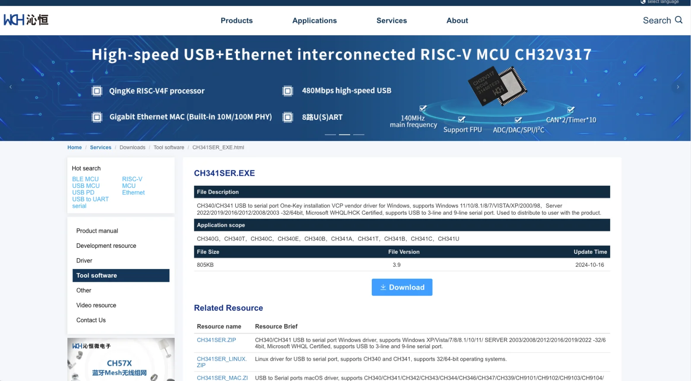
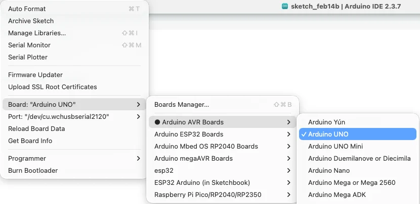
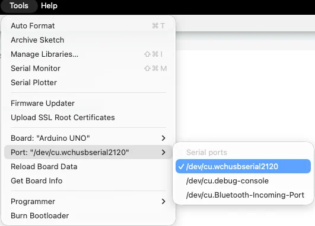

# Lesson 01 - Arduino IDE Installation & Environment Setup (Windows) <small>[Mac version click here](README-Mac.md)</small>

Complete download, installation, and basic setup of Arduino IDE on Windows for programming with the TinkerBlock kit. **Outcome:** IDE and CH340 driver ready; board and port selected correctly; Blink example uploads successfully and onboard LED blinks.

---

## 1. Requirements

- **OS**: Windows 7/10/11  
- **IDE**: 2.x recommended (e.g. 2.3.x)  
- **Space**: about 500MB–1GB  
- **Download**: https://www.arduino.cc/en/software → choose **Windows Win 10 or newer (64-bit)** (one-click install); MSI installer and ZIP portable are also available

---

## 2. Installation

1. Double-click the `.exe`; when UAC prompts, choose Yes  
2. Accept the agreement; path is best in English with no spaces (e.g. `D:\Arduino`); you can check “desktop shortcut”  
3. Install → Finish; if prompted to install drivers, choose Install

---

## 3. CH340 driver (required when board is not recognized)

**Download** (WCH site): [CH341SER.EXE](https://www.wch-ic.com/downloads/CH341SER_EXE.html) | [ZIP](https://www.wch-ic.com/downloads/CH341SER_ZIP.html) | [All drivers](https://www.wch-ic.com/downloads/category/30.html)

1. Connect the board; `Win + X` → Device Manager → **Ports (COM & LPT)**  
2. If there is no **CH340** or **WCH** port (COMx) or there is a yellow warning: download and run the CH341SER installer  
3. Unplug and replug USB; confirm **CH340 (COMx)** or **WCH (COMx)** appears

---

## 4. Board and port

- **Board**: Tools → Board → Arduino AVR → **Arduino Uno** or **Arduino Nano** (for Nano, try Processor: ATmega328P or Old Bootloader)  

- **Port**: Tools → Port → select **COMx**; name may be **USB-SERIAL CH340** or **WCH** etc. (same driver)  

---

## 5. First verification

1. File → Examples → 01.Basics → **Blink**  
2. Click **Verify** (✓); it should show “Done compiling”  
3. Click **Upload** (→); after success the onboard LED blinks about once per second  

Proceed to Lesson 02.

---

*TinkerBlock Arduino Beginner Workshop — Lesson 01*
