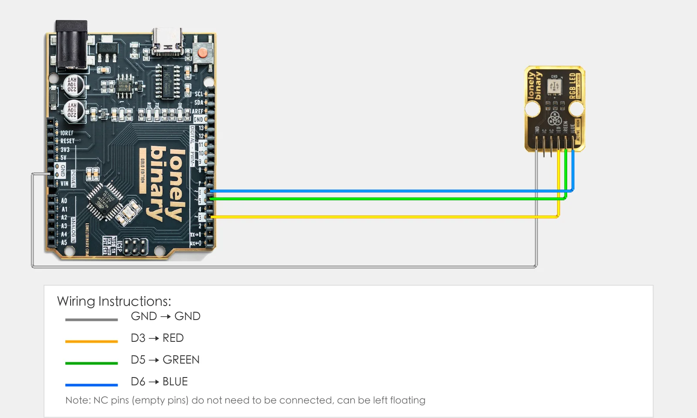
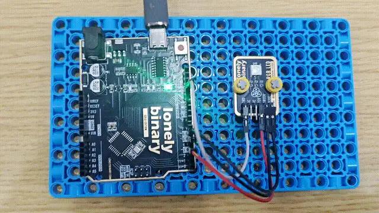

# Lesson 06 - RGB LED

**This lesson uses:** Arduino UNO R3 board, **TinkerBlock TK02 RGB LED** module, jumper wires (or breadboard). Control three RGB LED channels; learn **multi-channel digital output** and `#define`. **Outcome:** red on 1 s → green on 1 s → blue on 1 s → all off 1 s, repeat (optional: serial prints current color).

---

## 1. Wiring

Connect TK02 RGB LED to Arduino (three colors to D3, D5, D6; in code use **3, 5, 6** for these pins):

- **GND** → Arduino GND  
- **RED** → Arduino D3  
- **GREEN** → Arduino D5  
- **BLUE** → Arduino D6  
- **NC** — leave unconnected



---

## 2. New sketch

1. Arduino IDE: File → **New** (or Ctrl/Cmd + N) to create a blank sketch  
2. Confirm board and port are selected (same as Lesson 01)  
3. **Type** the code below into the default `setup()` and `loop()` yourself  

---

## 3. Program structure

Same as last lesson: two fixed blocks `setup()` and `loop()`.

- **`setup()`**: Tell the board “pins 3, 5, 6 are for the RGB LED”; start serial (optional, to print state); runs once.  
- **`loop()`**: Keep repeating “red on → green on → blue on → all off → repeat”.

Type the code below and the LED will go red, then green, then blue, then off, in a loop.

---

## 4. Code to write

**Type** the code below line by line into `setup()` and `loop()` (do not copy-paste; typing it yourself helps you remember):

```cpp
// RGB LED: red(D3), green(D5), blue(D6), one color at a time then all off
#define RED_PIN 3
#define GREEN_PIN 5
#define BLUE_PIN 6

void setup() {
  pinMode(RED_PIN, OUTPUT);     // red / green / blue all outputs
  pinMode(GREEN_PIN, OUTPUT);
  pinMode(BLUE_PIN, OUTPUT);
  Serial.begin(9600);
  Serial.println("RGB LED started");
}

void loop() {
  digitalWrite(RED_PIN, HIGH);   // red only
  digitalWrite(GREEN_PIN, LOW);
  digitalWrite(BLUE_PIN, LOW);
  Serial.println("Red");
  delay(1000);
  digitalWrite(RED_PIN, LOW);
  digitalWrite(GREEN_PIN, HIGH);  // green only
  digitalWrite(BLUE_PIN, LOW);
  Serial.println("Green");
  delay(1000);
  digitalWrite(RED_PIN, LOW);
  digitalWrite(GREEN_PIN, LOW);
  digitalWrite(BLUE_PIN, HIGH);  // blue only
  Serial.println("Blue");
  delay(1000);
  digitalWrite(RED_PIN, LOW);     // all off
  digitalWrite(GREEN_PIN, LOW);
  digitalWrite(BLUE_PIN, LOW);
  Serial.println("Off");
  delay(1000);
}
```

---

### Program notes

**Overall idea:** Three pins for three LED channels; only one HIGH at a time, others LOW, then `delay(1000)`; cycle red → green → blue → all off. Same idea as the traffic light; use `#define` for the three pins so the code is easy to read and change.

| Code | In this lesson |
|------|----------------|
| **`#define RED_PIN 3` etc.** | Macro for pin numbers; red/green/blue map to D3/D5/D6 |
| **`pinMode(..., OUTPUT)`** | Set all three pins as output so each channel can be controlled |
| **`digitalWrite(RED_PIN, HIGH)`** | That channel high = on; others LOW = off; only one color on at a time |
| **`Serial.println("Red")`** | Optional: print current color to serial for reference |

---

## 5. Hands-on

1. After entering the code, click **Verify** (✓) to compile  
2. Click **Upload** (→) to upload to the board  
3. Watch TK02 RGB LED: red 1 s → green 1 s → blue 1 s → all off 1 s, then repeat  
4. (Optional) Open serial monitor (Tools → Serial Monitor, 9600 baud) and watch the printed state  
5. Try it yourself: turn on two colors at once (e.g. `digitalWrite(RED_PIN, HIGH)` and `digitalWrite(GREEN_PIN, HIGH)`) and see what mixed color you get  

**Expected result:**



Proceed to Lesson 07.

---

## 6. Common issues

| Symptom | What to do |
|---------|------------|
| No light after upload | Check wiring GND, RED→D3, GREEN→D5, BLUE→D6; confirm board and port |
| Wrong color | Check the three pins: RED→D3, GREEN→D5, BLUE→D6 |
| Compile error | Check brackets and semicolons are paired; no semicolon after `#define` |

---

*TinkerBlock Arduino Beginner Workshop — Lesson 06*
