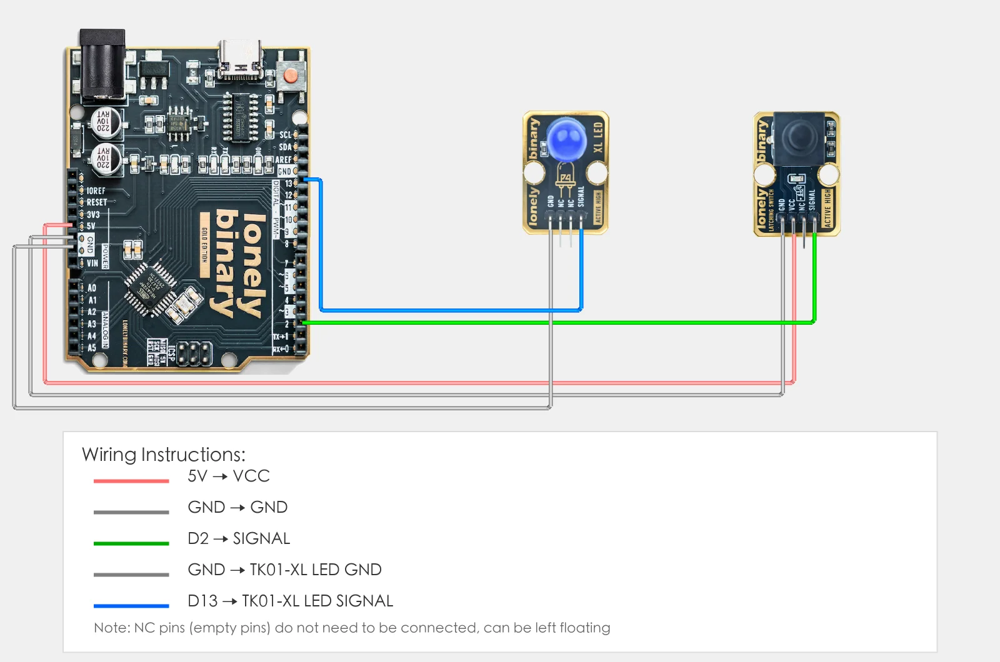
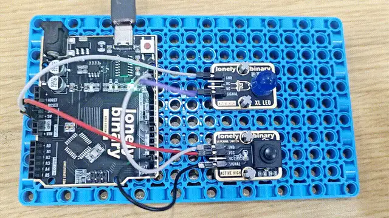

# Lesson 07 - Latching Button

**This lesson uses:** Arduino UNO R3 board, **TinkerBlock TK05 Latching Button** module, **TinkerBlock TK01 XL LED** module, jumper wires (or breadboard). Learn the **latching button** and **state hold**. **Outcome:** press once and the LED stays on; press again and it turns off; no need to hold the button.

---

## 1. Wiring

- **TK05 latching button:** VCC → 5V, GND → GND, SIGNAL → D2, NC leave unconnected  
- **TK01 LED:** GND → GND, SIGNAL → D13



---

## 2. New sketch

1. Arduino IDE: File → **New** (or Ctrl/Cmd + N) to create a blank sketch  
2. Confirm board and port are selected (same as Lesson 01)  
3. **Type** the code below into the default `setup()` and `loop()` yourself  

---

## 3. Program structure

Same as last lesson: two fixed blocks `setup()` and `loop()`.

- **`setup()`**: Tell the board “pin 2 for reading the latching button, pin 13 for the LED”; runs once.  
- **`loop()`**: Keep repeating “read pin 2 → if latched then LED on, else LED off → short delay”.

After you type the code in, one press makes the LED stay on, another press turns it off; you don’t need to hold the button.

---

## 4. Code to write

**Type** the code below line by line into `setup()` and `loop()` (do not copy-paste; typing it yourself helps you remember):

```cpp
// Latching button on D2, LED on D13: latched=HIGH LED on, unlatched=LOW LED off
#define BUTTON_PIN 2
#define LED_PIN 13

void setup() {
  pinMode(BUTTON_PIN, INPUT);   // D2 input, read latching button
  pinMode(LED_PIN, OUTPUT);     // D13 output, control LED
}

void loop() {
  int state = digitalRead(BUTTON_PIN);   // TK05 is HIGH when latched, LOW when unlatched

  if (state == HIGH) {
    digitalWrite(LED_PIN, HIGH);   // latched: LED on
  } else {
    digitalWrite(LED_PIN, LOW);    // unlatched: LED off
  }
  delay(100);   // short delay to reduce bounce
}
```

---

### Program notes

**Overall idea:** The latching button is read with `digitalRead` like a normal button; the difference is that TK05 **keeps its output** (latched HIGH or unlatched LOW) after one press until you press again. So the program still does “HIGH = LED on, LOW = LED off” and doesn’t need to remember “last state” in code.

| Code | In this lesson |
|------|----------------|
| **`digitalRead(BUTTON_PIN)`** | Read current state of latching button: latched=HIGH, unlatched=LOW |
| **`if (state == HIGH)`** | If latched turn LED on, else off; hardware holds the state, program just follows |
| **`delay(100)`** | Lower read rate to reduce bounce |

---

## 5. Hands-on

1. After entering the code, click **Verify** (✓) to compile  
2. Click **Upload** (→) to upload to the board  
3. **Latching button controls LED:**
   - Press TK05 once: LED **stays on** (latched)
   - Press again: LED **turns off** (unlatched)
   - Press again: LED **stays on** again (latched)
4. Compare with Lesson 03’s normal button: the normal button must be held for the LED to stay on; the latching button keeps state with one press

**Expected result:**



Proceed to Lesson 08.

---

## 6. Common issues

| Symptom | What to do |
|---------|------------|
| LED does not follow latch/unlatch | Check TK05 wiring VCC→5V, GND→GND, SIGNAL→D2; check TK01 SIGNAL→D13, GND→GND |
| No response to press | TK05 is a latching button; press until you hear a “click” to latch; press again and hear “click” to unlatch |

---

*TinkerBlock Arduino Beginner Workshop — Lesson 07*
