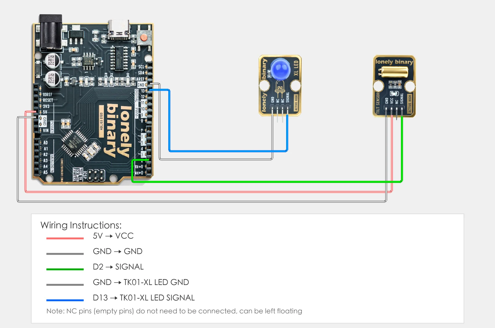
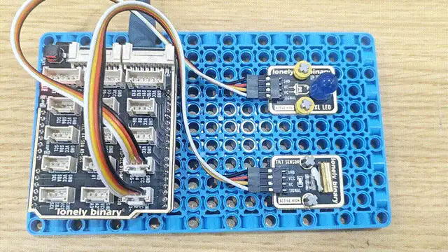

# Lesson 10 - Tilt Sensor

**This lesson uses:** Arduino UNO R3 board, **TinkerBlock TK62 Tilt Sensor** module, **TinkerBlock TK01 XL LED** module, jumper wires (or breadboard). Learn the **tilt sensor**. **Outcome:** when the module is tilted the LED turns on; when it is level the LED turns off.

---

## 1. Wiring

- **TK62 tilt sensor:** VCC → 5V, GND → GND, SIGNAL → D2, NC leave unconnected  
- **TK01 LED:** GND → GND, SIGNAL → D13



---

## 2. New sketch

1. Arduino IDE: File → **New** (or Ctrl/Cmd + N) to create a blank sketch  
2. Confirm board and port are selected (same as Lesson 01)  
3. **Type** the code below into the default `setup()` and `loop()` yourself  

---

## 3. Program structure

Same as last lesson: two fixed blocks `setup()` and `loop()`.

- **`setup()`**: Tell the board “pin 2 for reading the tilt sensor, pin 13 for the LED”; runs once.  
- **`loop()`**: Keep repeating “read pin 2 → if tilted then LED on, else LED off → short delay”.

Type the code in; tilt the module and the LED turns on, level it and it turns off—tilt detection is that simple.

---

## 4. Code to write

**Type** the code below line by line into `setup()` and `loop()` (do not copy-paste; typing it yourself helps you remember):

```cpp
// Tilt sensor on D2, LED on D13: output HIGH when tilted, LED on
#define TILT_PIN 2
#define LED_PIN 13

void setup() {
  pinMode(TILT_PIN, INPUT);   // D2 read tilt sensor
  pinMode(LED_PIN, OUTPUT);   // D13 control LED
}

void loop() {
  int state = digitalRead(TILT_PIN);   // TK62 is HIGH when tilted, LOW when level

  if (state == HIGH) {
    digitalWrite(LED_PIN, HIGH);
  } else {
    digitalWrite(LED_PIN, LOW);
  }
  delay(100);   // debounce
}
```

---

### Program notes

**Overall idea:** Digital input on D2; when tilted TK62 outputs HIGH so LED on, when level LOW so LED off. Same logic as button, touch, collision and other digital sensors.

| Code | In this lesson |
|------|----------------|
| **`digitalRead(TILT_PIN)`** | Read tilt state: tilted=HIGH, level=LOW |
| **`if (state == HIGH)`** | If tilted then LED on, else off |

---

## 5. Hands-on

1. After entering the code, click **Verify** (✓) to compile  
2. Click **Upload** (→) to upload to the board  
3. **Tilt detection:**
   - Tilt the TK62 module by some angle: TK01 LED should turn on  
   - Level the module: LED should turn off  
4. Try different tilt angles and see when it triggers  

**Expected result:**



**Note:** If your kit has the TK19 4-Directions Tilt Sensor, you can try it; it can detect tilt in four directions (up, down, left, right).

Proceed to Lesson 11.

---

## 6. Common issues

| Symptom | What to do |
|---------|------------|
| LED does not turn on when tilted | Check TK62 wiring VCC→5V, GND→GND, SIGNAL→D2; check TK01 SIGNAL→D13, GND→GND; try tilting more |
| LED always on | TK62 may be seeing constant tilt; level the module and try again |

---

*TinkerBlock Arduino Beginner Workshop — Lesson 10*
