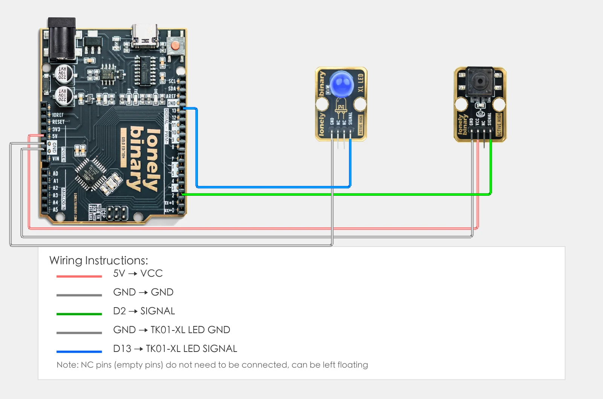

# Lesson 15 - Multiple Sensors with Serial

**This lesson uses:** Arduino UNO R3 board, **TinkerBlock TK08 Rotary Potentiometer** module, **TinkerBlock TK04 Push Button** module, **TinkerBlock TK01 XL LED** module, jumper wires (or breadboard). **Review:** combine potentiometer and button; **outcome:** serial shows potentiometer value and button state (pressed/released) at the same time, and the button still controls the LED.

---

## 1. Wiring

- **TK08 Potentiometer:** GND → GND, VCC → 5V, SIGNAL → A0  
- **TK04 Button:** VCC → 5V, GND → GND, SIGNAL → D2  
- **TK01 LED:** GND → GND, SIGNAL → D13



---

## 2. New sketch

1. Arduino IDE: File → **New** (or Ctrl/Cmd + N) to create a blank sketch  
2. Confirm board and port are selected (same as Lesson 01)  
3. **Type** the code below into the default `setup()` and `loop()` yourself  

---

## 3. Program structure

Same as last lesson: two fixed blocks `setup()` and `loop()`.

- **`setup()`**: Tell the board “A0 for potentiometer, D2 for button, D13 for LED”; start serial; runs once.  
- **`loop()`**: Keep repeating “read potentiometer → read button → print both to serial → control LED by button → short delay”.

One piece of code reads both potentiometer and button; both values appear on the serial—upload and see.

---

## 4. Code to write

**Type** the code below line by line into `setup()` and `loop()` (do not copy-paste; typing it yourself helps you remember):

```cpp
#define POT_PIN A0      // Potentiometer on A0
#define BUTTON_PIN 2    // Button on D2
#define LED_PIN 13      // LED on D13

void setup() {
  pinMode(POT_PIN, INPUT);     // A0 input for potentiometer (analog doesn't need pinMode, but OK to write)
  pinMode(BUTTON_PIN, INPUT);  // D2 input for button
  pinMode(LED_PIN, OUTPUT);    // D13 output for LED
  
  Serial.begin(9600);   // Start serial, baud 9600
  Serial.println("Multiple sensors program started");
}

void loop() {
  int potVal = analogRead(POT_PIN);           // Read potentiometer, store in potVal
  int buttonState = digitalRead(BUTTON_PIN);  // Read button, store in buttonState
  
  // Print both to serial
  Serial.print("Pot: ");
  Serial.print(potVal);
  Serial.print(" | Button: ");
  if (buttonState == HIGH) {
    Serial.println("Pressed");
  } else {
    Serial.println("Released");
  }
  
  // Control LED by button
  if (buttonState == HIGH) {
    digitalWrite(LED_PIN, HIGH);   // Pressed: LED on
  } else {
    digitalWrite(LED_PIN, LOW);    // Released: LED off
  }
  
  delay(200);   // 200 ms
}
```

---

### Program notes

**Overall idea:** In the same `loop()` round, `analogRead` potentiometer and `digitalRead` button, store in `potVal` and `buttonState`; use Serial to print one line “Pot: xxx | Button: Pressed/Released” and control the LED by button. Review multiple variables and serial combo printing.

| Code | In this lesson |
|------|----------------|
| **`int potVal`** | Integer variable for potentiometer value (0–1023) |
| **`int buttonState`** | Integer variable for button state (HIGH or LOW) |
| **`Serial.print("Pot: ")`** | Print text "Pot: " to serial, **no newline** |
| **`Serial.print(potVal)`** | Print `potVal` to serial, **no newline** (continues same line) |
| **`Serial.println("Pressed")`** | Print "Pressed" to serial, **newline** (next print on new line) |

---

## 5. Hands-on

1. After entering the code, click **Verify** (✓) to compile  
2. Click **Upload** (→) to upload to the board  
3. **Open Serial Monitor** (Tools → Serial Monitor, baud 9600)  
4. **Watch the Serial Monitor:**
   - Rotate TK08: potentiometer value changes 0–1023  
   - Press TK04: button shows "Pressed", TK01 LED on  
   - Release: button shows "Released", LED off  
5. Operate potentiometer and button together and see both values on serial  

**Expected result:**

Serial monitor shows:
```
Multiple sensors program started
Pot: 512 | Button: Released
Pot: 523 | Button: Released
Pot: 678 | Button: Pressed
Pot: 890 | Button: Pressed
Pot: 456 | Button: Released
...
```

Proceed to Lesson 16.

---

## 6. Common issues

| Symptom | What to do |
|---------|------------|
| Serial monitor shows nothing | Ensure `Serial.begin(9600)` is in setup(); set Serial Monitor baud to 9600 |
| Potentiometer value does not change | Check TK08 wiring GND→GND, VCC→5V, SIGNAL→A0; try rotating the knob |
| Button state wrong | Check TK04 wiring VCC→5V, GND→GND, SIGNAL→D2 |

---

*TinkerBlock Arduino Beginner Workshop — Lesson 15*
