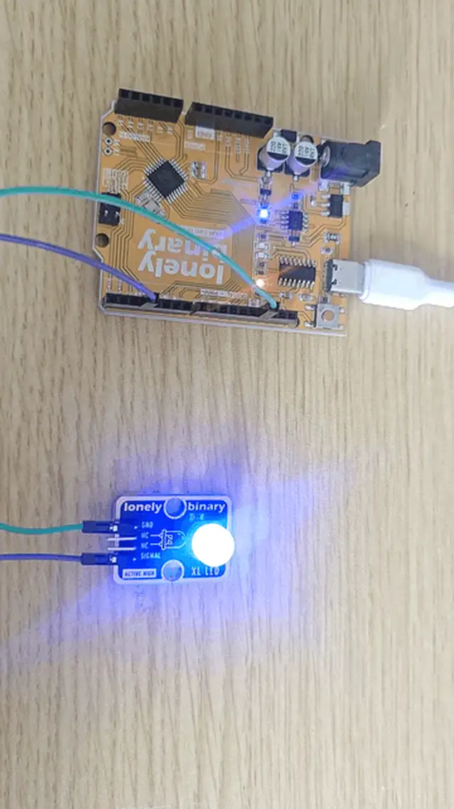

# Lesson 16 - PWM Fading LED

**This lesson uses:** Arduino UNO R3 board, **TinkerBlock TK01 XL LED** module, jumper wires (or breadboard). Learn **PWM** and **`analogWrite()`**; use a **`for` loop** for **outcome:** LED fades from dim to bright and back to dim—a breathing light.

---

## 1. Wiring

Connect TK01 XL LED to Arduino (**must use a PWM pin**, e.g. D3, D5, D6, D9, D10, D11):

- **GND** → Arduino GND  
- **SIGNAL** → Arduino D3 (PWM pin)  
- **NC** leave unconnected


**Note:** `analogWrite()` only works on **PWM pins** (Arduino Uno: D3, D5, D6, D9, D10, D11, marked with ~).

---

## 2. What is PWM?

**PWM (Pulse Width Modulation)** is a way to “simulate” different brightness or voltage with a digital pin.

- **Principle:** The pin switches quickly between **high (on)** and **low (off)**. The **ratio** of high time to the total period is the **duty cycle**: higher duty cycle → higher average voltage → LED looks brighter; lower → dimmer.
- **On Arduino:** In `analogWrite(pin, value)`, **value** is **0–255**, corresponding to 0%–100% duty cycle. You don’t compute the waveform; write 0 (off), 255 (full), or something in between (e.g. 128 ≈ half), and the board outputs the right duty cycle.
- **Why it “fades”:** Step through 0–255 in small steps; each step `analogWrite` a slightly larger (or smaller) value and wait a few ms—to the eye it looks like smooth brightness change, a breathing light.

With PWM in mind, wire up and type the code so the LED really “breathes.”

---

## 3. New sketch

1. Arduino IDE: File → **New** (or Ctrl/Cmd + N) to create a blank sketch  
2. Confirm board and port are selected (same as Lesson 01)  
3. **Type** the code below into the default `setup()` and `loop()` yourself  

---

## 4. Program structure

Same as last lesson: two fixed blocks `setup()` and `loop()`.

- **`setup()`**: Tell the board “pin 3 for LED (PWM output)”; runs once.  
- **`loop()`**: Keep repeating “`for` loop dim→bright → `for` loop bright→dim”.

Type the code below and the LED will slowly brighten then dim, like breathing.

---

## 5. Code to write

**Type** the code below line by line into `setup()` and `loop()` (do not copy-paste; typing it yourself helps you remember):

```cpp
#define LED_PIN 3   // LED on D3 (PWM pin)

void setup() {
  pinMode(LED_PIN, OUTPUT);   // D3 output for LED
}

void loop() {
  // Dim to bright (0 → 255)
  for (int brightness = 0; brightness <= 255; brightness++) {
    analogWrite(LED_PIN, brightness);   // Set brightness (0=dim, 255=bright)
    delay(10);   // 10 ms for smoother fade
  }
  
  // Bright to dim (255 → 0)
  for (int brightness = 255; brightness >= 0; brightness--) {
    analogWrite(LED_PIN, brightness);   // Output current brightness
    delay(10);   // 10 ms per step for smoother fade
  }
}
```

---

### Program notes

**Overall idea:** Two `for` loops: brightness 0→255 then 255→0; each step `analogWrite` and `delay(10)` for a smooth fade. PWM pin 0–255 is duty cycle; visually that’s brightness change.

**About the for loop**

- **Three parts in parentheses:** In `for`, two semicolons separate: **init** (e.g. `int brightness = 0`), **condition** (e.g. `brightness <= 255`), **update** (e.g. `brightness++`). Init runs once; then each iteration: check condition → if true run body → run update → check again, until condition is false.
- **`brightness++`:** “Add 1 to brightness”, same as `brightness = brightness + 1`.
- **`brightness--`:** “Subtract 1 from brightness”, same as `brightness = brightness - 1`.

| Code | In this lesson |
|------|----------------|
| **`analogWrite(LED_PIN, brightness)`** | PWM control LED brightness **0–255** (0=off/dim, 255=full). Only on PWM pins (D3, D5, D6, D9, D10, D11) |
| **`for (int brightness = 0; brightness <= 255; brightness++)`** | **for loop:** variable `brightness` from 0, add 1 each time until 255. `brightness++` is `brightness = brightness + 1` |
| **`for (int brightness = 255; brightness >= 0; brightness--)`** | for loop: from 255 down to 0. `brightness--` is `brightness = brightness - 1` |

---

## 6. Hands-on

1. After entering the code, click **Verify** (✓) to compile  
2. Click **Upload** (→) to upload to the board  
3. Watch TK01 XL LED: it should gradually brighten then dim—breathing light  
4. Try yourself:
   - Change `delay(10)` to `delay(5)` or `delay(20)` and see speed change  
   - Change `brightness++` to `brightness = brightness + 5` for a faster fade  

**Expected result:** As in the figure.



Proceed to Lesson 17.

---

## 7. Common issues

| Symptom | What to do |
|---------|------------|
| LED only on/off, no fade | Ensure SIGNAL is on a PWM pin (D3, D5, D6, D9, D10, D11), not a plain digital pin |
| Fade too fast or too slow | Change `delay()`: larger value → slower fade |
| Compile error | Check `for` parentheses and semicolons: `for (int i = 0; i <= 255; i++)` |

---

*TinkerBlock Arduino Beginner Workshop — Lesson 16*
