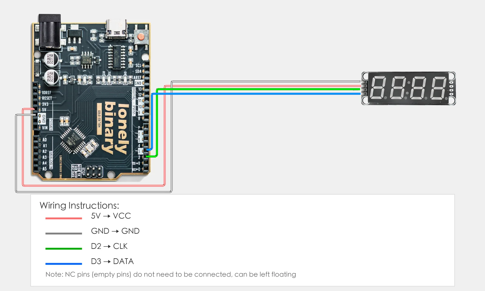
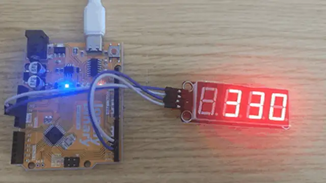

# Lesson 21 - TM1637 4-Digit Display

**This lesson uses:** Arduino UNO R3 board, **TinkerBlock TK51 TM1637 4-Digit Display** module, jumper wires (or breadboard). Learn **library install and use**; control the 4-digit display with TM1637Display library; **outcome:** display counts up from 0 to 9999, changing every 0.5 s, then repeats.

---

## 1. Install the library

Before writing code, install the **TM1637Display** library:

1. Arduino IDE: Tools → **Manage Libraries...**
2. Search: **TM1637Display**
3. Find **TM1637Display by Avishay Orpaz**, click **Install**
4. Wait until installation finishes

---

## 2. Wiring

Connect TK51 TM1637 4-digit display to Arduino:

- **GND** → Arduino GND  
- **VCC** → Arduino 5V  
- **CLK** → Arduino D2  
- **DIO** → Arduino D3  
- **NC** leave unconnected



---

## 3. New sketch

1. Arduino IDE: File → **New** (or Ctrl/Cmd + N) to create a blank sketch  
2. Confirm board and port are selected (same as Lesson 01)  
3. **Type** the code below into the file top and into `setup()` and `loop()` yourself  

---

## 4. Program structure

Same as last lesson: two fixed blocks `setup()` and `loop()`.

- **`setup()`**: Include library, create display object, set brightness; runs once.  
- **`loop()`**: Keep repeating “show number → wait → show next number → repeat”.

After uploading the display will count from 0 to 9999; two wires drive four digits.

---

## 5. Code to write

**Type** the code below at the top of the file and in `setup()` and `loop()` (do not copy-paste; typing it yourself helps you remember):

```cpp
#include <TM1637Display.h>   // Include library

#define CLK_PIN 2   // CLK on D2
#define DIO_PIN 3   // DIO on D3

// Create display object
TM1637Display display(CLK_PIN, DIO_PIN);

void setup() {
  display.setBrightness(7);   // Brightness 0-7, 7 = brightest
  Serial.begin(9600);
  Serial.println("4-digit display program started");
}

void loop() {
  // Show 0-9999 in a loop
  for (int i = 0; i < 10000; i++) {
    display.showNumberDec(i);   // Show number i
    Serial.print("Display: ");
    Serial.println(i);
    delay(500);
  }
}
```

---

### Program notes

**Overall idea:** TM1637 talks to Arduino on two lines (CLK, DIO); the library handles the protocol. After creating the `display` object, `setBrightness(0–7)` sets brightness and `showNumberDec(i)` shows decimal i. A for loop from 0 to 9999 gives the counting effect.

| Code | In this lesson |
|------|----------------|
| **`#include <TM1637Display.h>`** | Include library; provides TM1637Display class and methods |
| **`TM1637Display display(CLK_PIN, DIO_PIN)`** | Construct display object with CLK and DIO pins |
| **`display.setBrightness(7)`** | Brightness 0–7, 7 = brightest |
| **`display.showNumberDec(i)`** | Show integer i (0–9999) on 4-digit display |

---

## 6. Hands-on

1. After entering the code, click **Verify** (✓) to compile  
2. Click **Upload** (→) to upload to the board  
3. Watch TK51: it should show 0, 1, 2, 3... up to 9999, then repeat  
4. Try yourself:
   - Use `display.showNumberDec(i, true)` to show leading zeros  
   - Show a fixed number, e.g. `display.showNumberDec(1234)`  

**Expected result:** As in the figure.



Proceed to Lesson 22.

---

## 7. Common issues

| Symptom | What to do |
|---------|------------|
| Compile error: library not found | Install TM1637Display (Tools → Manage Libraries) |
| Display wrong | Check CLK and DIO wiring; VCC→5V, GND→GND |

---

*TinkerBlock Arduino Beginner Workshop — Lesson 21*
