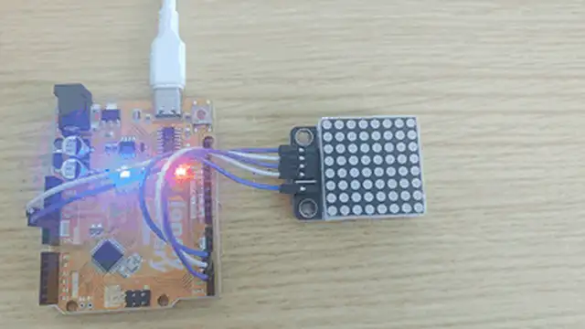

# Lesson 22 - Matrix LED

**This lesson uses:** Arduino UNO R3 board, **TinkerBlock TK52 Matrix LED** module, jumper wires (or breadboard). Learn to control the 8×8 matrix with **LedControl** library and **arrays**; **outcome:** matrix shows a heart pattern for about 1 s, then clears, repeat.

---

## 1. Install the library

Before writing code, install the **LedControl** library:

1. Arduino IDE: Tools → **Manage Libraries...**
2. Search: **LedControl**
3. Find **LedControl by Eberhard Fahle**, click **Install**
4. Wait until installation finishes

---

## 2. Wiring

Connect TK52 Matrix LED to Arduino:

- **GND** → Arduino GND  
- **VCC** → Arduino 5V  
- **DIN** → Arduino D3  
- **CLK** → Arduino D4  
- **CS** → Arduino D2  
- **NC** leave unconnected


---

## 3. New sketch

1. Arduino IDE: File → **New** (or Ctrl/Cmd + N) to create a blank sketch  
2. Confirm board and port are selected (same as Lesson 01)  
3. **Type** the code below into the file top and into `setup()` and `loop()` yourself  

---

## 4. Program structure

Same as last lesson: two fixed blocks `setup()` and `loop()`.

- **`setup()`**: Include library, create display object, init matrix; runs once.  
- **`loop()`**: Keep repeating “show pattern → wait → show next → repeat”.

Type the code below and the matrix will show a heart—that’s how 8×8 works.

---

## 5. Code to write

**Type** the code below at the top of the file and in `setup()` and `loop()` (do not copy-paste; typing it yourself helps you remember):

```cpp
#include <LedControl.h>

#define DIN_PIN 3   // DIN on D3
#define CLK_PIN 4   // CLK on D4
#define CS_PIN 2    // CS on D2

LedControl lc = LedControl(DIN_PIN, CLK_PIN, CS_PIN, 1);

void setup() {
  lc.shutdown(0, false);   // Wake matrix
  lc.setIntensity(0, 8);   // Brightness 0-15
  lc.clearDisplay(0);      // Clear screen
}

void loop() {
  // Heart pattern
  byte heart[8] = {
    0b00000000,
    0b01100110,
    0b11111111,
    0b11111111,
    0b01111110,
    0b00111100,
    0b00011000,
    0b00000000
  };
  
  for (int i = 0; i < 8; i++) {
    lc.setRow(0, i, heart[i]);   // Write row i (0 = first block)
  }
  delay(1000);   // Show 1 s
  lc.clearDisplay(0);   // Clear matrix
  delay(500);   // 0.5 s before repeat
}
```

---

### Program notes

**Overall idea:** 8×8 matrix has 8 points per row; 8 bytes = 8 rows, bit 1=on, 0=off; binary `0b...` is convenient. Library talks to MAX7219 via DIN, CLK, CS; `setRow(0, row, data)` sets one row, `clearDisplay(0)` clears. A for loop writes the 8 rows of `heart[]` to show the pattern.

| Code | In this lesson |
|------|----------------|
| **`#include <LedControl.h>`** | Include LedControl for MAX7219 matrix |
| **`LedControl lc(DIN, CLK, CS, 1)`** | Create object; last 1 = one matrix block |
| **`byte heart[8] = { ... }`** | Array of 8 rows, 8 bits each (0b); 1=on, 0=off |
| **`lc.setRow(0, i, heart[i])`** | Write row i (i 0–7) to matrix |
| **`lc.clearDisplay(0)`** | Clear entire display |

---

## 6. Hands-on

1. After entering the code, click **Verify** (✓) to compile  
2. Click **Upload** (→) to upload to the board  
3. Watch TK52: heart pattern, then clear, repeat  
4. Try yourself: change the pattern data to make your own shape  

**Expected result:** As in the figure.



**Note:** If your kit has TK53 74HC595 Segment LED, you can try it on your own.

Proceed to Lesson 23.

---

*TinkerBlock Arduino Beginner Workshop — Lesson 22*
