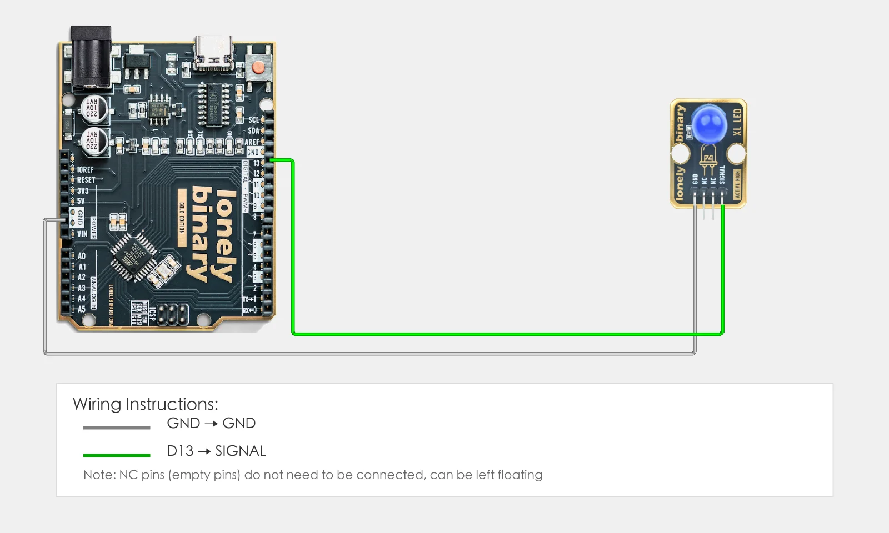
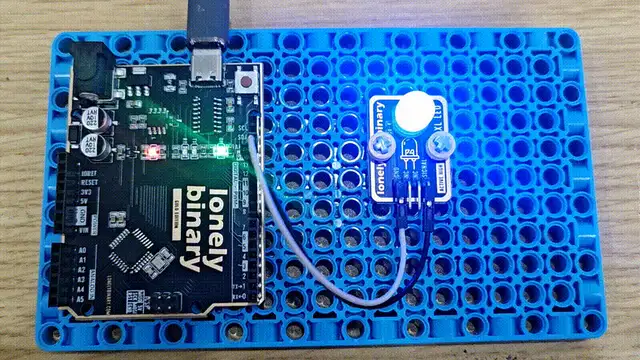

# Lesson 23 - Custom Functions

**This lesson uses:** Arduino UNO R3 board, **TinkerBlock TK01 XL LED** module (or TK02/TK03), jumper wires (or breadboard). Learn **custom functions**; **outcome:** wrap “on 200 ms, off 200 ms” in `myBlink()`, call it from loop, LED blinks at a fixed rhythm.

---

## 1. Wiring

Reuse a previous module, e.g. TK01 XL LED:

- **GND** → Arduino GND  
- **SIGNAL** → Arduino D13  
- **NC** leave unconnected



---

## 2. New sketch

1. Arduino IDE: File → **New** (or Ctrl/Cmd + N) to create a blank sketch  
2. Confirm board and port are selected (same as Lesson 01)  
3. **Type** the code below into the default `setup()` and `loop()` yourself  

---

## 3. Program structure

Same as last lesson: two fixed blocks `setup()` and `loop()`. We also **define our own function**.

- **Custom function:** Wrap repeated code in a named block and call it when needed  
- **`setup()`**: Tell the board “pin 13 for LED”; runs once  
- **`loop()`**: Call the custom function so the LED blinks  

One “blink” is inside `myBlink()`; loop just calls it and the LED blinks at a fixed rhythm.

---

## 4. Code to write

**Define the function** before `setup()` and `loop()`, then **call it** inside them:

```cpp
#define LED_PIN 13   // LED on D13

// Custom function: blink once
void myBlink() {
  digitalWrite(LED_PIN, HIGH);   // On
  delay(200);                    // 200 ms
  digitalWrite(LED_PIN, LOW);    // Off
  delay(200);                    // 200 ms
}

void setup() {
  pinMode(LED_PIN, OUTPUT);   // D13 for LED
}

void loop() {
  myBlink();   // Call custom function: blink once
  delay(500);  // 500 ms before next blink
}
```

---

### Program notes

**Overall idea:** Put the four steps “on → delay → off → delay” inside `myBlink()`; in `loop()` call `myBlink()` to run them. `void` means no return value; call it multiple times for more blinks, or later change to `blink(int n)` with a parameter.

| Code | In this lesson |
|------|----------------|
| **`void myBlink() { ... }`** | Define a function with no return value; body runs when called |
| **`myBlink()`** | Call the function; runs “on 200 ms, off 200 ms” once |
| **Encapsulate repeat logic** | When the same code is needed in several places, a function keeps it in one place |

---

## 5. Hands-on

1. After entering the code, click **Verify** (✓) to compile  
2. Click **Upload** (→) to upload to the board  
3. Watch TK01: one quick blink, pause, then another blink, repeat  
4. Try yourself:
   - Call `myBlink()` several times in `loop()`, e.g. `myBlink(); myBlink(); myBlink();`  
   - Add `myBlinkSlow()` that blinks slower  
   - Try a function with a parameter, e.g. `blink(int times)` to blink that many times  

**Expected result:** As in the figure.



Proceed to Lesson 24.

---

## 6. Common issues

| Symptom | What to do |
|---------|------------|
| Compile error | Check function form: `void name() { ... }`, brackets and braces |
| Function never runs | Make sure you call it inside `loop()` |

---

*TinkerBlock Arduino Beginner Workshop — Lesson 23*
