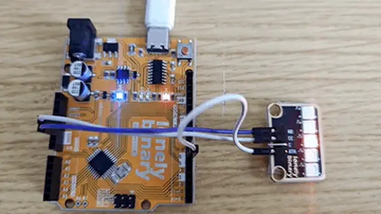

# Lesson 25 - WS2812 RGB LED Bar

**This lesson uses:** Arduino UNO R3 board, **TinkerBlock TK33 WS2812 RGB LED Bar** module, jumper wires (or breadboard). Learn to control the WS2812 bar with **FastLED** library; **outcome:** one red LED moves along the bar in sequence—a running light.

---

## 1. Install the library

Before writing code, install the **FastLED** library:

1. Arduino IDE: Tools → **Manage Libraries...**
2. Search: **FastLED**
3. Find **FastLED by Daniel Garcia**, click **Install**
4. Wait until installation finishes

---

## 2. Wiring

Connect TK33 WS2812 RGB LED Bar to Arduino:

- **GND** → Arduino GND  
- **VCC** → Arduino 5V  
- **DATA** → Arduino D6  
- **NC** leave unconnected


---

## 3. New sketch

1. Arduino IDE: File → **New** (or Ctrl/Cmd + N) to create a blank sketch  
2. Confirm board and port are selected (same as Lesson 01)  
3. **Type** the code below into the default `setup()` and `loop()` yourself  

---

## 4. Program structure

Same as last lesson: two fixed blocks `setup()` and `loop()`.

- **`setup()`**: Include library, create strip object, set brightness; runs once.  
- **`loop()`**: Keep repeating “set each LED color → update display → wait → repeat”.

One wire controls the whole bar; you’ll see one red dot “run” from one end to the other.

---

## 5. Code to write

**Type** the code below at the top of the file and in `setup()` and `loop()` (do not copy-paste; typing it yourself helps you remember):

```cpp
// FastLED with WS2812 bar; DATA on one wire controls all LEDs
#include <FastLED.h>

#define DATA_PIN 6   // Bar DATA on D6
#define NUM_LEDS 5   // Number of LEDs (TK33 has 5)

CRGB leds[NUM_LEDS];   // Color array: leds[i] = RGB for LED i

void setup() {
  FastLED.addLeds<WS2812, DATA_PIN, GRB>(leds, NUM_LEDS);  // Type, pin, color order, array, count
  FastLED.setBrightness(50);   // Global brightness 0-255, avoid too bright
}

void loop() {
  // Running light: each round light LED i, others off; i from 0 to NUM_LEDS-1
  for (int i = 0; i < NUM_LEDS; i++) {
    for (int j = 0; j < NUM_LEDS; j++) {
      leds[j] = CRGB::Black;   // All off first
    }
    leds[i] = CRGB::Red;       // Only LED i red
    FastLED.show();            // Send array to bar so LEDs update
    delay(200);                // 200 ms before next
  }
}
```

---

### Program notes

**Overall idea:** WS2812 bar is one DATA line in series; each LED’s color comes from the corresponding element of `leds[]`. In `loop()` two for loops: outer `i` = “which LED is on”; inner loop set all to black then set `leds[i]` to red, then `FastLED.show()` sends to hardware—one red dot moves step by step.

**Why `FastLED.show()`:** Changing `leds[]` only changes data in memory; only after `show()` is the data sent to the bar and the LEDs updated.

**Color order GRB:** WS2812 is often GRB (green-red-blue); `CRGB::Red` is sent in GRB order by the library, no need to convert.

| Code | In this lesson |
|------|----------------|
| **`#include <FastLED.h>`** | Include FastLED; provides CRGB, addLeds, show, etc. |
| **`CRGB leds[NUM_LEDS]`** | Color array; index 0–NUM_LEDS-1 per LED; must call `show()` after changes |
| **`FastLED.addLeds<WS2812, DATA_PIN, GRB>(...)`** | Init: chip type, data pin, color order (GRB), array and length |
| **`FastLED.setBrightness(50)`** | Global brightness (0–255); does not change RGB ratio, only scale |
| **`CRGB::Black` / `CRGB::Red`** | Predefined colors; or use `CRGB(255,0,0)` etc. |
| **`FastLED.show()`** | Send current `leds[]` to the bar and update display |
| **Double for** | Outer i = “which LED on”; inner all off then LED i on = running light |

---

## 6. Hands-on

1. After entering the code, click **Verify** (✓) to compile  
2. Click **Upload** (→) to upload to the board  
3. Watch TK33: each LED lights in turn (red), running light  
4. Try yourself:
   - Change `CRGB::Red` to `CRGB::Green` or `CRGB::Blue`  
   - Light several LEDs at once  
   - Try a fade effect  

**Expected result:** As in the figure.



Proceed to Lesson 26.

---

*TinkerBlock Arduino Beginner Workshop — Lesson 25*
