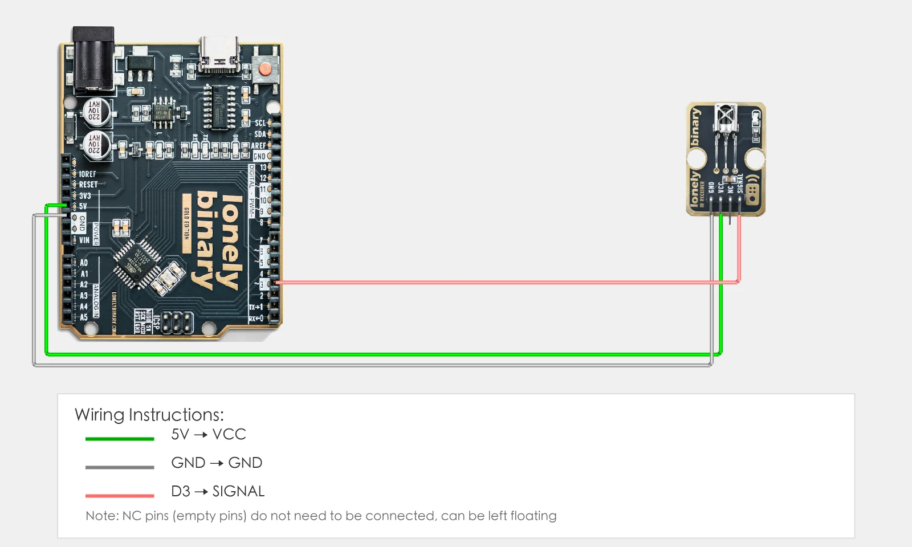
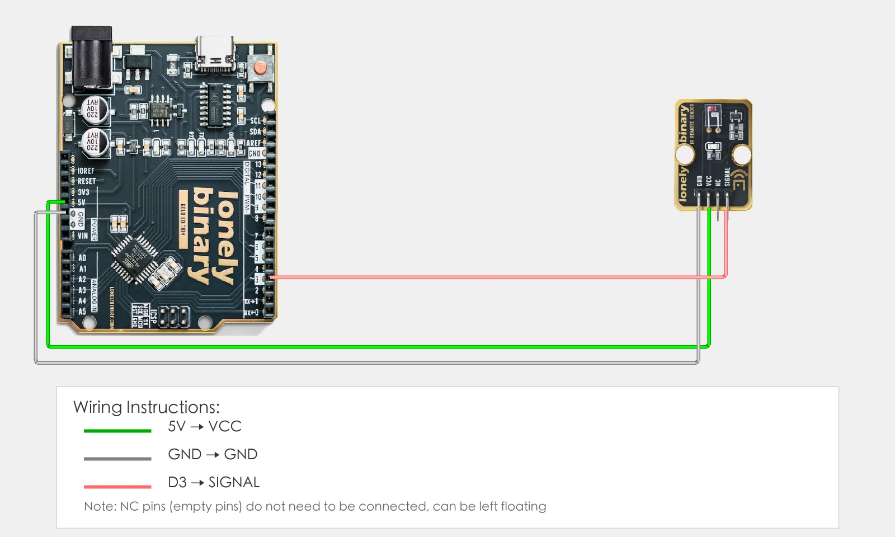
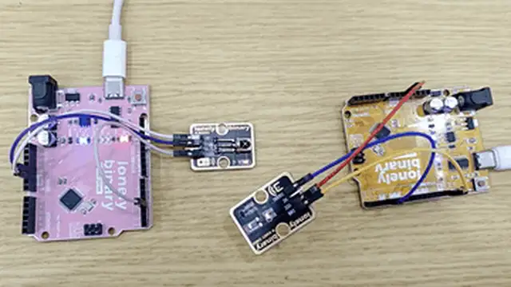

# Lesson 26 - IR Communication

**This lesson uses:** **Two** Arduino UNO R3 boards, **TinkerBlock TK15 IR Receiver** module, **TinkerBlock TK16 IR Remote Sender** module, jumper wires (or breadboard). Learn **infrared communication** (one board receives, one sends); **outcome:** sender sends IR codes on a timer, receiver prints received codes on serial; you can also point a normal remote at the receiver and see the key codes.

---

## 1. Install the library

Before writing code, install the **IRremote** library:

1. Arduino IDE: Tools → **Manage Libraries...**
2. Search: **IRremote**
3. Find **IRremote by shirriff, z3t0, ArminJo**, click **Install**
4. Wait until installation finishes

---

## 2. Wiring (two boards)

This lesson uses **two UNO R3** boards: one with the **receiver** only, one with the **sender** only.

### Board A: IR receiver (TK15)

- **GND** → Arduino GND  
- **VCC** → Arduino 5V  
- **SIGNAL** → Arduino D3  
- **NC** leave unconnected



### Board B: IR sender (TK16)

- **GND** → Arduino GND  
- **VCC** → Arduino 5V  
- **SIGNAL** → Arduino D3  
- **NC** leave unconnected



---

## 3. New sketch and program structure

You need **two programs**, one for each board:

- **Program 1 (receiver):** Upload to board A (with TK15); receives IR and prints to serial.  
- **Program 2 (sender):** Upload to board B (with TK16); sends IR at intervals.

Each is a separate sketch: File → **New**, set board and port, then type the code into `setup()` and `loop()`.

One program per board—one receives, one sends; point the sender at the receiver and you’ll see codes on serial.

---

## 4. Program 1: Receiver (upload to board A)

In the sketch for **board A**, type the code below and upload to the UNO with **TK15**.

```cpp
// Program 1: IR receiver (upload to board A with TK15)
#include <IRremote.h>

#define IR_RX_PIN 3   // IR receiver SIGNAL on D3

IRrecv irrecv(IR_RX_PIN);  // Create receiver object

void setup() {
  irrecv.enableIRIn();     // Start IR receive
  Serial.begin(9600);     // Baud 9600 for printing received codes
  Serial.println("IR receiver ready");
}

void loop() {
  if (irrecv.decode()) {   // If IR data received
    Serial.print("Received IR code: ");
    Serial.println(irrecv.decodedIRData.decodedRawData, HEX);  // Print in hex
    irrecv.resume();       // Ready for next frame
  }
}
```

---

## 5. Program 2: Sender (upload to board B)

In the sketch for **board B**, type the code below and upload to the UNO with **TK16**.

```cpp
// Program 2: IR sender (upload to board B with TK16)
#include <IRremote.h>

#define IR_TX_PIN 3   // IR sender SIGNAL on D3

IRsend irsend(IR_TX_PIN);  // Create sender object

void setup() {
  Serial.begin(9600);
  Serial.println("IR sender ready");
}

void loop() {
  irsend.sendNEC(0xFF00FF, 32);  // Send NEC IR code, data 0xFF00FF, 32 bits
  Serial.println("IR sent");
  delay(2000);                  // Every 2 s so receiver can see
}
```

---

### Program notes

**Receiver (Program 1):** `irrecv.decode()` is true when a new IR frame is received; use `decodedIRData.decodedRawData` for the raw code and print in hex; then call `irrecv.resume()` to be ready for the next frame.

**Sender (Program 2):** `irsend.sendNEC(0xFF00FF, 32)` sends a NEC-format code (first arg = 32-bit data, second = bit count); every 2 s so the receiver can observe. To control a device with a remote, use the code you see on the receiver here.

**NEC format:** Many remotes use NEC; the same key usually sends the same code, so the receiver can identify it.

| Code | In this lesson |
|------|----------------|
| **`#include <IRremote.h>`** | Include IR library; provides IRrecv, IRsend, NEC, etc. |
| **`IRrecv irrecv(IR_RX_PIN)`** | Create receiver; specify RX pin (D3 here) |
| **`irrecv.enableIRIn()`** | Enable receive in setup; call once |
| **`irrecv.decode()`** | Returns true if a new frame was received; fills decodedIRData |
| **`decodedIRData.decodedRawData`** | Decoded raw code (print in hex to view) |
| **`irrecv.resume()`** | Must call after handling a frame to receive the next |
| **`IRsend irsend(IR_TX_PIN)`** | Create sender; specify TX pin (D3 here) |
| **`irsend.sendNEC(data, 32)`** | Send NEC code; 32-bit data (e.g. 0xFF00FF) |

---

## 7. Hands-on

1. Board A: Upload **Program 1**, open Serial Monitor (9600), select board A’s port.  
2. Board B: Upload **Program 2**; you can open another Serial Monitor for board B or just watch board A.  
3. Point TK16 at TK15; board B sends every 2 s, board A’s serial prints “Received IR code: …”.  
4. Point a normal IR remote at TK15; board A’s serial will show the received codes.

**Expected result:** As in the figure.



**Note:** TK64 IR Receiver and TK63 IR Sender work similarly; you can try them.

Proceed to Lesson 27.

---

*TinkerBlock Arduino Beginner Workshop — Lesson 26*
