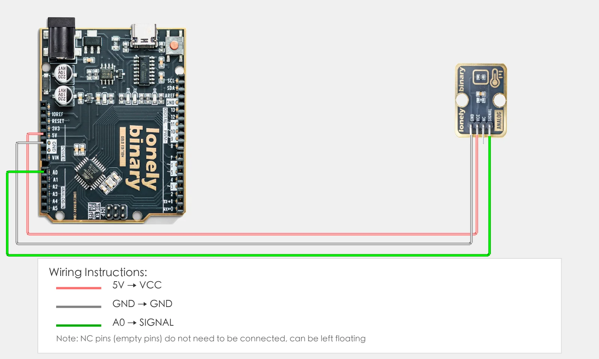

# Lesson 27 - NTC Thermistor Temperature Sensor

**This lesson uses:** Arduino UNO R3 board, **TinkerBlock TK12 NTC Thermistor** module, jumper wires (or breadboard). Learn to use **analog input** and the **Beta equation** to convert NTC thermistor voltage to temperature. **Outcome:** serial continuously displays current temperature (°C); values change when you warm the module or bring it near a heat source.

---

## 1. Wiring

Connect TK12 NTC Thermistor to Arduino:

- **GND** → Arduino GND  
- **VCC** → Arduino 5V  
- **SIGNAL** → Arduino A0  
- **NC** — leave unconnected



---

## 2. New sketch

1. Arduino IDE: File → **New** (or Ctrl/Cmd + N) to create a blank sketch.
2. Confirm board and port are selected (same as Lesson 01).
3. **Type** the code below into the default `setup()` and `loop()` yourself.

---

## 3. Program structure

- **`setup()`**: Start serial; runs once.
- **`loop()`**: Read A0 voltage → compute NTC resistance → compute temperature (°C) with Beta equation → print to serial → wait a bit → repeat.

Once the code is in place, the serial will keep showing current temperature; warm the module with your hand or bring it near a heat source and the value will change.

---

## 4. Code to write

**Type** the code below line by line into the file header and into `setup()` and `loop()` (do not copy-paste; typing it yourself helps you remember):

```cpp
// Lesson 27: NTC thermistor read temperature (°C)
#include <math.h>   // for log() to compute natural logarithm

#define TEMP_PIN A0  // TK12 SIGNAL to A0

// NTC parameters (typical for 10K thermistor; adjust BETA or R_SERIES if inaccurate)
const float VCC = 5.0;           // supply 5V
const float R0 = 10000.0;        // NTC resistance at 25°C (Ω)
const float T0 = 25.0 + 273.15;  // reference temperature (Kelvin)
const float BETA = 3950.0;       // Beta (datasheet often 3950; try 3435 or 4100)
const float R_SERIES = 10000.0;  // series resistor in divider (Ω)

void setup() {
  Serial.begin(9600);
  Serial.println("NTC temperature sensor started");
}

void loop() {
  int raw = analogRead(TEMP_PIN);   // read A0, 0–1023
  float voltage = raw * (VCC / 1023.0);  // convert to voltage 0–5V

  // Voltage divider: solve for NTC resistance: R_NTC = R_SERIES * Vout / (VCC - Vout)
  float rNTC = R0;
  if (voltage > 0 && voltage < VCC) {
    rNTC = R_SERIES * voltage / (VCC - voltage);
  }

  // Beta equation for temperature (Kelvin): T = 1 / (1/T0 + (1/BETA)*ln(R/R0))
  float tempK = T0;
  if (rNTC > 0 && rNTC < 1000000.0) {
    float lnR = log(rNTC / R0);
    tempK = 1.0 / (1.0 / T0 + (1.0 / BETA) * lnR);
  }
  float tempC = tempK - 273.15;  // convert to Celsius
  if (tempC < -50.0) tempC = -50.0;   // clamp display range, avoid outliers
  if (tempC > 150.0) tempC = 150.0;

  Serial.print("Temperature: ");
  Serial.print(tempC, 2);
  Serial.println(" °C");

  delay(1000);   // update once per second to avoid flooding serial
}
```

---

### Program notes

**Overall idea:** NTC resistance changes with temperature; the module uses a fixed resistor and the NTC in a voltage divider; Arduino reads A0 to get the voltage. The program converts the raw value to voltage, uses the divider formula to get NTC resistance, then uses the Beta equation to get temperature in Kelvin, subtracts 273.15 for Celsius, and prints to serial.

**Voltage divider:** Typically the module is VCC → R_SERIES → NTC → GND; A0 measures the voltage Vout between NTC and R_SERIES. From Vout = VCC × R_NTC / (R_SERIES + R_NTC) we get R_NTC = R_SERIES × Vout / (VCC - Vout). When Vout is near 0 or VCC the formula is unstable, so the code uses if to limit the range.

**Beta equation:** For NTC, resistance R at temperature T and reference (T0, R0) satisfy ln(R/R0) = BETA×(1/T - 1/T0), giving T = 1 / (1/T0 + (1/BETA)×ln(R/R0)). T and T0 are in Kelvin; subtract 273.15 for °C. BETA is from the datasheet (often 3950); adjust slightly if readings are off.

| Code / expression | In this lesson |
|-------------------|----------------|
| **`#include <math.h>`** | Include math library to use `log()` for natural logarithm ln(R/R0). |
| **`analogRead(TEMP_PIN)`** | Read A0 analog value 0–1023, corresponding to 0V–5V. |
| **`raw * (VCC / 1023.0)`** | Map 0–1023 linearly to 0–5V voltage. |
| **`R_SERIES * voltage / (VCC - voltage)`** | Voltage divider: solve for current NTC resistance (Ω). |
| **`log(rNTC / R0)`** | Natural log of resistance ratio for Beta equation. |
| **`1.0 / (1.0/T0 + (1.0/BETA)*lnR)`** | Beta equation: temperature in Kelvin. |
| **`tempK - 273.15`** | Kelvin to Celsius; clamp to -50–150°C to avoid outliers. |

---

## 5. Hands-on

1. After entering the code, click **Verify** (✓) to compile.
2. Click **Upload** (→) to upload to the board.
3. **Open Serial Monitor** (Tools → Serial Monitor, 9600 baud).
4. Watch the serial: it should show current temperature (°C).
5. Warm TK12 with your hand or bring it near a heat source and watch the temperature change.

**Expected output:**

Serial monitor shows:
```
NTC temperature sensor started
Temperature: 25.32 °C
Temperature: 26.01 °C
Temperature: 28.45 °C
...
```

**Note:** If the temperature is consistently off, try adjusting `BETA` (e.g. 3435 or 4100) or `R_SERIES` in the code to match the module’s series resistor.

Proceed to Lesson 28.

---

*TinkerBlock Arduino Beginner Workshop — Lesson 27*
