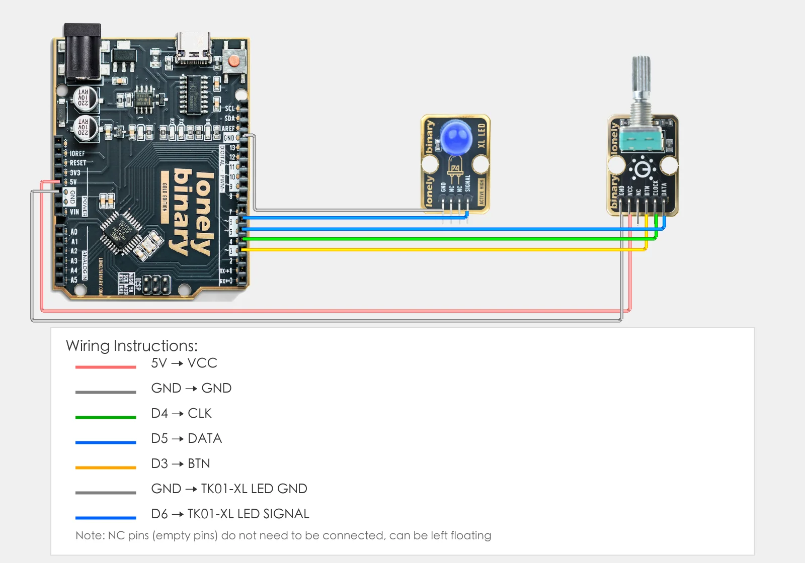
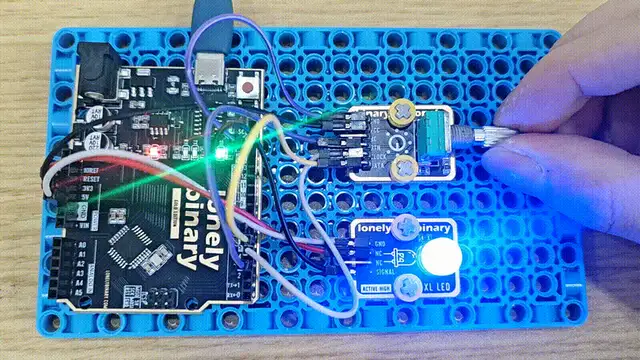

# Lesson 30 - Rotary Encoder

**This lesson uses:** Arduino UNO R3 board, **TinkerBlock TK06 Rotary Encoder** module, **TinkerBlock TK01 XL LED** module, jumper wires (or breadboard). Use the **rotary encoder** for rotation direction and button; **outcome:** turn encoder to adjust LED brightness (CW brighter, CCW dimmer), press encoder button to toggle LED (off/on), and when turning on again the previous brightness is restored.

---

## 1. Wiring

- **TK06 Rotary Encoder:** VCC → 5V, GND → GND, CLK → D4, DATA → D5, BTN → D3  
- **TK01 LED:** GND → GND, SIGNAL → D6 (PWM pin)



---

## 2. New sketch

1. Arduino IDE: File → **New** (or Ctrl/Cmd + N) to create a blank sketch  
2. Confirm board and port are selected (same as Lesson 01)  
3. **Type** the code below into the default `setup()` and `loop()` yourself  

---

## 3. Program structure

Same as last lesson: two fixed blocks `setup()` and `loop()`.

- **`setup()`**: Tell the board “D4, D5 for encoder, D3 for button, D6 for LED”; start serial; runs once.  
- **`loop()`**: Keep repeating “detect rotation → change brightness (when LED on) → detect button (press to toggle) → wait → repeat”.

Turn encoder to change brightness; one press turns LED off, another turns it on and restores the last brightness.

---

## 4. Code to write

**Type** the code below into `setup()` and `loop()` (do not copy-paste; typing it yourself helps you remember):

```cpp
// Pins: encoder CLK/DATA for direction, BTN for button, LED on PWM pin
#define CLK_PIN 4    // Encoder CLK on D4
#define DATA_PIN 5   // Encoder DATA on D5
#define BTN_PIN 3    // Encoder button BTN on D3
#define LED_PIN 6    // LED on D6 (PWM)

int brightness = 128;           // Current LED brightness (0-255)
int savedBrightness = 128;      // Stored when off; restore when on again
bool ledOn = true;             // LED state: true=on, false=off
int lastClkState = HIGH;       // Previous CLK for edge detection

void setup() {
  pinMode(CLK_PIN, INPUT_PULLUP);   // Encoder CLK, internal pull-up
  pinMode(DATA_PIN, INPUT_PULLUP);   // Encoder DATA
  pinMode(BTN_PIN, INPUT_PULLUP);    // Button: pressed = LOW
  pinMode(LED_PIN, OUTPUT);
  
  Serial.begin(9600);
  lastClkState = digitalRead(CLK_PIN);  // Initial CLK to avoid false edge
  analogWrite(LED_PIN, brightness);     // Start at brightness
}

void loop() {
  int clkState = digitalRead(CLK_PIN);
  
  // Rotation: CLK change = one step
  if (clkState != lastClkState) {
    if (clkState == LOW && ledOn) {
      int dataState = digitalRead(DATA_PIN);
      
      if (dataState == LOW) {
        brightness = min(255, brightness + 20);  // CW: brighter, cap 255
        Serial.println("CW - brightness up");
      } else {
        brightness = max(0, brightness - 20);   // CCW: dimmer, min 0
        Serial.println("CCW - brightness down");
      }
      
      analogWrite(LED_PIN, brightness);
    }
    lastClkState = clkState;
  }
  
  // Button: LOW when pressed. Toggle on/off; save brightness when off, restore when on
  if (digitalRead(BTN_PIN) == LOW) {
    ledOn = !ledOn;
    if (ledOn) {
      brightness = savedBrightness;
      analogWrite(LED_PIN, brightness);
      Serial.println("Button - LED on");
    } else {
      savedBrightness = brightness;  // Save before turning off
      brightness = 0;
      analogWrite(LED_PIN, 0);
      Serial.println("Button - LED off");
    }
    delay(200);   // Debounce
  }
  
  delay(10);   // Short delay for stable read
}
```

---

### Program notes

**Overall idea:** In `loop()` read CLK, DATA, and BTN; use CLK change to detect one step and DATA to tell CW/CCW and adjust brightness; on button press flip `ledOn`, save brightness when turning off and restore when turning on.

**Direction:** When the encoder turns one step, CLK and DATA change in order. This code reads DATA only on **CLK falling edge (HIGH→LOW)**: DATA LOW = CW, DATA HIGH = CCW, so no double count and stable direction.

**Button and memory:** `ledOn` is the on/off state. On button (BTN LOW), `ledOn = !ledOn`. When turning off, save `brightness` to `savedBrightness` then set 0; when turning on, copy `savedBrightness` back to `brightness`. Rotation only changes brightness when `ledOn` is true.

**Debounce:** `delay(200)` after button press to avoid multiple triggers.

| Code | In this lesson |
|------|----------------|
| **`#define CLK_PIN 4` etc.** | Pin constants; change here if you rewire |
| **`INPUT_PULLUP`** | Input with internal pull-up; BTN is HIGH when not pressed, LOW when pressed |
| **`lastClkState`** | Previous CLK; compare with current to detect edge = one step |
| **`clkState == LOW && ledOn`** | Only adjust brightness on CLK edge when LED is on |
| **`min(255, brightness + 20)`** | Cap at 255; `max(0, brightness - 20)` caps at 0 |
| **`ledOn = !ledOn`** | Toggle on/off |
| **`savedBrightness`** | Store brightness when off; restore when on |
| **`delay(200)`** | Simple button debounce |

---

## 5. Hands-on

1. After entering the code, click **Verify** (✓) to compile  
2. Click **Upload** (→) to upload to the board  
3. **Open Serial Monitor** (Tools → Serial Monitor, baud 9600)  
4. **Turn TK06** (when LED on): CW = brighter, CCW = dimmer  
5. **Press encoder button:** once = off, again = on (previous brightness restored)  

**Expected result:** As in the figure.



Proceed to Lesson 31.

---

*TinkerBlock Arduino Beginner Workshop — Lesson 30*
