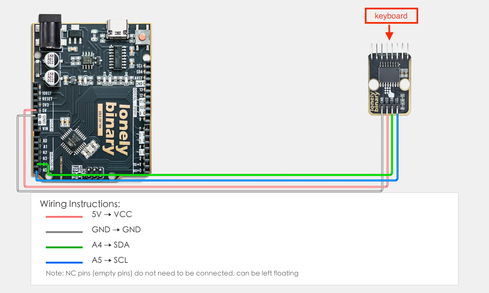
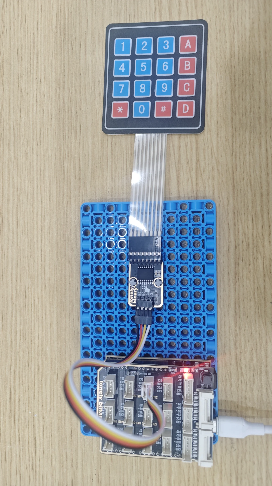

# Lesson 32 - I2C Matrix Keypad

**This lesson uses:** Arduino UNO R3 board, **TinkerBlock TK85 Matrix Keypad I2C Adapter** module, jumper wires (or breadboard). Use **Wire** library to scan the matrix keypad over I2C; **outcome:** when you press a key, serial prints the character (0–9, A–D, *, #).

---

## 1. Wiring

Connect TK85 Matrix Keypad I2C Adapter to Arduino (I2C):

- **GND** → Arduino GND  
- **VCC** → Arduino 5V  
- **SDA** → Arduino A4 (I2C data)  
- **SCL** → Arduino A5 (I2C clock)  
- **NC** leave unconnected



---

## 2. New sketch

1. Arduino IDE: File → **New** (or Ctrl/Cmd + N) to create a blank sketch  
2. Confirm board and port are selected (same as Lesson 01)  
3. **Type** the code below into the default `setup()` and `loop()` yourself  

---

## 3. Program structure

Same as last lesson: two fixed blocks `setup()` and `loop()`.

- **`setup()`**: Include library, start I2C, start serial; runs once.  
- **`loop()`**: Keep repeating “scan keypad → detect key → print to serial → wait → repeat”.

I2C connects the keypad; press a key and serial shows the character.

---

## 4. Code to write

**Type** the code below at the top of the file and in `setup()` and `loop()` (do not copy-paste; typing it yourself helps you remember):

```cpp
// I2C scan 4×4 matrix keypad: PCF8574 selects column, read rows for key index, then lookup char
#include <Wire.h>

#define KEYPAD_ADDRESS 0x20   // PCF8574 I2C address

char keymap[16] = "DCBA#9630852*741";   // Key index 0-15 → character

void setup() {
  Wire.begin();   // I2C init
  Serial.begin(9600);
  Serial.println("I2C matrix keypad started");
}

void loop() {
  int key = readKeypad();   // Scan; returns 0-15 or -1
  if (key >= 0 && key < 16) {
    Serial.print("Key: ");
    Serial.println(keymap[key]);
  }
  delay(100);   // Scan interval and debounce
}

// Drive each column low, read rows; low row = key pressed, return 0-15, else -1
int readKeypad() {
  for (int col = 0; col < 4; col++) {
    Wire.beginTransmission(KEYPAD_ADDRESS);
    Wire.write(0xFF & ~(1 << (4 + col)));   // Select column col
    Wire.endTransmission();
    delayMicroseconds(200);
    Wire.requestFrom(KEYPAD_ADDRESS, 1);
    if (Wire.available()) {
      int rowData = Wire.read();
      for (int row = 0; row < 4; row++) {
        if (!(rowData & (1 << row)))
          return row * 4 + col;
      }
    }
  }
  return -1;
}
```

---

### Program notes

**Overall idea:** TK85 uses PCF8574 for 4×4 matrix; columns are PCF outputs, rows are PCF inputs. Drive one column low at a time, read rows; a low row means that row×column key is pressed, index row*4+col. Map index to character with `keymap[]` and print.

| Code | In this lesson |
|------|----------------|
| **`Wire.write(0xFF & ~(1 << (4+col)))`** | Select column col (PCF high 4 bits = columns, low 4 = rows) |
| **`Wire.requestFrom(..., 1)`** | Read 1 byte; bits show which rows are low (pressed) |
| **`row * 4 + col`** | Key index 0–15 for keymap |
| **`keymap[key]`** | Index → character (layout depends on hardware) |

---

## 5. Hands-on

1. After entering the code, click **Verify** (✓) to compile  
2. Click **Upload** (→) to upload to the board  
3. **Open Serial Monitor** (Tools → Serial Monitor, baud 9600)  
4. **Press keys:** serial shows the corresponding character  
5. Try different keys and watch the output  

**Expected result:**



Serial monitor:
```
I2C matrix keypad started
Key: 1
Key: 2
Key: 3
...
```

Proceed to Lesson 33.

---

*TinkerBlock Arduino Beginner Workshop — Lesson 32*
