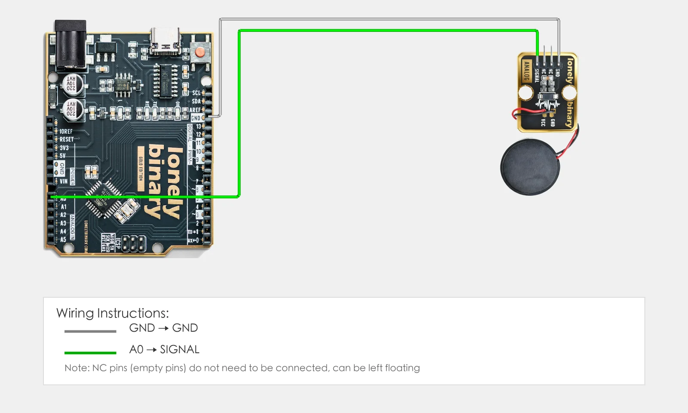
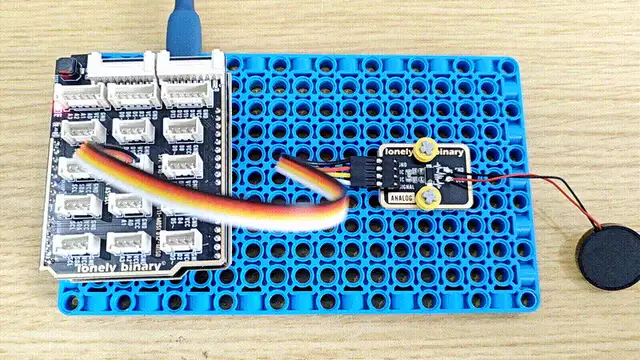

# Lesson 36 - Piezo Sensor

**This lesson uses:** Arduino UNO R3 board, **TinkerBlock TK59 Piezo-Ceramic Sensor** module, jumper wires (or breadboard). Use **analog input** to read the piezo sensor; **outcome:** serial shows pressure/vibration value (0–1023); tapping or pressing increases the value.

---

## 1. Wiring

Connect TK59 Piezo-Ceramic Sensor to Arduino:

- **GND** → Arduino GND  
- **VCC** → Arduino 5V  
- **SIGNAL** → Arduino A0  
- **NC** leave unconnected



---

## 2. New sketch

1. Arduino IDE: File → **New** (or Ctrl/Cmd + N) to create a blank sketch  
2. Confirm board and port are selected (same as Lesson 01)  
3. **Type** the code below into the default `setup()` and `loop()` yourself  

---

## 3. Program structure

Same as last lesson: two fixed blocks `setup()` and `loop()`.

- **`setup()`**: Start serial; runs once.  
- **`loop()`**: Keep repeating “read analog value → print to serial → wait → repeat”.

Tap or press the piezo and the serial value will jump—upload and try.

---

## 4. Code to write

**Type** the code below into `setup()` and `loop()` (do not copy-paste; typing it yourself helps you remember):

```cpp
// Piezo sensor on A0; pressure/vibration changes output voltage, ADC 0-1023
#define PIEZO_PIN A0

void setup() {
  Serial.begin(9600);
  Serial.println("Piezo sensor program started");
}

void loop() {
  int val = analogRead(PIEZO_PIN);   // Read A0; more pressure/vibration = higher value
  Serial.print("Pressure: ");
  Serial.println(val);
  delay(100);   // Poll every 100 ms
}
```

---

### Program notes

**Overall idea:** Piezo generates voltage when pressed or vibrated; the module conditions it and A0 reads it; higher value = stronger pressure/vibration. This lesson only prints the raw value; you can use it for thresholds or simple strength comparison.

| Code | In this lesson |
|------|----------------|
| **`analogRead(PIEZO_PIN)`** | Read A0, 0–1023; higher usually = more pressure/vibration |

---

## 5. Hands-on

1. After entering the code, click **Verify** (✓) to compile  
2. Click **Upload** (→) to upload to the board  
3. **Open Serial Monitor** (Tools → Serial Monitor, baud 9600)  
4. Watch serial: current pressure value  
5. Tap or press the sensor and see the value change  

**Expected result:**

Serial monitor:
```
Piezo sensor program started
Pressure: 125
Pressure: 132
Pressure: 589
...
```
Tapping or pressing increases the value. As in the figure.



**Note:** TK96 Mechanical Key LED is different (key + LED); you can try it.

Proceed to Lesson 37.

---

*TinkerBlock Arduino Beginner Workshop — Lesson 36*
